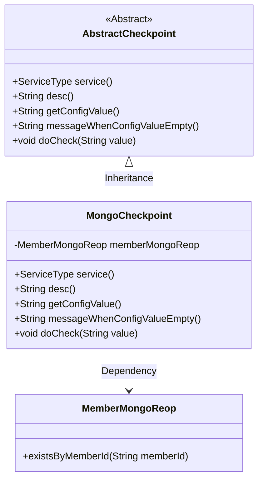
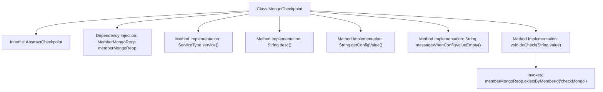

# Basic Information

|      |      |
|------|------|
| Name | MongoCheckpoint |
| Language | .java |
| Code Path | WeFe/union/union-service/src/main/java/com/welab/wefe/union/service/service/available/checkpoint/MongoCheckpoint.java |
| Package Name | com.welab.wefe.union.service.service.available.checkpoint |
| Dependencies | ['com.welab.wefe.common.data.mongodb.repo.MemberMongoReop', 'com.welab.wefe.common.wefe.checkpoint.AbstractCheckpoint', 'com.welab.wefe.common.wefe.enums.ServiceType', 'org.springframework.beans.factory.annotation.Autowired', 'org.springframework.stereotype.Service'] |
| Brief Description | The MongoCheckpoint class inherits from AbstractCheckpoint, checks the MongoDB service status, and verifies through the memberMongoReop.existsByMemberId method. |

# Description

MongoCheckpoint is a service class that inherits from AbstractCheckpoint, designed to check the operational status of MongoDB services. It performs database operations by injecting the MemberMongoReop member variable. The service type is defined as MongodbService, with a description stating it verifies whether the MongoDB service is running properly. During the check process, it calls the existsByMemberId method of memberMongoReop to validate the database connection. Both the configuration value and empty configuration prompt are null, with the core check logic solely involving database existence verification.

# Class Summary

| Name   | Type  | Description |
|-------|------|-------------|
| MongoCheckpoint | class | The MongoCheckpoint class inherits from AbstractCheckpoint, checks the MongoDB service status, and verifies operational status through memberMongoReop.existsByMemberId. |

## Class MongoCheckpoint

|      |      |
|------|------|
| Access Modifier | @Service;public |
| Type | class |
| Name | MongoCheckpoint |
| Description | The MongoCheckpoint class inherits from AbstractCheckpoint, checks the MongoDB service status, and verifies operational status through memberMongoReop.existsByMemberId. |

### UML Class Diagram

This code demonstrates a MongoDB checkpoint service MongoCheckpoint, which inherits from the abstract base class AbstractCheckpoint and implements multiple inspection-related abstract methods. The class diagram clearly shows inheritance and dependency relationships, where MongoCheckpoint relies on MemberMongoReop through a member variable to perform actual MongoDB inspection operations. This design follows the Template Method pattern, with the parent class defining the inspection process framework and child classes implementing specific inspection logic.

### Internal Method Call Graph

This flowchart illustrates the structure of the MongoCheckpoint class and its inheritance relationship with the parent class AbstractCheckpoint. The class injects the MemberMongoReop dependency via @Autowired and implements 5 abstract methods. The core method doCheck() invokes memberMongoReop.existsByMemberId() for MongoDB health checks. All method implementations adhere to the constraints of the abstract parent class, but getConfigValue() and messageWhenConfigValueEmpty() return null values, indicating potential incomplete implementation of configuration-related functionality.

### Field List

| Name  | Type  | Description |
|-------|-------|------|
| memberMongoReop | MemberMongoReop | Use @Autowired to automatically inject the MemberMongoReop member variable. |

### Method List

| Name  | Type  | Description |
|-------|-------|------|
| getConfigValue | String | Rewrite the getConfigValue method to return null. |
| service | ServiceType | This method overrides the parent class method and returns the MongodbService service type. |
| desc | String | Check the running status of the MongoDB service. |
| messageWhenConfigValueEmpty | String | Method override, returns null when the configuration value is empty. |
| doCheck | void | The method `doCheck` verifies whether the member ID exists in MongoDB by invoking the `memberMongoReop.existsByMemberId` method. |

