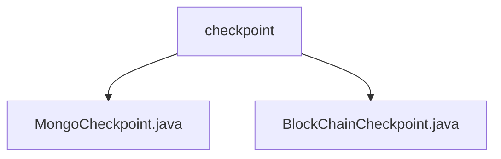

# Basic Information

|      |      |
|------|------|
| Name | checkpoint |
| Language | .java |
| Code Path | WeFe/union/union-service/src/main/java/com/welab/wefe/union/service/service/available/checkpoint |
| Package Name | docs.union.union-service.src.main.java.com.welab.wefe.union.service.service.available.checkpoint |
| Brief Description | MongoCheckpoint checks the status of the MongoDB service by verifying the connection through existsByMemberId. BlockChainCheckpoint checks the status of the blockchain service by validating member existence via isExist. Neither has configurable values, with the core logic centered on existence verification. |

# Description

## Overview  
The core responsibility of this module is to provide health check capabilities for multiple types of services, including operational status validation for MongoDB and blockchain services. The interface specifications uniformly inherit from the AbstractCheckpoint base class, performing existence checks by injecting specific components (such as MemberMongoReop or MemberContractService). Key data structures include service type enums (MongodbService/BlockChainService) and member ID parameters. External dependencies involve MongoDB drivers and blockchain contract services. For example, MongoCheckpoint verifies connections via existsByMemberId, while BlockChainCheckpoint calls isExist to confirm member existence.  

## Primary Business Scenarios  
The module adopts a unified inspection model: initialize service type → inject dependency components → execute atomic validation (similar to a probe mechanism). The complete business process includes two scenarios: database connection testing and on-chain contract queries. Typical applications include service pre-checks during alliance node startup. All API types are parameterless inspection interfaces, with integration cases covering MongoDB connection pool health monitoring and blockchain node liveliness verification. Examples include verifying blockchain service availability through member ID queries or checking MongoDB collection accessibility.

### Package Internal Structure View

This flowchart illustrates the hierarchical structure of the checkpoint directory under the union-service module in the WeFe project. The parent node 'checkpoint' contains two child node files: MongoCheckpoint.java and BlockChainCheckpoint.java, which implement different types of checkpoint functionalities respectively. The entire structure clearly reflects the code organization of checkpoint-related services, adhering to modular development standards.

# File List

| Name   | Type  | Description |
|-------|------|-------------|
| [MongoCheckpoint.java](MongoCheckpoint.md) | file | The MongoCheckpoint class inherits from AbstractCheckpoint, checks the MongoDB service status, and verifies through the memberMongoReop.existsByMemberId method. |
| [BlockChainCheckpoint.java](BlockChainCheckpoint.md) | file | The `BlockChainCheckpoint` class inherits from `AbstractCheckpoint` and checks the operational status of blockchain services, verifying member existence through `memberContractService`. |

