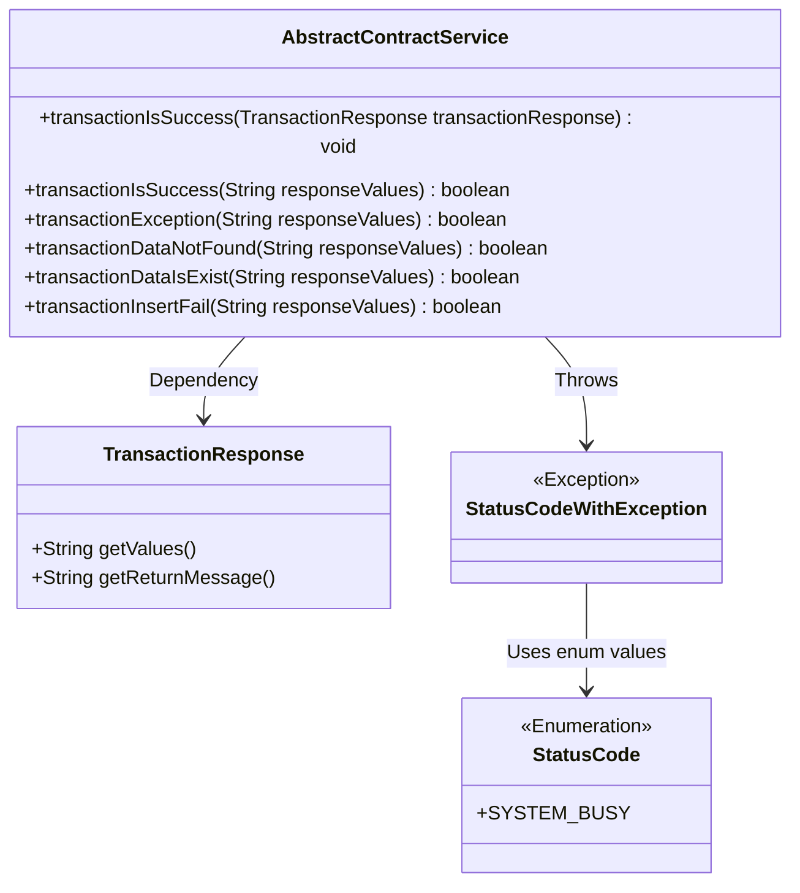

# Basic Information

|      |      |
|------|------|
| Name | AbstractContractService |
| Language | .java |
| Code Path | WeFe/union/union-service/src/main/java/com/welab/wefe/union/service/service/contract/AbstractContractService.java |
| Package Name | com.welab.wefe.union.service.service.contract |
| Dependencies | ['com.alibaba.fastjson.JSONArray', 'com.welab.wefe.common.StatusCode', 'com.welab.wefe.common.exception.StatusCodeWithException', 'com.welab.wefe.common.util.JObject', 'org.fisco.bcos.sdk.transaction.model.dto.TransactionResponse'] |
| Brief Description | The `AbstractContractService` class provides transaction status check methods, handling different return codes (0 for success, -1 for data exists, -2 for failure, -3 for data does not exist), including exception judgment and data existence validation. |

# Description

The `AbstractContractService` class provides methods for handling blockchain transaction responses. The `transactionIsSuccess` method checks whether a transaction is successful and throws different exceptions based on return codes, including data already existing, transaction failure, data not found, etc. Other helper methods include `transactionIsSuccess` (boolean return value), `transactionException` (checks if the response is abnormal), `transactionDataNotFound` (checks if data exists), `transactionDataIsExist` (checks if data already exists), and `transactionInsertFail` (checks if insertion failed). These methods determine results by parsing JSON-formatted response values.

# Class Summary

| Name   | Type  | Description |
|-------|------|-------------|
| AbstractContractService | class | The AbstractContractService class provides transaction status checking methods, parses blockchain response values, handles different return codes (0 for success, -1 for data exists, -2 for failure, -3 for data does not exist), and includes exception judgment and data existence validation functionality. |

## Class AbstractContractService

|      |      |
|------|------|
| Access Modifier | public |
| Type | class |
| Name | AbstractContractService |
| Description | The AbstractContractService class provides transaction status checking methods, parses blockchain response values, handles different return codes (0 for success, -1 for data exists, -2 for failure, -3 for data does not exist), and includes exception judgment and data existence validation functionality. |

### UML Class Diagram

This class diagram illustrates the relationships between AbstractContractService and its associated classes. The AbstractContractService provides multiple methods for processing transaction responses, including checking transaction status and data existence. TransactionResponse serves as an input parameter class for response data, while StatusCodeWithException is a custom exception class that uses the StatusCode enumeration to represent error types. All methods focus on parsing JSON-formatted transaction response values to determine states, forming a complete transaction status handling logic.

### Internal Method Call Graph

```mermaid
graph TD
    A["AbstractContractService"]
    B["transactionIsSuccess(TransactionResponse)"]
    C["transactionIsSuccess(String)"]
    D["transactionException(String)"]
    E["transactionDataNotFound(String)"]
    F["transactionDataIsExist(String)"]
    G["transactionInsertFail(String)"]

    A --> B
    A --> C
    A --> D
    A --> E
    A --> F
    A --> G

    B --> H["getValues()"]
    B --> I["parseArray()"]
    B --> J["isEmpty()"]
    B --> K["getIntValue(0)"]
    B --> L["StatusCodeWithException"]

    C --> M["parseArray()"]
    C --> N["isEmpty()"]
    C --> O["getIntValue(0)"]

    D --> P["parseArray()"]
    D --> Q["isEmpty()"]

    E --> R["parseArray()"]
    E --> S["transactionException()"]
    E --> T["getIntValue(0)"]

    F --> U["parseArray()"]
    F --> V["transactionException()"]
    F --> W["getIntValue(0)"]

    G --> X["parseArray()"]
    G --> Y["transactionException()"]
    G --> Z["getIntValue(0)"]
```

The flowchart illustrates the invocation relationships among multiple methods within the AbstractContractService class. The core method transactionIsSuccess has two overloaded versions, handling TransactionResponse objects and String-type response values respectively. Auxiliary methods such as transactionException, transactionDataNotFound, etc., all rely on JSONArray parsing and basic validation logic. All methods share parseArray and getIntValue operations, with exception handling centralized in the first overloaded method.

### Field List

| Name  | Type  | Description |
|-------|-------|------|

### Method List

| Name  | Type  | Description |
|-------|-------|------|
| transactionIsSuccess | void | Check the transaction response and parse the JSON array. If it is empty or the error code is not 0, throw the corresponding exception: -1 data already exists, -2 transaction failed, -3 data does not exist, other unknown error codes. |
| transactionDataNotFound | boolean | Check if the response data is invalid: returns true when non-exceptional and the first element is negative. |
| transactionException | boolean | Check if the JSON response is empty or invalid. |
| transactionIsSuccess | boolean | Check if the response value is a valid JSON array with the first element non-negative; otherwise, return failure. |
| transactionDataIsExist | boolean | Check if transaction data exists: return true when non-abnormal and the first value is -1. |
| transactionInsertFail | boolean | Check if the response value is non-exceptional and the first element is -2, returning a boolean result. |

