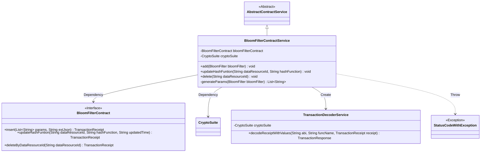
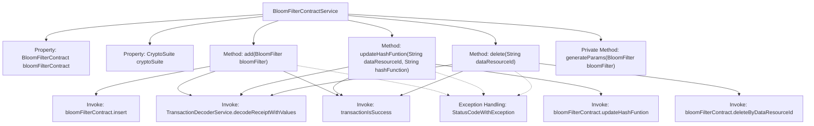

# Basic Information

|      |      |
|------|------|
| Name | BloomFilterContractService |
| Language | .java |
| Code Path | WeFe/union/union-service/src/main/java/com/welab/wefe/union/service/service/contract/BloomFilterContractService.java |
| Package Name | com.welab.wefe.union.service.service.contract |
| Dependencies | ['com.welab.wefe.common.StatusCode', 'com.welab.wefe.common.data.mongodb.entity.union.BloomFilter', 'com.welab.wefe.common.exception.StatusCodeWithException', 'com.welab.wefe.common.util.DateUtil', 'com.welab.wefe.common.util.JObject', 'com.welab.wefe.common.util.StringUtil', 'com.welab.wefe.union.service.contract.BloomFilterContract', 'org.fisco.bcos.sdk.crypto.CryptoSuite', 'org.fisco.bcos.sdk.model.TransactionReceipt', 'org.fisco.bcos.sdk.transaction.codec.decode.TransactionDecoderService', 'org.fisco.bcos.sdk.transaction.model.dto.TransactionResponse', 'org.springframework.beans.factory.annotation.Autowired', 'org.springframework.stereotype.Service', 'java.util.ArrayList', 'java.util.Date', 'java.util.List'] |
| Brief Description | BloomFilterContractService provides the functionality to add, update, and delete Bloom filters by operating smart contracts and verifying transaction results, throwing errors in case of exceptions. |

# Description

BloomFilterContractService is a service class that inherits from AbstractContractService, designed to manage Bloom filter-related operations. It implements add, update, and delete functionalities through BloomFilterContract and CryptoSuite. The add operation inserts Bloom filter parameters and extended JSON into the contract, the update operation modifies the hash function and timestamp of a specified data resource, and the delete operation removes records based on the data resource ID. All operations verify results through transaction receipt decoding and throw StatusCodeWithException in case of exceptions. The generateParams method is used to generate the parameter list for the Bloom filter.

# Class Summary

| Name   | Type  | Description |
|-------|------|-------------|
| BloomFilterContractService | class | BloomFilterContractService provides Bloom filter operations, including adding, updating hash functions, and deletion functionalities. It processes transaction receipts, checks results, and throws system errors in case of exceptions. |

## Class BloomFilterContractService

|      |      |
|------|------|
| Access Modifier | @Service;public |
| Type | class |
| Name | BloomFilterContractService |
| Description | BloomFilterContractService provides Bloom filter operations, including adding, updating hash functions, and deletion functionalities. It processes transaction receipts, checks results, and throws system errors in case of exceptions. |

### UML Class Diagram

This class diagram illustrates that BloomFilterContractService inherits from AbstractContractService and depends on the BloomFilterContract interface and CryptoSuite class. Its core functionalities include adding, updating, and deleting BloomFilter data by invoking smart contract methods and decoding transaction receipts to verify operation results. Exception handling utilizes StatusCodeWithException, while the internal generateParams method prepares contract invocation parameters. TransactionDecoderService decodes transaction receipts, encapsulating blockchain interaction logic within the service class.

### Internal Method Call Graph

The flowchart depicts the core structure and invocation relationships of the BloomFilterContractService class. Inheriting from AbstractContractService, this class contains two auto-injected properties and four primary methods. The three public methods (add/update/delete) follow a similar workflow: invoking contract methods → decoding transaction receipts → verifying transaction results → exception handling. The private method generateParams is used to construct parameter lists. All public methods utilize TransactionDecoderService to parse transaction results, uniformly call transactionIsSuccess to validate transaction status, and throw StatusCodeWithException when exceptions occur.

### Field List

| Name  | Type  | Description |
|-------|-------|------|
| bloomFilterContract | BloomFilterContract | Automatically inject the Bloom filter contract instance. |
| cryptoSuite | CryptoSuite | Automatically inject encrypted tool component instances. |

### Method List

| Name  | Type  | Description |
|-------|-------|------|
| delete | void | Delete the BloomFilter information for the specified data resource ID, process the transaction receipt, and check the result, throwing an exception if it fails. |
| updateHashFuntion | void | Update the hash function method by passing in the data resource ID and the new hash function, record the update time, and invoke the contract to update. Decode the transaction receipt to verify success; throw an exception if it fails. |
| add | void | The method `add` inserts Bloom filter data into the contract, processes transaction receipts, and checks the results, throwing an exception upon failure. |
| generateParams | List<String> | Method for generating parameter list: Receives a Bloom filter object, extracts the data resource ID, hash functions, creation and update times, and returns a string list. |

