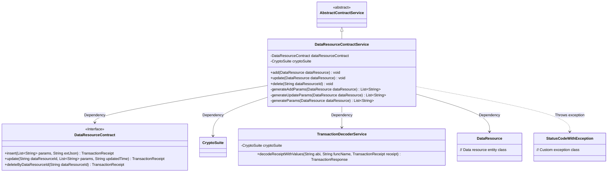
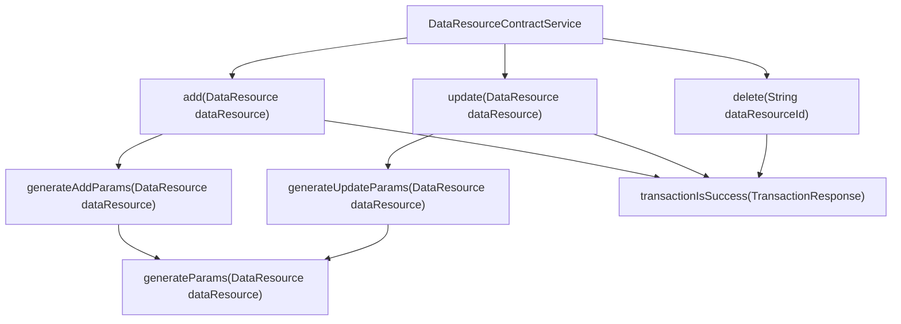
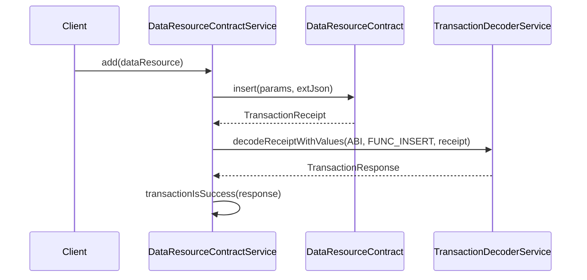

# Basic Information

|      |      |
|------|------|
| Name | DataResourceContractService |
| Language | .java |
| Code Path | WeFe/union/union-service/src/main/java/com/welab/wefe/union/service/service/contract/DataResourceContractService.java |
| Package Name | com.welab.wefe.union.service.service.contract |
| Dependencies | ['com.welab.wefe.common.StatusCode', 'com.welab.wefe.common.data.mongodb.entity.union.DataResource', 'com.welab.wefe.common.exception.StatusCodeWithException', 'com.welab.wefe.common.util.DateUtil', 'com.welab.wefe.common.util.JObject', 'com.welab.wefe.common.util.StringUtil', 'com.welab.wefe.union.service.contract.DataResourceContract', 'org.fisco.bcos.sdk.crypto.CryptoSuite', 'org.fisco.bcos.sdk.model.TransactionReceipt', 'org.fisco.bcos.sdk.transaction.codec.decode.TransactionDecoderService', 'org.fisco.bcos.sdk.transaction.model.dto.TransactionResponse', 'org.springframework.beans.factory.annotation.Autowired', 'org.springframework.stereotype.Service', 'java.util.ArrayList', 'java.util.Date', 'java.util.List'] |
| Brief Description | The DataResourceContractService provides functionalities for adding, deleting, and modifying data resources, operating through smart contracts to verify transaction results and handle exceptional cases. |

# Description

The DataResourceContractService is a service class that inherits from AbstractContractService and is used to manage the addition, deletion, and modification operations of data resources. It interacts with the blockchain through the auto-injected DataResourceContract and CryptoSuite. The add method converts a DataResource object into a parameter list and invokes the contract's insert method, processing the transaction receipt and checking for success. The update method modifies data resource information and records the update time. The delete method removes a data resource based on its ID. Private methods generateAddParams and generateUpdateParams are used to generate parameter lists required for contract calls, including attributes such as resource ID, member ID, name, and description. All operations catch exceptions and throw StatusCodeWithException.

# Class Summary

| Name   | Type  | Description |
|-------|------|-------------|
| DataResourceContractService | class | The DataResourceContractService provides CRUD (Create, Read, Update, Delete) operations for data resources. It interacts with blockchain contracts, processes transaction receipts, validates results, and throws system errors upon exceptions. |

## Class DataResourceContractService

|      |      |
|------|------|
| Access Modifier | @Service;public |
| Type | class |
| Name | DataResourceContractService |
| Description | The DataResourceContractService provides CRUD (Create, Read, Update, Delete) operations for data resources. It interacts with blockchain contracts, processes transaction receipts, validates results, and throws system errors upon exceptions. |

### UML Class Diagram

This code describes a data resource contract service class (DataResourceContractService), which inherits from the abstract contract service class (AbstractContractService) and primarily provides CRUD operations for data resources. The service class interacts with the blockchain contract through the injected DataResourceContract interface, uses TransactionDecoderService to parse transaction receipts, and handles potential StatusCodeWithException exceptions. The class diagram clearly illustrates the dependency relationships between the service class and the contract interface, cryptographic suite, transaction decoding service, and data resource entity class, while also reflecting the inheritance structure and exception handling mechanism.

### Internal Method Call Graph

This code implements the DataResourceContractService class, primarily providing CRUD operations for data resources. The flowchart illustrates core methods and their invocation relationships within the class, while the sequence diagram demonstrates the complete call chain of the add method. The class manipulates data resources through smart contracts, encompassing key steps such as parameter generation, transaction submission, receipt decoding, and result verification, employing a unified exception handling mechanism to ensure operational reliability.

### Field List

| Name  | Type  | Description |
|-------|-------|------|
| dataResourceContract | DataResourceContract | Automatically inject the DataResourceContract instance. |
| cryptoSuite | CryptoSuite | Automatically inject encrypted tool component instances. |

### Method List

| Name  | Type  | Description |
|-------|-------|------|
| update | void | Update DataResource information, process transaction receipts and check results, throw an exception on failure. |
| delete | void | Method for deleting specified data resources: call the contract deletion interface, process the transaction receipt and verify the result, throwing a system error in case of exceptions. |
| add | void | This method adds the data resource to the blockchain, processes the transaction response, and checks the success status, throwing an exception if it fails. |
| generateAddParams | List<String> | Generate a method to add parameter list: Include the data resource ID, member ID, type, creation and update time into the list and return it. |
| generateUpdateParams | List<String> | Generate the parameter update list, invoke the generateParams method to process the dataResource and return the result. |
| generateParams | List<String> | Generate parameter list method to convert multiple attributes of a data resource object into a string list, with null values handled as blanks. |

