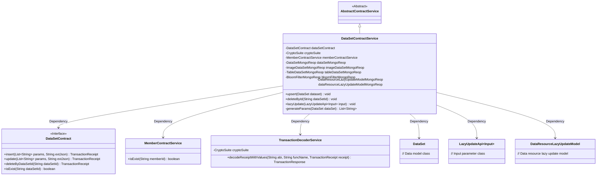
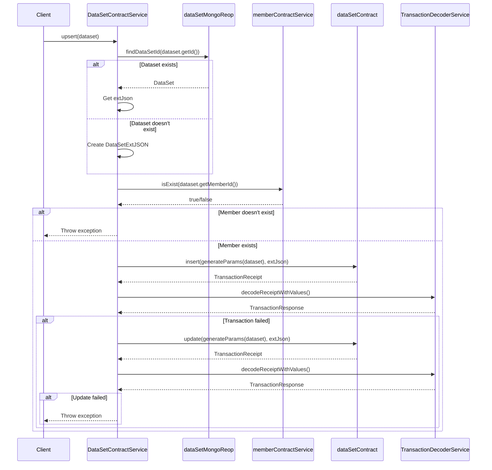

# Basic Information

|      |      |
|------|------|
| Name | DataSetContractService |
| Language | .java |
| Code Path | WeFe/union/union-service/src/main/java/com/welab/wefe/union/service/service/contract/DataSetContractService.java |
| Package Name | com.welab.wefe.union.service.service.contract |
| Dependencies | ['com.alibaba.fastjson.JSON', 'com.welab.wefe.common.StatusCode', 'com.welab.wefe.common.data.mongodb.entity.base.AbstractMongoModel', 'com.welab.wefe.common.data.mongodb.entity.union.DataResourceLazyUpdateModel', 'com.welab.wefe.common.data.mongodb.entity.union.ext.DataSetExtJSON', 'com.welab.wefe.common.data.mongodb.repo', 'com.welab.wefe.common.exception.StatusCodeWithException', 'com.welab.wefe.common.util.DateUtil', 'com.welab.wefe.common.util.JObject', 'com.welab.wefe.common.util.StringUtil', 'com.welab.wefe.union.service.api.dataresource.LazyUpdateApi', 'com.welab.wefe.union.service.contract.DataSetContract', 'com.welab.wefe.union.service.entity.DataSet', 'org.fisco.bcos.sdk.crypto.CryptoSuite', 'org.fisco.bcos.sdk.model.TransactionReceipt', 'org.fisco.bcos.sdk.transaction.codec.decode.TransactionDecoderService', 'org.fisco.bcos.sdk.transaction.model.dto.TransactionResponse', 'org.springframework.beans.factory.annotation.Autowired', 'org.springframework.stereotype.Service', 'java.util.ArrayList', 'java.util.List'] |
| Brief Description | Dataset service class, providing CRUD functionality, handling dataset insertion, updates, deletions, and lazy update operations, dependent on multiple Mongo repositories and smart contract interactions. |

# Description

The `DataSetContractService` is a service class that inherits from `AbstractContractService`, primarily used for managing CRUD operations on datasets. By injecting multiple MongoDB repositories and smart contract services, it implements functionalities such as dataset upload, update, deletion, and deferred updates. Upload and update operations first verify member existence before processing through smart contracts, throwing exceptions on failure. Deletion operations validate dataset existence before execution. The deferred update feature updates corresponding statistical information to MongoDB based on data types. The `generateParams` method generates parameter lists for datasets. All operations include exception handling and status code returns.

# Class Summary

| Name   | Type  | Description |
|-------|------|-------------|
| DataSetContractService | class | Dataset service class, which includes insert, update, delete, and delayed update functionalities, processes dataset information and verifies member existence, supporting operations on various types of data resources. |

## Class DataSetContractService

|      |      |
|------|------|
| Access Modifier | @Service;public |
| Type | class |
| Name | DataSetContractService |
| Description | Dataset service class, which includes insert, update, delete, and delayed update functionalities, processes dataset information and verifies member existence, supporting operations on various types of data resources. |

### UML Class Diagram

This code demonstrates a DataSet Contract Service (DataSetContractService) that inherits from an Abstract Contract Service (AbstractContractService). Its primary functions include CRUD operations for datasets. The service obtains multiple MongoDB repositories and smart contract interfaces through dependency injection. The core method upsert() implements dataset insertion or update logic, deleteById() handles deletion operations, and lazyUpdate() implements lazy update functionality. The class diagram clearly illustrates the relationships between the service and various dependent components, including contract interfaces, member services, transaction decoders, and various data models.

### Internal Method Call Graph

```mermaid
graph TD
    A["Class DataSetContractService"]
    B["Property: DataSetContract dataSetContract"]
    C["Property: CryptoSuite cryptoSuite"]
    D["Property: MemberContractService memberContractService"]
    E["Property: DataSetMongoReop dataSetMongoReop"]
    F["Property: ImageDataSetMongoReop imageDataSetMongoReop"]
    G["Property: TableDataSetMongoReop tableDataSetMongoReop"]
    H["Property: BloomFilterMongoReop bloomFilterMongoReop"]
    I["Property: DataResourceLazyUpdateModelMongoReop dataResourceLazyUpdateModelMongoReop"]
    J["Method: upsert(DataSet dataset)"]
    K["Method: deleteById(String dataSetId)"]
    L["Method: lazyUpdate(LazyUpdateApi.Input input)"]
    M["Private Method: generateParams(DataSet dataSet)"]

    A --> B
    A --> C
    A --> D
    A --> E
    A --> F
    A --> G
    A --> H
    A --> I
    A --> J
    A --> K
    A --> L
    A --> M
```

This code implements the DataSetContractService class, primarily handling CRUD operations for datasets. The class contains multiple auto-injected dependencies such as dataset contract, crypto suite, member contract service, etc. The core method upsert implements dataset insertion or update logic: first checking dataset existence, then validating member validity, and finally executing operations through blockchain contracts. The deleteById method deletes datasets by specified ID, while the lazyUpdate method handles delayed updates of data resources. The private generateParams method generates parameter lists required for dataset operations. The entire process involves database queries, blockchain transactions, and exception handling, demonstrating a complete chain for complex business logic processing.

### Field List

| Name  | Type  | Description |
|-------|-------|------|
| bloomFilterMongoReop | BloomFilterMongoReop | Use @Autowired to automatically inject the BloomFilterMongoReop repository instance. |
| dataSetContract | DataSetContract | Automatically inject the DataSetContract instance. |
| imageDataSetMongoReop | ImageDataSetMongoReop | Using @Autowired to automatically inject the ImageDataSetMongoReop repository instance. |
| dataSetMongoReop | DataSetMongoReop | Use @Autowired to automatically inject the DataSetMongoReop repository instance. |
| tableDataSetMongoReop | TableDataSetMongoReop | Use @Autowired to automatically inject the MongoDB repository instance of TableDataSetMongoReop. |
| memberContractService | MemberContractService | The code snippet uses the @Autowired annotation to automatically inject an instance of MemberContractService. |
| dataResourceLazyUpdateModelMongoReop | DataResourceLazyUpdateModelMongoReop | Using @Autowired to automatically inject the DataResourceLazyUpdateModelMongoReop repository instance. |
| cryptoSuite | CryptoSuite | Use @Autowired to automatically inject the CryptoSuite encryption tool component. |

### Method List

| Name  | Type  | Description |
|-------|-------|------|
| upsert | void | The method `upsert` is used to insert or update a dataset. It checks if the member ID exists; if not, an error is reported. If the dataset exists, its extended JSON is retrieved; otherwise, a new one is created. It attempts to insert the data, and if that fails, it performs an update. If the operation fails, an exception is thrown. |
| deleteById | void | This method deletes a dataset based on its ID, checks for existence before invoking the contract deletion, processes the transaction receipt, and verifies the result, throwing an exception upon failure. |
| lazyUpdate | void | The lazy update method queries the corresponding data source based on the input type, verifies it, then creates or updates the lazy update model, sets various statistical information, and saves it. |
| generateParams | List<String> | This method converts the attributes of the DataSet object into a list of strings, including ID, member ID, name, number of rows and columns, number of features, public level, usage count, description, tags, and creation/update times. |

