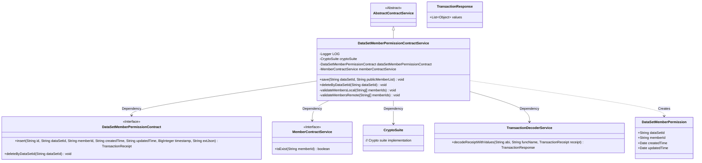
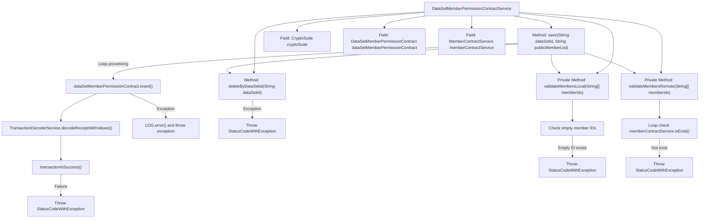

# Basic Information

|      |      |
|------|------|
| Name | DataSetMemberPermissionContractService |
| Language | .java |
| Code Path | WeFe/union/union-service/src/main/java/com/welab/wefe/union/service/service/contract/DataSetMemberPermissionContractService.java |
| Package Name | com.welab.wefe.union.service.service.contract |
| Dependencies | ['com.welab.wefe.common.StatusCode', 'com.welab.wefe.common.exception.StatusCodeWithException', 'com.welab.wefe.common.util.DateUtil', 'com.welab.wefe.union.service.contract.DataSetMemberPermissionContract', 'com.welab.wefe.union.service.entity.DataSetMemberPermission', 'org.fisco.bcos.sdk.crypto.CryptoSuite', 'org.fisco.bcos.sdk.model.TransactionReceipt', 'org.fisco.bcos.sdk.transaction.codec.decode.TransactionDecoderService', 'org.fisco.bcos.sdk.transaction.model.dto.TransactionResponse', 'org.slf4j.Logger', 'org.slf4j.LoggerFactory', 'org.springframework.beans.factory.annotation.Autowired', 'org.springframework.stereotype.Service', 'java.math.BigInteger', 'java.util.Arrays', 'java.util.List', 'java.util.stream.Collectors'] |
| Brief Description | The dataset member permission service class provides functionality for saving and deleting permissions. When saving, it validates the member ID's effectiveness, deletes old permissions before inserting new ones, and throws status code errors in case of exceptions. |

# Description

The `DataSetMemberPermissionContractService` is a service class that inherits from `AbstractContractService`, primarily used for managing dataset member permissions. It handles permission saving and deletion operations through auto-injected components. The `save` method accepts a dataset ID and a member list, first validating the local and remote validity of member IDs, then deleting old permissions and inserting new permission records. During insertion, it generates transaction receipts and checks execution status, throwing exceptions on failure. The `deleteByDataSetId` method deletes permission records based on the dataset ID. Local validation checks for empty member IDs, while remote validation ensures member existence. Exception handling includes logging and status code returns.

# Class Summary

| Name   | Type  | Description |
|-------|------|-------------|
| DataSetMemberPermissionContractService | class | The `DataSetMemberPermissionContractService` class is used to manage dataset member permissions, including functionalities for saving and deleting permissions. During saving, it validates the member ID's effectiveness, deletes old permissions before inserting new ones. Exception handling covers parameter validation and system errors. |

## Class DataSetMemberPermissionContractService

|      |      |
|------|------|
| Access Modifier | @Service;public |
| Type | class |
| Name | DataSetMemberPermissionContractService |
| Description | The `DataSetMemberPermissionContractService` class is used to manage dataset member permissions, including functionalities for saving and deleting permissions. During saving, it validates the member ID's effectiveness, deletes old permissions before inserting new ones. Exception handling covers parameter validation and system errors. |

### UML Class Diagram

This code implements a dataset member permission management service, with core functionalities including permission saving and deletion by dataset ID. The service ensures data validity through local validation (empty ID check) and remote validation (member existence verification), leveraging blockchain smart contracts for persistence operations. The class diagram illustrates the service's collaboration with cryptographic components, contract interfaces, member services, and transaction decoders, reflecting layered design and interface segregation principles. Key business processes involve permission object creation, blockchain transaction submission, and receipt parsing.

### Internal Method Call Graph

This code represents a dataset member permission contract service class, primarily handling save and delete operations for member permissions. The flowchart illustrates the class structure and core method invocation chain: The save method first validates member IDs, deletes old permissions, then loops to insert new permission records; The delete method directly removes specified dataset permissions; Two validation methods respectively check local format and remote member existence. Key operations involve blockchain transaction processing and exception status code returns.

### Field List

| Name  | Type  | Description |
|-------|-------|------|
| memberContractService | MemberContractService | The code snippet uses @Autowired to automatically inject an instance of the MemberContractService. |
| cryptoSuite | CryptoSuite | Automated Injection Encryption Tool Component. |
| dataSetMemberPermissionContract | DataSetMemberPermissionContract | Automatically inject dataset member permission contract instance. |
| LOG = LoggerFactory.getLogger(DataSetMemberPermissionContractService.class) | Logger | Define the logger LOG for logging output in the DataSetMemberPermissionContractService class. |

### Method List

| Name  | Type  | Description |
|-------|-------|------|
| save | void | The method `save` is used to save dataset permissions: it verifies local and remote member IDs, deletes old permissions, then inserts new permissions one by one into the blockchain contract, handling transaction results and exceptions. |
| deleteByDataSetId | void | This method deletes relevant permissions based on the dataset ID and throws a system error exception if the operation fails. |
| validateMembersLocal | void | This method verifies whether the member ID array contains empty strings. If an empty ID is found, it throws an invalid parameter exception with the message "Contains empty member ID." |
| validateMembersRemote | void | Verify the validity of remote member IDs, and throw an invalid parameter exception if any ID does not exist. |

