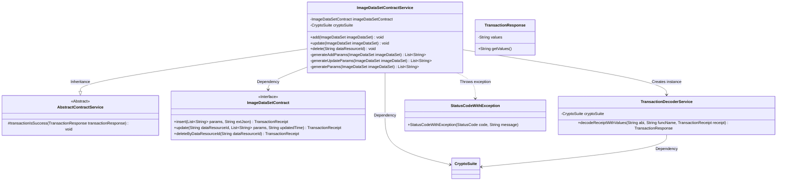
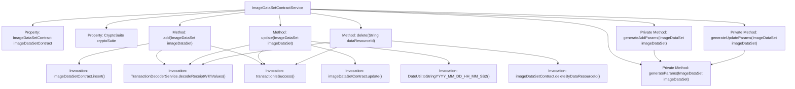

# Basic Information

|      |      |
|------|------|
| Name | ImageDataSetContractService |
| Language | .java |
| Code Path | WeFe/union/union-service/src/main/java/com/welab/wefe/union/service/service/contract/ImageDataSetContractService.java |
| Package Name | com.welab.wefe.union.service.service.contract |
| Dependencies | ['com.welab.wefe.common.StatusCode', 'com.welab.wefe.common.data.mongodb.entity.union.ImageDataSet', 'com.welab.wefe.common.exception.StatusCodeWithException', 'com.welab.wefe.common.util.DateUtil', 'com.welab.wefe.common.util.JObject', 'com.welab.wefe.common.util.StringUtil', 'com.welab.wefe.union.service.contract.ImageDataSetContract', 'org.fisco.bcos.sdk.crypto.CryptoSuite', 'org.fisco.bcos.sdk.model.TransactionReceipt', 'org.fisco.bcos.sdk.transaction.codec.decode.TransactionDecoderService', 'org.fisco.bcos.sdk.transaction.model.dto.TransactionResponse', 'org.springframework.beans.factory.annotation.Autowired', 'org.springframework.stereotype.Service', 'java.util.ArrayList', 'java.util.Date', 'java.util.List'] |
| Brief Description | The ImageDataSetContractService provides functionalities for adding, deleting, and modifying image datasets. It operates data through smart contracts, processes transaction receipts, and validates results, throwing errors in case of exceptions. |

# Description

The `ImageDataSetContractService` is a service class that inherits from `AbstractContractService` and is used to manage image dataset contract operations. It interacts with the blockchain by autowiring `ImageDataSetContract` and `CryptoSuite`. Its primary functions include adding, updating, and deleting image datasets.  

The add operation generates parameters via `generateAddParams` and invokes the contract insertion method. The update operation uses `generateUpdateParams` to generate parameters and records the update time. The delete operation is executed based on the `dataResourceId`.  

All operations involve parsing transaction receipts through `TransactionDecoderService` and verifying success status. If an exception occurs, it throws `StatusCodeWithException`. The parameter generation methods handle various attributes of the dataset, ensuring non-null values are converted to empty strings.

# Class Summary

| Name   | Type  | Description |
|-------|------|-------------|
| ImageDataSetContractService | class | The ImageDataSetContractService provides functionalities for adding, deleting, and modifying image datasets. It operates data through smart contracts, processes transaction receipts, and verifies results, throwing errors in case of exceptions. |

## Class ImageDataSetContractService

|      |      |
|------|------|
| Access Modifier | @Service;public |
| Type | class |
| Name | ImageDataSetContractService |
| Description | The ImageDataSetContractService provides functionalities for adding, deleting, and modifying image datasets. It operates data through smart contracts, processes transaction receipts, and verifies results, throwing errors in case of exceptions. |

### UML Class Diagram

This code demonstrates an image dataset contract service class that inherits from an abstract contract service class and implements CRUD operations for image datasets. Key functionalities include inserting, updating, and deleting image datasets via smart contracts, processing transaction receipts, and verifying transaction results. The class diagram clearly illustrates inheritance, dependency, and association relationships between classes, including the blockchain-interfacing contract interface, transaction decoding service, and exception handling mechanism. By encapsulating blockchain operation details, this service provides upper layers with a streamlined dataset management interface.

### Internal Method Call Graph

This flowchart illustrates the structure of the ImageDataSetContractService class and its key method invocation relationships. The class contains three core methods (add/update/delete) and three parameter generation methods, all centered around operations with the ImageDataSetContract smart contract. Each core method follows a similar workflow: invoking contract methods → decoding transaction receipts → verifying transaction results, throwing StatusCodeWithException on errors. The private method generateParams is reused by other parameter generation methods, demonstrating code reusability.

### Field List

| Name  | Type  | Description |
|-------|-------|------|
| imageDataSetContract | ImageDataSetContract | Using @Autowired to automatically inject an instance of ImageDataSetContract. |
| cryptoSuite | CryptoSuite | Automatically inject encrypted tool component instances. |

### Method List

| Name  | Type  | Description |
|-------|-------|------|
| generateAddParams | List<String> | Generate a method to add parameter list: Include the data resource ID, generation parameters, creation and update times into the list and return it. |
| generateUpdateParams | List<String> | Generate the update parameter list and invoke the universal parameter generation method to process the image dataset. |
| delete | void | This method deletes the record of a specified data resource ID through blockchain smart contracts, processes transaction receipts, and checks the execution result, throwing a system error exception upon failure. |
| add | void | This method is used to add an image dataset, invoking the contract to insert data and process the transaction receipt. It returns a response value upon success or throws an exception indicating a system error upon failure. |
| update | void | Update the ImageDataSet data, generate parameters, and invoke the contract to update, process the transaction receipt, and throw an exception if it fails. |
| generateParams | List<String> | This method generates a parameter list containing the job type of the image dataset, label list, annotated quantity, annotation completion status, and file size, with null values converted to empty strings. |

