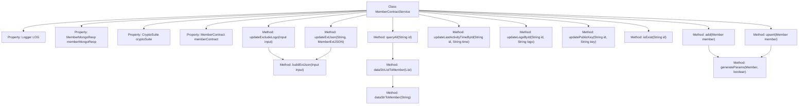

# Basic Information

|      |      |
|------|------|
| Name | MemberContractService |
| Language | .java |
| Code Path | WeFe/union/union-service/src/main/java/com/welab/wefe/union/service/service/contract/MemberContractService.java |
| Package Name | com.welab.wefe.union.service.service.contract |
| Dependencies | ['com.welab.wefe.common.StatusCode', 'com.welab.wefe.common.data.mongodb.entity.union.ext.MemberExtJSON', 'com.welab.wefe.common.data.mongodb.repo.MemberMongoReop', 'com.welab.wefe.common.exception.StatusCodeWithException', 'com.welab.wefe.common.util.DateUtil', 'com.welab.wefe.common.util.JObject', 'com.welab.wefe.common.util.StringUtil', 'com.welab.wefe.union.service.api.member.UpdateExcludeLogoApi', 'com.welab.wefe.union.service.contract.MemberContract', 'com.welab.wefe.union.service.entity.Member', 'org.apache.commons.collections4.CollectionUtils', 'org.fisco.bcos.sdk.abi.datatypes.generated.tuples.generated.Tuple2', 'org.fisco.bcos.sdk.crypto.CryptoSuite', 'org.fisco.bcos.sdk.model.TransactionReceipt', 'org.fisco.bcos.sdk.transaction.codec.decode.TransactionDecoderService', 'org.fisco.bcos.sdk.transaction.model.dto.TransactionResponse', 'org.slf4j.Logger', 'org.slf4j.LoggerFactory', 'org.springframework.beans.factory.annotation.Autowired', 'org.springframework.stereotype.Service', 'java.lang.reflect.Field', 'java.math.BigInteger', 'java.util.ArrayList', 'java.util.Date', 'java.util.List'] |
| Brief Description | The MemberContractService provides member management functionalities, including adding, updating, and querying member information, processing blockchain transactions, and verifying results. It supports updating member attributes such as logos, public keys, and activity timestamps, ensuring data consistency through transactions. |

# Description

The MemberContractService is a blockchain-based member management service class that inherits from AbstractContractService. It interacts with the blockchain through member contracts to provide CRUD (Create, Read, Update, Delete) functionality for member information. Key features include: adding members (add), updating member information (upsert), updating member information excluding the logo (updateExcludeLogo), updating a member's last activity time (updateLastActivityTimeById), updating a member's logo (updateLogoById), updating a member's public key (updatePublicKey), checking if a member exists (isExist), and querying all members (queryAll). The service class uses MongoDB to store extended member information and leverages TransactionDecoderService to parse blockchain transaction receipts, handling various exceptions such as data already existing or data not found. Member information is converted between pipe-delimited strings and Member objects.

# Class Summary

| Name   | Type  | Description |
|-------|------|-------------|
| MemberContractService | class | The MemberContractService provides member management functionalities, including adding, updating, and querying member information, processing blockchain transactions, and logging activities. |


## Class MemberContractService

|      |      |
|------|------|
| Access Modifier | @Service;public |
| Type | class |
| Name | MemberContractService |
| Description | The MemberContractService provides member management functionalities, including adding, updating, and querying member information, processing blockchain transactions, and logging activities. |


### UML Class Diagram

```mermaid
classDiagram
    class AbstractContractService {
        <<abstract>>
    }

    class MemberContractService {
        -Logger LOG
        -MemberMongoReop memberMongoReop
        -CryptoSuite cryptoSuite
        -MemberContract memberContract
        +add(Member member) void
        +upsert(Member member) void
        +updateExcludeLogo(UpdateExcludeLogoApi.Input input) void
        +buildExtJson(UpdateExcludeLogoApi.Input input) JObject
        +updateLastActivityTimeById(String id, String lastActivityTime) void
        +updateLogoById(String id, String logo) void
        +updatePublicKey(String id, String publicKey) void
        +isExist(String id) boolean
        +queryAll(String id) List~Member~
        -dataStrListToMember(List~String~ dataStrList) List~Member~
        -dataStrToMember(String dataStr) Member
        -generateParams(Member member, boolean isContainPublicKey) List~String~
        +updateExtJson(String memberId, MemberExtJSON extJSON) void
    }

    class Member {
        +String id
        +String name
        +String mobile
        +int allowOpenDataSet
        +int hidden
        +int freezed
        +int lostContact
        +String logo
        +String publicKey
        +String email
        +String gatewayUri
        +Date createdTime
        +Date updatedTime
        +long lastActivityTime
        +long logTime
        +String extJson
    }

    class MemberContract {
        <<Interface>>
        +insert(List~String~ params, String extJson) TransactionReceipt
        +updateExcludePublicKey(List~String~ params, String extJson) TransactionReceipt
        +updateExcludeLogo(List~String~ params, String extJson) TransactionReceipt
        +updateLastActivityTimeById(String id, String lastActivityTime) TransactionReceipt
        +updateLogoById(String id, String logo) TransactionReceipt
        +updatePublicKey(String id, String publicKey) TransactionReceipt
        +isExist(String id) Boolean
        +selectById(String id) Tuple2~BigInteger, List~String~~
        +count(String id, String name, String mobile, String email, String gatewayUri) BigInteger
        +selectByPage(String id, String name, String mobile, String email, String gatewayUri, BigInteger offset, BigInteger limit) Tuple2~BigInteger, List~String~~
        +updateExtJson(String memberId, String extJson) TransactionReceipt
    }

    class TransactionDecoderService {
        -CryptoSuite cryptoSuite
        +decodeReceiptWithValues(String abi, String functionName, TransactionReceipt receipt) TransactionResponse
    }

    class TransactionResponse {
        +String values
        +String returnMessage
        +getValues() String
        +getReturnMessage() String
    }

    class MemberExtJSON {
        +String secretKeyType
        +Boolean memberGatewayTlsEnable
    }

    class UpdateExcludeLogoApi$Input {
        +String id
        +String name
        +String mobile
        +Boolean allowOpenDataSet
        +Boolean hidden
        +Boolean freezed
        +Boolean lostContact
        +String publicKey
        +String email
        +String gatewayUri
        +String curMemberId
    }

    AbstractContractService <|-- MemberContractService
    MemberContractService --> MemberContract : Dependency
    MemberContractService --> MemberMongoReop : Dependency
    MemberContractService --> CryptoSuite : Dependency
    MemberContractService --> TransactionDecoderService : Dependency
    MemberContractService --> Member : Dependency
    MemberContractService --> MemberExtJSON : Dependency
    MemberContractService --> UpdateExcludeLogoApi$Input : Dependency
    TransactionDecoderService --> CryptoSuite : Dependency
    TransactionDecoderService --> TransactionResponse : Dependency
```

This class diagram illustrates the structure of MemberContractService and its related classes. MemberContractService inherits from AbstractContractService and depends on components such as MemberContract, MemberMongoReop, and CryptoSuite to provide core member management functionalities, including adding, updating, and querying member information. The Member class represents the member entity, MemberContract is the smart contract interface, and TransactionDecoderService is used to decode transaction responses. The overall design reflects the layered architecture of a blockchain application, where the service layer handles business logic and the contract layer interacts with the blockchain.


### Internal Method Call Graph



This flowchart illustrates the complete structure of the MemberContractService class, comprising 4 auto-injected properties and 12 core methods. The primary functionalities are categorized into member data operations (add/upsert/update series), query methods (isExist/queryAll), and utility methods (generateParams/dataStrToMember, etc.). All blockchain operations follow the standard workflow of "send transaction → decode receipt → verify result," with exception handling uniformly managed through StatusCodeWithException. Key methods like updateExcludeLogo invoke buildExtJson to construct extended parameters, while data conversion is achieved through dataStrToMember for string-to-object mapping.

### Field List

| Name  | Type  | Description |
|-------|-------|------|
| memberMongoReop | MemberMongoReop | Automatically inject the MemberMongoReop member variable |
| memberContract | MemberContract | Automatically inject the MemberContract member variable. |
| cryptoSuite | CryptoSuite | Use @Autowired to automatically inject the CryptoSuite encryption tool component. |
| LOG = LoggerFactory.getLogger(MemberContractService.class) | Logger | Define a private static constant LOG, using LoggerFactory to obtain the logger instance for the MemberContractService class. |

### Method List

| Name  | Type  | Description |
|-------|-------|------|
| buildExtJson | JObject | Construct an extended JSON object, set the key type and gateway TLS enablement status, iterate through fields to update JSON values, and return the result. |
| updateLastActivityTimeById | void | The method updates the member's last activity time via blockchain, processes transaction responses, and checks for exceptions, throwing a status code exception upon failure. |
| upsert | void | This method is used to update or insert member information. It sends a transaction and processes the returned result, throwing an error if the transaction is abnormal or the data does not exist. When catching an exception, it logs the error and throws a system error. |
| queryAll | List<Member> | Query member information methods: Retrieve a single member by ID or paginate through all members, returning an empty list if no data is found, and throwing a system error in case of exceptions. |
| dataStrListToMember | List<Member> | Convert a list of strings into a list of member objects, returning an empty list if the input is empty. Iterate through each string and call the conversion method, ultimately returning the member list. |
| isExist | boolean | Check if member information exists: Call memberContract.isExist(id). If the returned result is non-null and true, it exists; log the exception and throw a system error status in case of an exception. |
| updatePublicKey | void | Method for updating member public key, sending transaction and handling response, throws exception on failure. |
| updateLogoById | void | The method `updateLogoById` updates a member's logo via the blockchain. It sends the transaction and decodes the response, handling both success and exception cases such as system busy or data not found. Corresponding errors are thrown when exceptions occur. |
| updateExcludeLogo | void | This method is used to update the exclusion flag of a member contract, process input parameters and construct a transaction request, execute the blockchain transaction and handle the response result, capture exceptions and log them. |
| add | void | This method is used to add members to the blockchain contract. It sends the transaction and processes the returned result, checking for transaction exceptions, member existence, and insertion failures, throwing corresponding exceptions. It captures and logs error messages. |
| dataStrToMember | Member | Parse the string into a Member object, handling fields such as ID, name, and phone number, including status, time, and extended information. Returns null for empty strings. |
| generateParams | List<String> | Method for generating parameter list, including basic information such as member ID, name, phone number, and status flag, optional public key, with timestamp added and date formatted. |
| updateExtJson | void | Update member extension JSON data: Retrieve field values via reflection, convert them to underscore format, store in a JSON object, invoke the contract for updating, and verify the transaction result. Throw a system error if an exception occurs. |


