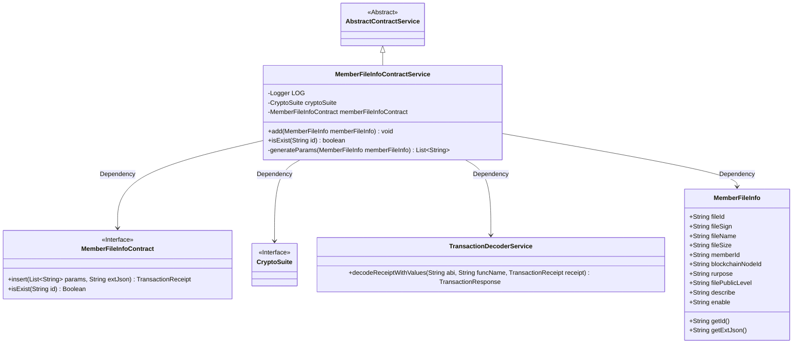
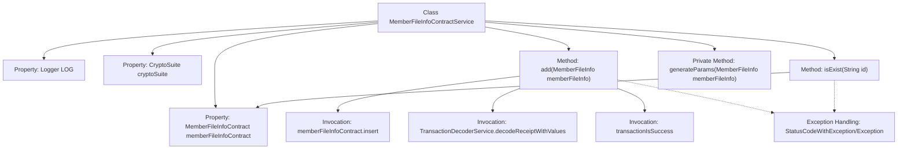
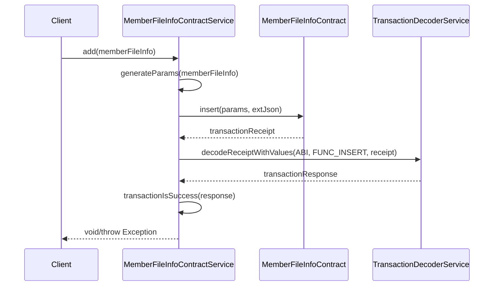

# Basic Information

|      |      |
|------|------|
| Name | MemberFileInfoContractService |
| Language | .java |
| Code Path | WeFe/union/union-service/src/main/java/com/welab/wefe/union/service/service/contract/MemberFileInfoContractService.java |
| Package Name | com.welab.wefe.union.service.service.contract |
| Dependencies | ['com.welab.wefe.common.StatusCode', 'com.welab.wefe.common.data.mongodb.entity.union.MemberFileInfo', 'com.welab.wefe.common.exception.StatusCodeWithException', 'com.welab.wefe.common.util.DateUtil', 'com.welab.wefe.common.util.JObject', 'com.welab.wefe.common.util.StringUtil', 'com.welab.wefe.union.service.contract.MemberFileInfoContract', 'org.fisco.bcos.sdk.crypto.CryptoSuite', 'org.fisco.bcos.sdk.model.TransactionReceipt', 'org.fisco.bcos.sdk.transaction.codec.decode.TransactionDecoderService', 'org.fisco.bcos.sdk.transaction.model.dto.TransactionResponse', 'org.slf4j.Logger', 'org.slf4j.LoggerFactory', 'org.springframework.beans.factory.annotation.Autowired', 'org.springframework.stereotype.Service', 'java.util.ArrayList', 'java.util.Date', 'java.util.List'] |
| Brief Description | The `MemberFileInfoContractService` class provides operations for member file information, including adding files and checking file existence. When adding a file, it generates parameters and sends a transaction, while existence checks are implemented through contract queries. Exception handling logs errors and throws status code exceptions. |

# Description

The code defines a service class named `MemberFileInfoContractService`, which inherits from `AbstractContractService`. Its primary functionalities include adding member file information and checking file existence. The addition feature sends a transaction by invoking the `insert` method of `memberFileInfoContract` and processes the transaction receipt. Existence checking is implemented by calling the `isExist` method. The class utilizes auto-injection of `CryptoSuite` and `MemberFileInfoContract`, and includes logging and exception handling. The `generateParams` method is used to generate the parameter list for member file information.

# Class Summary

| Name   | Type  | Description |
|-------|------|-------------|
| MemberFileInfoContractService | class | The MemberFileInfoContractService class provides operations for member file information, including adding files and checking file existence. When adding a file, it generates parameters and processes transaction responses, while checking existence returns a boolean value. Exception handling logs errors and throws them. |

## Class MemberFileInfoContractService

|      |      |
|------|------|
| Access Modifier | @Service;public |
| Type | class |
| Name | MemberFileInfoContractService |
| Description | The MemberFileInfoContractService class provides operations for member file information, including adding files and checking file existence. When adding a file, it generates parameters and processes transaction responses, while checking existence returns a boolean value. Exception handling logs errors and throws them. |

### UML Class Diagram

Class Diagram Description: This diagram illustrates that MemberFileInfoContractService inherits from AbstractContractService and depends on the MemberFileInfoContract interface, CryptoSuite interface, TransactionDecoderService class, and MemberFileInfo class. The service class provides methods for adding member file information and checking existence, including a private method for generating parameter lists. The components collaborate through clear dependency relationships to achieve blockchain transaction processing functionality.

### Internal Method Call Graph

This flowchart illustrates the core structure and invocation relationships of the MemberFileInfoContractService class, featuring three primary methods: adding member file information (add), checking existence (isExist), and generating parameter lists (generateParams). The sequence diagram details the execution flow of the add method, including parameter generation, contract invocation, transaction decoding, and result validation steps, while marking exception handling paths. The class performs blockchain-related operations through auto-wired cryptoSuite and memberFileInfoContract, with all methods incorporating comprehensive error handling and logging mechanisms.

### Field List

| Name  | Type  | Description |
|-------|-------|------|
| memberFileInfoContract | MemberFileInfoContract | Use @Autowired to automatically inject the MemberFileInfoContract member variable. |
| cryptoSuite | CryptoSuite | The code snippet declares a private field `cryptoSuite` and uses the `@Autowired` annotation to achieve automatic dependency injection. |
| LOG = LoggerFactory.getLogger(MemberFileInfoContractService.class) | Logger | The class MemberFileInfoContractService defines a static immutable logger LOG. |

### Method List

| Name  | Type  | Description |
|-------|-------|------|
| isExist | boolean | Check whether the member file information exists. Returns a boolean value upon success, logs an error and throws a system exception upon failure. |
| add | void | The method `add` is used to add member file information, invoking the contract to insert data and process the transaction result. It logs the operation upon success and throws an error in case of exceptions. |
| generateParams | List<String> | Method to generate parameter list, including file ID, signature, name, size, member ID, node ID, purpose, public level, description, enabled status, and two timestamps. |

