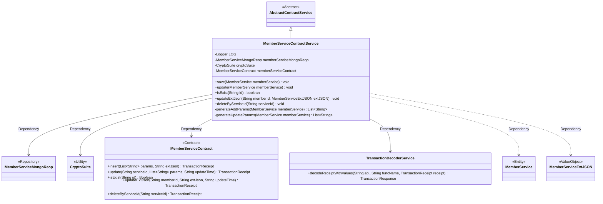
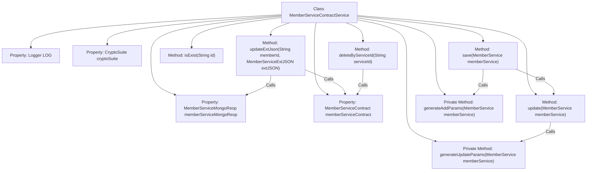

# Basic Information

|      |      |
|------|------|
| Name | MemberServiceContractService |
| Language | .java |
| Code Path | WeFe/union/union-service/src/main/java/com/welab/wefe/union/service/service/contract/MemberServiceContractService.java |
| Package Name | com.welab.wefe.union.service.service.contract |
| Dependencies | ['com.welab.wefe.common.StatusCode', 'com.welab.wefe.common.data.mongodb.entity.union.MemberService', 'com.welab.wefe.common.data.mongodb.entity.union.ext.MemberServiceExtJSON', 'com.welab.wefe.common.data.mongodb.repo.MemberServiceMongoReop', 'com.welab.wefe.common.exception.StatusCodeWithException', 'com.welab.wefe.common.util.DateUtil', 'com.welab.wefe.common.util.JObject', 'com.welab.wefe.common.util.StringUtil', 'com.welab.wefe.union.service.contract.MemberServiceContract', 'org.fisco.bcos.sdk.crypto.CryptoSuite', 'org.fisco.bcos.sdk.model.TransactionReceipt', 'org.fisco.bcos.sdk.transaction.codec.decode.TransactionDecoderService', 'org.fisco.bcos.sdk.transaction.model.dto.TransactionResponse', 'org.slf4j.Logger', 'org.slf4j.LoggerFactory', 'org.springframework.beans.factory.annotation.Autowired', 'org.springframework.stereotype.Service', 'java.lang.reflect.Field', 'java.util.ArrayList', 'java.util.Date', 'java.util.List'] |
| Brief Description | The MemberServiceContractService class provides CRUD functionality for member services, including save, update, existence check, extended JSON update, and delete operations, handling transaction responses and logging. |

# Description

The MemberServiceContractService is a service class that inherits from AbstractContractService, primarily used for managing CRUD operations of member services. It interacts with the blockchain through MemberServiceContract and utilizes TransactionDecoderService to parse transaction receipts. Key functionalities include saving member services (save), updating member services (update), checking service existence (isExist), updating extended JSON (updateExtJson), and deleting services (deleteByServiceId). Both save and update operations generate corresponding parameter lists and handle transaction responses. All operations incorporate exception handling and logging to ensure system stability and traceability.

# Class Summary

| Name   | Type  | Description |
|-------|------|-------------|
| MemberServiceContractService | class | The MemberServiceContractService class provides operations for member service contracts, including saving, updating, checking existence, updating extended JSON, and deletion functionalities, handling transaction responses, and logging. |

## Class MemberServiceContractService

|      |      |
|------|------|
| Access Modifier | @Service;public |
| Type | class |
| Name | MemberServiceContractService |
| Description | The MemberServiceContractService class provides operations for member service contracts, including saving, updating, checking existence, updating extended JSON, and deletion functionalities, handling transaction responses, and logging. |

### UML Class Diagram

This code demonstrates a member service contract service class `MemberServiceContractService`, which inherits from the abstract class `AbstractContractService` and relies on components such as `MemberServiceMongoReop`, `CryptoSuite`, and `MemberServiceContract` to implement CRUD operations for member services. The class processes transactions by invoking smart contract methods and uses `TransactionDecoderService` to parse transaction receipts, while including private methods for generating parameter lists. The overall design reflects a layered architecture that separates business logic from data access and contract interactions.

### Internal Method Call Graph

This code demonstrates a Member Service Contract Service class, primarily handling CRUD operations for member services. The class contains methods for saving, updating, checking existence, updating extended JSON, and deleting services, along with private methods for generating add and update parameters. The core workflow involves blockchain transaction processing, including transaction sending, receipt decoding, and result verification, while integrating MongoDB storage and cryptographic suite functionality. The exception handling mechanism is robust, with key operation information logged.

### Field List

| Name  | Type  | Description |
|-------|-------|------|
| memberServiceContract | MemberServiceContract | Automatically inject the MemberServiceContract member service contract instance. |
| cryptoSuite | CryptoSuite | The code snippet declares a private member variable `cryptoSuite`, which utilizes the `@Autowired` annotation to achieve automatic dependency injection. |
| memberServiceMongoReop | MemberServiceMongoReop | Using @Autowired to automatically inject an instance of MemberServiceMongoReop. |
| LOG = LoggerFactory.getLogger(MemberServiceContractService.class) | Logger | The class MemberServiceContractService defines a static immutable log object LOG. |

### Method List

| Name  | Type  | Description |
|-------|-------|------|
| updateExtJson | void | The method `updateExtJson` updates member extended JSON data: queries existing data, reflects and iterates through fields to update non-null values, invokes the contract to update and checks transaction results, throwing a system error on exceptions. |
| update | void | Update member service information, log records and send transactions, handle transaction responses and exceptions. |
| deleteByServiceId | void | This method deletes data based on the serviceId, invokes the contract deletion interface, and parses the transaction receipt, throwing an exception upon failure. |
| isExist | boolean | Method to check if member service information exists: Call memberServiceContract.isExist(id), returns non-null and true if it exists; logs and throws a system error in case of exceptions. |
| save | void | The method `save` invokes `memberServiceContract` to insert data, processes the transaction receipt, updates or checks for success based on the result, logs the operation, and throws `StatusCodeWithException` or a system error in case of exceptions. |
| generateAddParams | List<String> | Parameter generation list: includes service ID, member ID, name, base URL, API name, service type, query parameters, service status, and current timestamp. |
| generateUpdateParams | List<String> | This method generates an update parameter list, which includes the service name, base URL, API name, service type, query parameters, and service status of the member service. |

