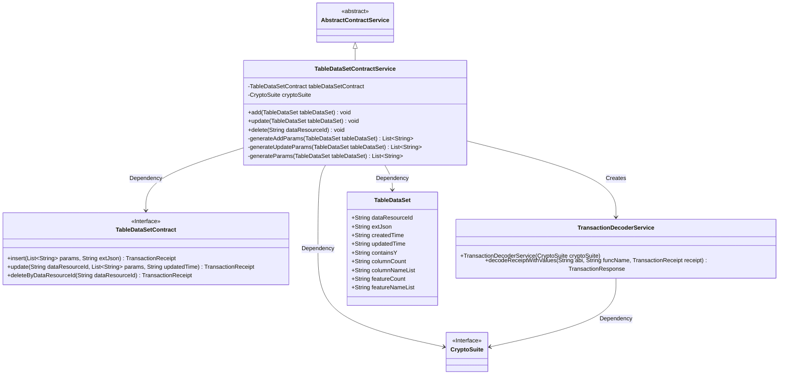
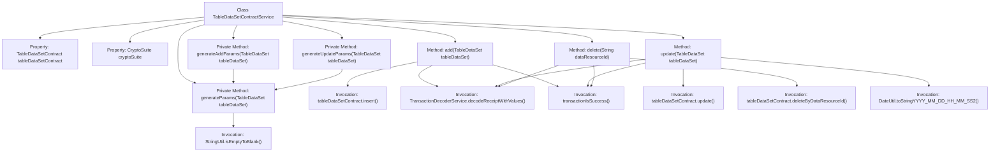

# Basic Information

|      |      |
|------|------|
| Name | TableDataSetContractService |
| Language | .java |
| Code Path | WeFe/union/union-service/src/main/java/com/welab/wefe/union/service/service/contract/TableDataSetContractService.java |
| Package Name | com.welab.wefe.union.service.service.contract |
| Dependencies | ['com.welab.wefe.common.StatusCode', 'com.welab.wefe.common.data.mongodb.entity.union.TableDataSet', 'com.welab.wefe.common.exception.StatusCodeWithException', 'com.welab.wefe.common.util.DateUtil', 'com.welab.wefe.common.util.JObject', 'com.welab.wefe.common.util.StringUtil', 'com.welab.wefe.union.service.contract.TableDataSetContract', 'org.fisco.bcos.sdk.crypto.CryptoSuite', 'org.fisco.bcos.sdk.model.TransactionReceipt', 'org.fisco.bcos.sdk.transaction.codec.decode.TransactionDecoderService', 'org.fisco.bcos.sdk.transaction.model.dto.TransactionResponse', 'org.springframework.beans.factory.annotation.Autowired', 'org.springframework.stereotype.Service', 'java.util.ArrayList', 'java.util.Date', 'java.util.List'] |
| Brief Description | The TableDataSetContractService provides CRUD (Create, Read, Update, Delete) functionality for datasets. It operates through smart contracts, processes transaction receipts, validates results, and throws system errors when exceptions occur. |

# Description

TableDataSetContractService is a service class that inherits from AbstractContractService, designed to manage the addition, deletion, and modification operations of TableDataSet. It interacts with the blockchain through the injected TableDataSetContract and CryptoSuite. The `add` method is used to insert new TableDataSet entries, generating parameters and invoking the contract's `insert` method, while processing transaction receipts and verifying results. The `update` method modifies existing TableDataSet entries by generating parameters and calling the contract's `update` method, similarly handling transaction receipts. The `delete` method removes records by `dataResourceId`, invoking the contract's `deleteByDataResourceId` method. Private methods `generateAddParams` and `generateUpdateParams` are utilized to generate parameter lists required for contract calls, including data resource IDs, feature information, timestamps, etc. All operations capture exceptions and throw StatusCodeWithException.

# Class Summary

| Name   | Type  | Description |
|-------|------|-------------|
| TableDataSetContractService | class | The TableDataSetContractService provides CRUD (Create, Read, Update, Delete) functionality for table datasets, operates data through smart contracts, processes transaction receipts, and checks results, throwing system errors in case of exceptions. |

## Class TableDataSetContractService

|      |      |
|------|------|
| Access Modifier | @Service;public |
| Type | class |
| Name | TableDataSetContractService |
| Description | The TableDataSetContractService provides CRUD (Create, Read, Update, Delete) functionality for table datasets, operates data through smart contracts, processes transaction receipts, and checks results, throwing system errors in case of exceptions. |

### UML Class Diagram

This code illustrates a blockchain-based tabular data service system, where the core class TableDataSetContractService inherits from an abstract service class and manipulates data through smart contract interfaces. The system's primary functionalities include adding, updating, and deleting tabular datasets, utilizing cryptographic suites for transaction decoding, and constructing transaction parameters via parameter generators. The class diagram clearly depicts the dependency relationships between the service layer and contract interfaces, cryptographic components, and data models, as well as the creation process of the transaction decoding service. All operations incorporate exception handling mechanisms to ensure system stability.

### Internal Method Call Graph

This code implements the TableDataSetContractService class, which inherits from AbstractContractService. Its main functionalities include adding (add), updating (update), and deleting (delete) TableDataSet data by interacting with the blockchain through methods of tableDataSetContract. Each operation generates a transaction receipt, decodes it via TransactionDecoderService, and finally checks whether the transaction was successful. The private methods generateAddParams, generateUpdateParams, and generateParams are used to generate parameter lists required for different operations. The code utilizes utility methods such as date formatting and string null value handling.

### Field List

| Name  | Type  | Description |
|-------|-------|------|
| tableDataSetContract | TableDataSetContract | The code snippet uses the @Autowired annotation to automatically inject a private variable of type TableDataSetContract named tableDataSetContract. |
| cryptoSuite | CryptoSuite | Automated injection encryption tool component. |

### Method List

| Name  | Type  | Description |
|-------|-------|------|
| generateAddParams | List<String> | Generate a method for adding parameter lists: receives a table dataset and returns an ordered list containing data resource IDs, generation parameters, and creation/update timestamps. |
| add | void | The method `add` is used to add table data, invoking the contract to insert data and process transaction receipts, throwing an exception upon failure. |
| generateParams | List<String> | Method to generate parameter list: Extract five field values from TableDataSet, convert null values to empty strings, and store them in a list for return. |
| generateUpdateParams | List<String> | Generate the update parameter list and invoke the common parameter generation method to process the table dataset. |
| update | void | Update TableDataSet data, generate parameters and call the contract for updating, process transaction receipts, and throw an exception if failed. |
| delete | void | This method deletes the record of the specified data resource ID through a blockchain smart contract, processes the transaction receipt, and checks the result, throwing an exception upon failure. |

