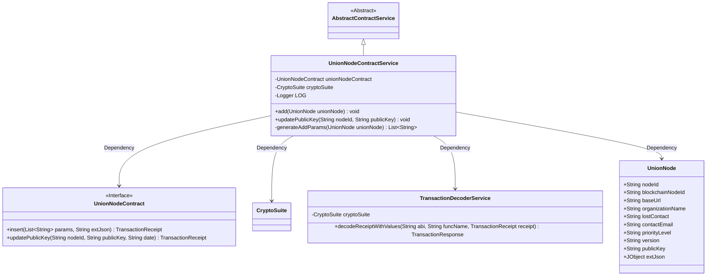
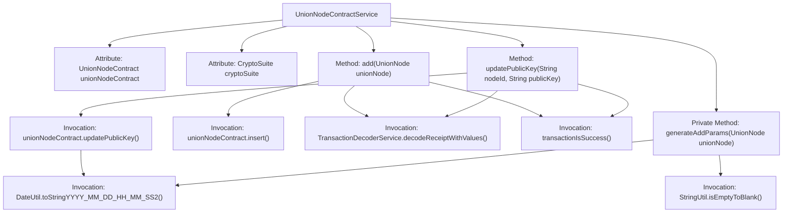

# Basic Information

|      |      |
|------|------|
| Name | UnionNodeContractService |
| Language | .java |
| Code Path | WeFe/union/union-service/src/main/java/com/welab/wefe/union/service/service/contract/UnionNodeContractService.java |
| Package Name | com.welab.wefe.union.service.service.contract |
| Dependencies | ['com.welab.wefe.common.StatusCode', 'com.welab.wefe.common.data.mongodb.entity.union.UnionNode', 'com.welab.wefe.common.exception.StatusCodeWithException', 'com.welab.wefe.common.util.DateUtil', 'com.welab.wefe.common.util.JObject', 'com.welab.wefe.common.util.StringUtil', 'com.welab.wefe.union.service.contract.UnionNodeContract', 'org.fisco.bcos.sdk.crypto.CryptoSuite', 'org.fisco.bcos.sdk.model.TransactionReceipt', 'org.fisco.bcos.sdk.transaction.codec.decode.TransactionDecoderService', 'org.fisco.bcos.sdk.transaction.model.dto.TransactionResponse', 'org.slf4j.Logger', 'org.slf4j.LoggerFactory', 'org.springframework.beans.factory.annotation.Autowired', 'org.springframework.stereotype.Service', 'java.util.ArrayList', 'java.util.Date', 'java.util.List'] |
| Brief Description | The UnionNodeContractService provides functionality for adding UnionNodes and updating public keys, processes transaction receipts and logs records, and throws a StatusCodeWithException in case of exceptions. |

# Description

The UnionNodeContractService is a service class that inherits from AbstractContractService and is used for managing UnionNode contract operations. It includes two main methods: `add` for adding UnionNode nodes, processing transaction receipts, and logging; `updatePublicKey` for updating node public keys, which also handles transactions and verifies results. Both methods capture exceptions and throw StatusCodeWithException. The private method `generateAddParams` generates the parameter list required for adding nodes, including fields such as node ID, URL, and organization name. The class injects an instance of the UnionNodeContract and the CryptoSuite encryption tool.

# Class Summary

| Name   | Type  | Description |
|-------|------|-------------|
| UnionNodeContractService | class | The UnionNodeContractService provides functionality for adding and updating UnionNodes, including node insertion and public key updates. It processes transaction receipts, logs records, and throws status code exceptions in case of errors. |

## Class UnionNodeContractService

|      |      |
|------|------|
| Access Modifier | @Service;public |
| Type | class |
| Name | UnionNodeContractService |
| Description | The UnionNodeContractService provides functionality for adding and updating UnionNodes, including node insertion and public key updates. It processes transaction receipts, logs records, and throws status code exceptions in case of errors. |

### UML Class Diagram

Class Diagram Description: UnionNodeContractService inherits from AbstractContractService and is responsible for handling UnionNode addition and public key updates. It depends on the UnionNodeContract interface to execute blockchain transactions, utilizes CryptoSuite for cryptographic operations, and parses transaction receipts via TransactionDecoderService. The UnionNode class stores node information, while the generateAddParams method generates transaction parameters. The service class logs operation results and handles various exception scenarios.

### Internal Method Call Graph

This code implements the UnionNodeContractService class, which inherits from AbstractContractService and is primarily used for handling consortium node contract operations. It includes two main methods: add() for adding consortium nodes, updatePublicKey() for updating node public keys, and a private method generateAddParams() for generating parameter lists required for node addition. The methods involve blockchain transaction submission, receipt decoding, logging, and parameter validation, with exception handling to ensure robust business logic.

### Field List

| Name  | Type  | Description |
|-------|-------|------|
| LOG = LoggerFactory.getLogger(UnionNodeContractService.class) | Logger | Define a private static log object LOG for the UnionNodeContractService class. |
| unionNodeContract | UnionNodeContract | Automatically inject the UnionNodeContract instance. |
| cryptoSuite | CryptoSuite | Automatically inject cipher suite instances. |

### Method List

| Name  | Type  | Description |
|-------|-------|------|
| add | void | The method `add` is used to insert node data into the UnionNode contract, process transaction responses, and log records. It throws a `StatusCodeWithException` or system error when catching exceptions. |
| updatePublicKey | void | The method `updatePublicKey` is used to update the node's public key, send the transaction and parse the receipt, handle success or exception cases, and log the events. |
| generateAddParams | List<String> | Generate a UnionNode parameter list, including node ID, blockchain node ID, base URL, organization name, contact information, priority, version, public key, and current timestamp. |

