# Basic Information

|      |      |
|------|------|
| Name | contract |
| Language | .java |
| Code Path | WeFe/union/union-service/src/main/java/com/welab/wefe/union/service/service/contract |
| Package Name | docs.union.union-service.src.main.java.com.welab.wefe.union.service.service.contract |
| Brief Description | Multiple service classes inherit from AbstractContractService to handle blockchain transactions. The functionalities include member file management, Bloom filter operations, data resource CRUD operations, dataset permission management, node management, etc. Each service class interacts through smart contracts, involving parameter generation, transaction receipt processing, and exception handling. |

# Description

## Overview  
This module is a collection of blockchain data management services, with its core responsibility being to implement CRUD operations and permission management for various data resources through smart contracts, similar to a database middleware. The interface specifications uniformly adopt transaction receipt parsing, parameter generation templates, and exception status code handling, such as validating results via the `transactionIsSuccess` method derived from `AbstractContractService`. Key data structures include `DataResource` (containing ID/member ID/description), `BloomFilter` (containing hash functions/timestamp), and `Member` (containing public key/activity time). External dependencies include the `CryptoSuite` encryption component, `TransactionDecoderService`, and `MongoDB` storage. For example, `MemberContractService` uses `MongoDB` to store member extension information.  

## Core Business Scenarios  
The module supports collaborative multi-party data management in federated learning scenarios. A typical workflow includes: 1) Identity verification via `MemberContractService` during member registration; 2) Dataset upload and permission configuration via `DataSetContractService`; 3) Resource metadata management via `DataResourceContractService`. The interaction model follows a "local validation + on-chain operation" two-phase approach, such as `DataSetMemberPermissionContractService` first validating member IDs locally before submitting on-chain transactions. Functional completeness is reflected in full lifecycle data coverage (e.g., `ImageDataSetContractService` handling image data CRUD) and fine-grained control (e.g., Bloom filter updates). API types encompass basic CRUD operations and extended functionalities (e.g., node public key updates via `UnionNodeContractService`), with integration cases including member services and data resource coordination.

### Package Internal Structure View

```mermaid
graph TD
    contract --> MemberFileInfoContractService.java
    contract --> BloomFilterContractService.java
    contract --> DataResourceContractService.java
    contract --> DataSetContractService.java
    contract --> AbstractContractService.java
    contract --> ImageDataSetContractService.java
    contract --> MemberServiceContractService.java
    contract --> DataSetMemberPermissionContractService.java
    contract --> TableDataSetContractService.java
    contract --> UnionNodeContractService.java
    contract --> MemberContractService.java
```

This flowchart illustrates the file structure of 11 service classes under the contract directory. All Java files are direct child nodes of contract, including concrete service implementations such as MemberFileInfoContractService, BloomFilterContractService, etc., as well as the abstract base class AbstractContractService, forming a flat service contract layer structure.

# File List

| Name   | Type  | Description |
|-------|------|-------------|
| [MemberFileInfoContractService.java](MemberFileInfoContractService.md) | file | The `MemberFileInfoContractService` class provides operations for member file information, including adding files and checking file existence. When adding a file, it generates parameters and sends a transaction, while checking existence is implemented through contract queries. Exception handling logs errors and throws status code exceptions. |
| [BloomFilterContractService.java](BloomFilterContractService.md) | file | The BloomFilterContractService provides functionalities for adding, updating, and deleting Bloom filters, operates via smart contracts, and verifies transaction results, throwing errors in case of exceptions. |
| [DataResourceContractService.java](DataResourceContractService.md) | file | The DataResourceContractService provides functionalities for adding, deleting, and modifying data resources. It operates through smart contracts to verify transaction results and handles exceptional scenarios. |
| [DataSetContractService.java](DataSetContractService.md) | file | Dataset Service Class, providing CRUD functionality, handling dataset insertion, updates, deletions, and lazy update operations, dependent on multiple Mongo repositories and smart contract interactions. |
| [AbstractContractService.java](AbstractContractService.md) | file | The `AbstractContractService` class provides transaction status checking methods, handling different return codes (0 for success, -1 for data exists, -2 for failure, -3 for data does not exist), including exception judgment and data existence validation. |
| [ImageDataSetContractService.java](ImageDataSetContractService.md) | file | The ImageDataSetContractService provides functionalities for adding, deleting, and modifying image datasets. It operates data through smart contracts, processes transaction receipts, and validates results, throwing errors in case of exceptions. |
| [MemberServiceContractService.java](MemberServiceContractService.md) | file | The MemberServiceContractService class provides CRUD functionalities for member services, including save, update, existence check, extended JSON update, and delete operations, handling transaction responses and logging. |
| [DataSetMemberPermissionContractService.java](DataSetMemberPermissionContractService.md) | file | The dataset member permission service class provides functionality for saving and deleting permissions. When saving, it validates the member ID's effectiveness, deletes old permissions before inserting new ones. It throws status code errors in case of exceptions. |
| [TableDataSetContractService.java](TableDataSetContractService.md) | file | The TableDataSetContractService provides CRUD (Create, Read, Update, Delete) functionality for datasets by operating smart contracts, processing transaction receipts, and validating results, throwing system errors when exceptions occur. |
| [UnionNodeContractService.java](UnionNodeContractService.md) | file | The UnionNodeContractService provides functionality for adding UnionNodes and updating public keys, processes transaction receipts and logs records, and throws a StatusCodeWithException in case of exceptions. |
| [MemberContractService.java](MemberContractService.md) | file | The MemberContractService provides member management functionalities, including adding, updating, and querying member information, processing blockchain transactions, and validating results. It supports updating member attributes such as logos, public keys, and activity timestamps, ensuring data consistency through transactions. |

