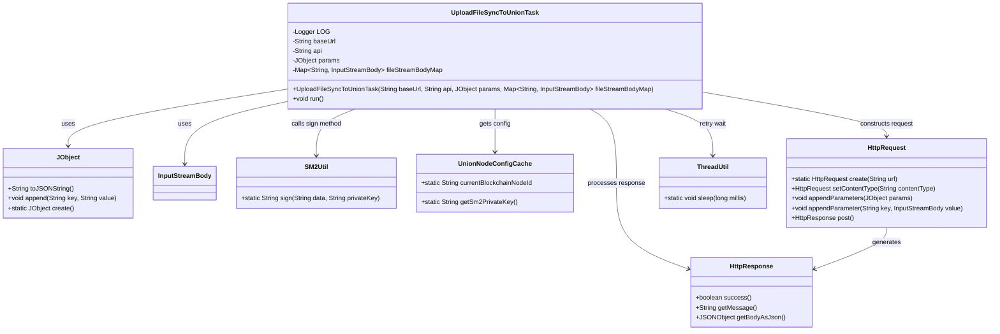
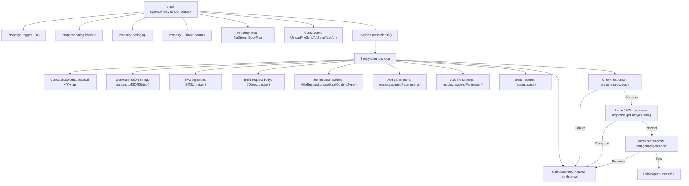

# Basic Information

|      |      |
|------|------|
| Name | UploadFileSyncToUnionTask |
| Language | .java |
| Code Path | WeFe/union/union-service/src/main/java/com/welab/wefe/union/service/task/UploadFileSyncToUnionTask.java |
| Package Name | com.welab.wefe.union.service.task |
| Dependencies | ['com.alibaba.fastjson.JSONException', 'com.alibaba.fastjson.JSONObject', 'com.welab.wefe.common.http.HttpContentType', 'com.welab.wefe.common.http.HttpRequest', 'com.welab.wefe.common.http.HttpResponse', 'com.welab.wefe.common.util.JObject', 'com.welab.wefe.common.util.SM2Util', 'com.welab.wefe.common.util.StringUtil', 'com.welab.wefe.common.util.ThreadUtil', 'com.welab.wefe.union.service.cache.UnionNodeConfigCache', 'org.apache.http.entity.ContentType', 'org.apache.http.entity.mime.content.InputStreamBody', 'org.slf4j.Logger', 'org.slf4j.LoggerFactory', 'org.springframework.util.MultiValueMap', 'org.springframework.web.multipart.MultipartFile', 'java.io.IOException', 'java.util.Map'] |
| Brief Description | UploadFileSyncToUnionTask is a thread class designed for uploading files to alliance nodes. It incorporates a retry mechanism with incrementally increasing intervals between requests. Utilizing SM2 signatures, it supports multipart form data uploads and verifies response status codes along with JSON results. Errors are logged and retried upon failure. |

# Description

The `UploadFileSyncToUnionTask` is a class that extends `Thread`, designed for synchronously uploading files to federation nodes. It includes properties such as `baseUrl`, `api`, `params`, and `fileStreamBodyMap`, which are initialized via the constructor. In the `run` method, the task attempts up to 3 upload operations, with incrementally increasing wait intervals after each failure. The upload process involves generating an SM2 signature, constructing a request body containing data and the signature, setting the multipart content type, adding file stream parameters, and sending a POST request. If the response fails or returns a non-zero status code, errors are logged and retries are attempted; success terminates the loop. The entire process logs error messages for tracking.

# Class Summary

| Name   | Type  | Description |
|-------|------|-------------|
| UploadFileSyncToUnionTask | class | File upload synchronization task class, including retry mechanism, using SM2 signature, sending multipart HTTP requests, handling responses and errors. |

## Class UploadFileSyncToUnionTask

|      |      |
|------|------|
| Access Modifier | public |
| Type | class |
| Name | UploadFileSyncToUnionTask |
| Description | File upload synchronization task class, including retry mechanism, using SM2 signature, sending multipart HTTP requests, handling responses and errors. |

### UML Class Diagram

Class diagram description: This diagram illustrates the structure and dependencies of the UploadFileSyncToUnionTask thread class. The class handles file synchronization upload tasks, containing private members such as base URL, API path, parameters, and file streams. It performs data signing via SM2Util, constructs multipart requests using HttpRequest, and processes HttpResponse results. It relies on JObject for JSON data handling, obtains configuration through UnionNodeConfigCache, and implements retry mechanisms with ThreadUtil. The diagram presents the core collaboration relationships of file upload tasks.

### Internal Method Call Graph

This code implements a multi-threaded file upload task that synchronizes files to federation nodes through a 3-retry mechanism. The workflow includes: initializing request parameters, generating SM2 signatures, constructing multipart form requests, adding file streams, sending POST requests, and performing multi-layer response validation (network status, JSON parsing, business status codes). After each failure, it sleeps with an incrementally increasing interval (300*i milliseconds) before retrying, until success or reaching the maximum retry count.

### Field List

| Name  | Type  | Description |
|-------|-------|------|
| fileStreamBodyMap | Map<String, InputStreamBody> | Defined a private Map variable named fileStreamBodyMap, with keys of type String and values of type InputStreamBody. |
| api | String | Declare a private string variable api. |
| baseUrl | String | Declare a private string variable baseUrl. |
| LOG = LoggerFactory.getLogger(this.getClass()) | Logger | Define the logger instance of the current class for outputting log information. |
| params | JObject | Private JObject type parameter params. |

### Method List

| Name  | Type  | Description |
|-------|-------|------|
| run | void | Implement a retry mechanism in code to send an HTTP request in a loop for 3 attempts. Each time, generate a signature, construct the request body, and upload the file stream. On failure, log the error and retry with a delay. The process terminates upon success or when the maximum retry count is reached. |

