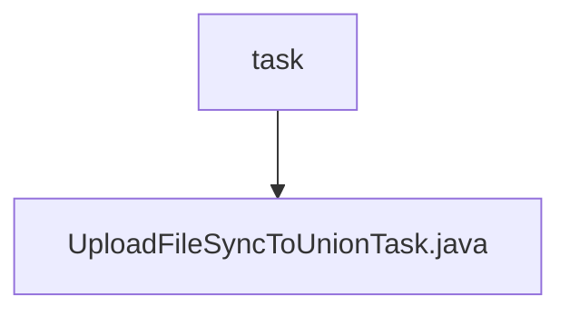

# Basic Information

|      |      |
|------|------|
| Name | task |
| Language | .java |
| Code Path | WeFe/union/union-service/src/main/java/com/welab/wefe/union/service/task |
| Package Name | docs.union.union-service.src.main.java.com.welab.wefe.union.service.task |
| Brief Description | UploadFileSyncToUnionTask is a thread class designed for uploading files to federation nodes. It incorporates a retry mechanism with incrementally increasing intervals between requests. Utilizing SM2 signatures, it supports multipart form data uploads and verifies response status codes along with JSON results. Errors are logged and retried upon failure. |

# Description

The `UploadFileSyncToUnionTask` is a class that extends `Thread`, designed for synchronously uploading files to alliance nodes. It includes properties such as `baseUrl`, `api`, `params`, and `fileStreamBodyMap`, which are initialized via the constructor. In the `run` method, the task attempts the upload operation up to 3 times, with incrementally increasing wait intervals after each failure. The upload process involves generating an SM2 signature, constructing a request body containing data and the signature, setting the multipart content type, adding file stream parameters, and sending a POST request. If the response fails or the return code is non-zero, it logs the error and retries; success terminates the loop. The entire process logs error messages for tracking.

### Package Internal Structure View

This flowchart illustrates the task directory structure within the union-service module of the WeFe project. The root node "task" represents the task package path, and its child node is the specific task implementation file "UploadFileSyncToUnionTask.java". This structure clearly reflects the single-file organizational pattern of the task processing module, adhering to common Java project conventions for storing task handler classes.

# File List

| Name   | Type  | Description |
|-------|------|-------------|
| [UploadFileSyncToUnionTask.java](UploadFileSyncToUnionTask.md) | file | UploadFileSyncToUnionTask is a thread class used for uploading files to federation nodes. It includes a retry mechanism with incrementally increasing intervals between each request. Utilizing SM2 signatures, it supports multipart form data uploads and verifies response status codes and JSON results. Errors are logged and retried upon failure. |

