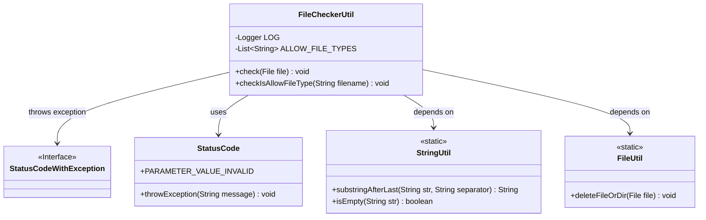
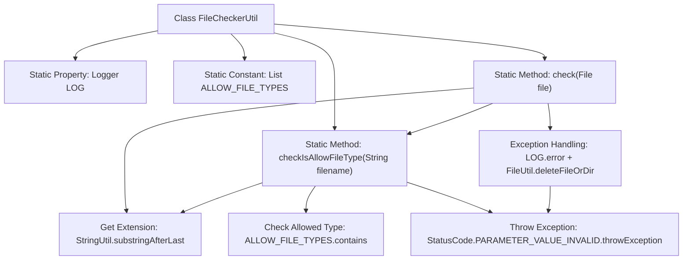
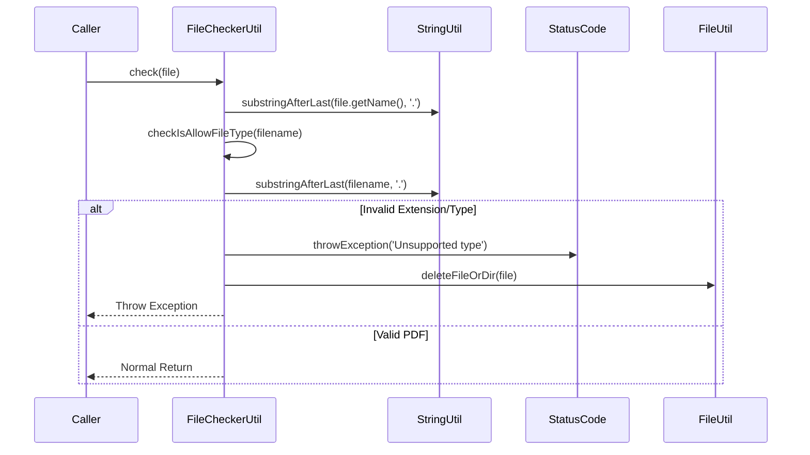

# Basic Information

|      |      |
|------|------|
| Name | FileCheckerUtil |
| Language | .java |
| Code Path | WeFe/union/union-service/src/main/java/com/welab/wefe/union/service/util/FileCheckerUtil.java |
| Package Name | com.welab.wefe.union.service.util |
| Dependencies | ['com.welab.wefe.common.StatusCode', 'com.welab.wefe.common.exception.StatusCodeWithException', 'com.welab.wefe.common.util.FileUtil', 'com.welab.wefe.common.util.StringUtil', 'org.slf4j.Logger', 'org.slf4j.LoggerFactory', 'java.io.File', 'java.util.Arrays', 'java.util.List'] |
| Brief Description | The FileCheckerUtil class is used to check file types, supporting pdf, jpg, png, and jpeg. If invalid, it deletes the file and throws an exception. |

# Description

FileCheckerUtil is a utility class for file type checking. It defines a list of allowed file types (pdf, jpg, png, jpeg) and provides two static methods: the `check` method verifies file security by validating the file type and deleting the file upon failure; the `checkIsAllowFileType` method specifically checks whether the file extension is valid, ensuring the filename is non-empty, has an extension, and belongs to the permitted types. Both methods throw exceptions and log error messages upon validation failure.

# Class Summary

| Name   | Type  | Description |
|-------|------|-------------|
| FileCheckerUtil | class | The FileCheckerUtil class is used to check file types, supporting formats such as pdf, jpg, png, and jpeg. If validation fails, it deletes the file and throws an exception. |

## Class FileCheckerUtil

|      |      |
|------|------|
| Access Modifier | public |
| Type | class |
| Name | FileCheckerUtil |
| Description | The FileCheckerUtil class is used to check file types, supporting formats such as pdf, jpg, png, and jpeg. If validation fails, it deletes the file and throws an exception. |

### UML Class Diagram

Class diagram description:  
FileCheckerUtil is a file validation utility class containing static methods check() and checkIsAllowFileType() to verify if a file type is permitted. It relies on StringUtil for string manipulation, StatusCode for error code handling, and FileUtil for file deletion operations. When validation fails, it throws a StatusCodeWithException. The class maintains a static list ALLOW_FILE_TYPES defining permitted file types.

### Internal Method Call Graph

Flowchart Description: This flowchart illustrates the structure of the FileCheckerUtil class, including its logger, allowed file type list, and two core methods. The check method validates file extensions by invoking checkIsAllowFileType, deleting files and throwing exceptions for mismatched types. The sequence diagram details the file checking process, covering extension extraction, type validation, and exception handling paths, with special emphasis on PDF file processing and error handling mechanisms for other file types.

### Field List

| Name  | Type  | Description |
|-------|-------|------|
| LOG = LoggerFactory.getLogger(FileCheckerUtil.class) | Logger | Define a static logger instance for the FileCheckerUtil class. |
| ALLOW_FILE_TYPES = Arrays.asList(            "pdf","jpg","png","jpeg"    ) | List<String> | List of allowed file types: pdf, jpg, png, jpeg. |

### Method List

| Name  | Type  | Description |
|-------|-------|------|
| check | void | Check if the file type is allowed. Only PDF format is supported; otherwise, throw an exception and delete the file. |
| checkIsAllowFileType | void | Check if the file type is allowed: the filename must not be empty, must have an extension, and the extension must be in the allowed list; otherwise, throw an exception. |

