# Basic Information

|      |      |
|------|------|
| Name | MapperUtil |
| Language | .java |
| Code Path | WeFe/union/union-service/src/main/java/com/welab/wefe/union/service/util/MapperUtil.java |
| Package Name | com.welab.wefe.union.service.util |
| Dependencies | ['com.welab.wefe.common.data.mongodb.dto.dataresource.DataResourceQueryInput', 'com.welab.wefe.common.data.mongodb.dto.dataresource.DataResourceQueryOutput', 'com.welab.wefe.common.data.mongodb.dto.dataset.DataSetQueryInput', 'com.welab.wefe.common.data.mongodb.dto.dataset.DataSetQueryOutput', 'com.welab.wefe.common.data.mongodb.dto.member.MemberServiceQueryOutput', 'com.welab.wefe.common.data.mongodb.entity.union.DataResource', 'com.welab.wefe.common.data.mongodb.entity.union.DataSet', 'com.welab.wefe.common.data.mongodb.entity.union.ImageDataSet', 'com.welab.wefe.common.data.mongodb.entity.union.Member', 'com.welab.wefe.common.util.DateUtil', 'com.welab.wefe.common.util.JObject', 'com.welab.wefe.common.util.StringUtil', 'com.welab.wefe.union.service.api.dataresource.dataset.image.PutApi', 'com.welab.wefe.union.service.api.dataresource.dataset.nomal.QueryApi', 'com.welab.wefe.union.service.dto.dataresource.ApiDataResourceQueryInput', 'com.welab.wefe.union.service.dto.dataresource.ApiDataResourceQueryOutput', 'com.welab.wefe.union.service.dto.dataresource.bloomfilter.ApiBloomFilterQueryOutput', 'com.welab.wefe.union.service.dto.dataresource.dataset.image.ApiImageDataSetQueryOutput', 'com.welab.wefe.union.service.dto.dataresource.dataset.table.ApiDataSetQueryOutput', 'com.welab.wefe.union.service.dto.dataresource.dataset.table.ApiTableDataSetQueryOutput', 'com.welab.wefe.union.service.dto.dataresource.dataset.table.DataSetDetailOutput', 'com.welab.wefe.union.service.dto.member.ApiMemberServiceQueryOutput', 'com.welab.wefe.union.service.dto.member.MemberQueryOutput', 'java.util.Date'] |
| Brief Description | The MapperUtil class provides multiple static methods for converting between different data models, including time format processing and attribute mapping. Its main functionalities include input-output conversion of data resources, datasets, and members, as well as date formatting. |

# Description

The MapperUtil class provides a series of static methods for converting and mapping different types of data. It mainly includes converting DataResourceQueryOutput to various API output objects (such as ApiBloomFilterQueryOutput, ApiImageDataSetQueryOutput, etc.), handling time format conversions, and mapping objects like members and datasets. Additionally, it contains methods for converting input objects to data resources, such as transferPutInputToDataResource. The utility class also offers a string-to-date conversion method, toDate, and demonstrates an example of date format conversion in the main method.

# Class Summary

| Name   | Type  | Description |
|-------|------|-------------|
| MapperUtil | class | The MapperUtil class provides data conversion functionalities, including converting DataResourceQueryOutput to different output types, handling date formats, and transforming members and datasets. |


## Class MapperUtil

|      |      |
|------|------|
| Access Modifier | public |
| Type | class |
| Name | MapperUtil |
| Description | The MapperUtil class provides data conversion functionalities, including converting DataResourceQueryOutput to different output types, handling date formats, and transforming members and datasets. |


### UML Class Diagram

```mermaid
classDiagram
    class MapperUtil {
        +ApiBloomFilterQueryOutput transferDetailBloomFilter(DataResourceQueryOutput dataResourceQueryOutput)
        +ApiImageDataSetQueryOutput transferDetailImageDataSet(DataResourceQueryOutput dataResourceQueryOutput)
        +ApiTableDataSetQueryOutput transferDetailTableDataSet(DataResourceQueryOutput dataResourceQueryOutput)
        +ApiDataResourceQueryOutput transferDetailDefault(DataResourceQueryOutput dataResourceQueryOutput)
        +DataResourceQueryInput transferDataResourceInput(ApiDataResourceQueryInput entity)
        +MemberQueryOutput transferMember(Member member)
        +DataSetDetailOutput transferDataSetDetail(DataSet dataSet)
        +ApiDataSetQueryOutput transferToDataSetOutput(DataSetQueryOutput entity)
        +DataSetQueryInput transferToDataSetInput(QueryApi$Input entity)
        +ApiMemberServiceQueryOutput transferToMemberServiceQueryOutput(MemberServiceQueryOutput memberServiceQueryOutput)
        +ImageDataSet transferPutInputToImageDataSet(PutApi$Input input)
        +DataResource transferPutInputToDataResource(PutApi$Input input)
        +Date toDate(String dateStr)
    }

    class DataResourceQueryOutput {
        // Base class for data resource query output
    }

    class ApiBloomFilterQueryOutput {
        // Bloom filter API output
    }

    class ApiImageDataSetQueryOutput {
        // Image dataset API output
    }

    class ApiTableDataSetQueryOutput {
        // Table dataset API output
    }

    class ApiDataResourceQueryOutput {
        // Data resource API output
    }

    class DataResourceQueryInput {
        // Data resource query input
    }

    class Member {
        // Member entity
    }

    class MemberQueryOutput {
        // Member query output
    }

    class DataSet {
        // Dataset entity
    }

    class DataSetDetailOutput {
        // Dataset detail output
    }

    class DataSetQueryOutput {
        // Dataset query output
    }

    class ApiDataSetQueryOutput {
        // Dataset API output
    }

    class QueryApi$Input {
        // Query API input
    }

    class DataSetQueryInput {
        // Dataset query input
    }

    class MemberServiceQueryOutput {
        // Member service query output
    }

    class ApiMemberServiceQueryOutput {
        // Member service API output
    }

    class PutApi$Input {
        // Update API input
    }

    class ImageDataSet {
        // Image dataset entity
    }

    class DataResource {
        // Data resource entity
    }

    MapperUtil --> DataResourceQueryOutput : transform
    MapperUtil --> ApiBloomFilterQueryOutput : generate
    MapperUtil --> ApiImageDataSetQueryOutput : generate
    MapperUtil --> ApiTableDataSetQueryOutput : generate
    MapperUtil --> ApiDataResourceQueryOutput : generate
    MapperUtil --> DataResourceQueryInput : transform
    MapperUtil --> Member : transform
    MapperUtil --> MemberQueryOutput : generate
    MapperUtil --> DataSet : transform
    MapperUtil --> DataSetDetailOutput : generate
    MapperUtil --> DataSetQueryOutput : transform
    MapperUtil --> ApiDataSetQueryOutput : generate
    MapperUtil --> QueryApi$Input : transform
    MapperUtil --> DataSetQueryInput : generate
    MapperUtil --> MemberServiceQueryOutput : transform
    MapperUtil --> ApiMemberServiceQueryOutput : generate
    MapperUtil --> PutApi$Input : transform
    MapperUtil --> ImageDataSet : generate
    MapperUtil --> DataResource : generate
```

This class diagram illustrates the relationships between the MapperUtil utility class and multiple data transformation classes. As a core converter, MapperUtil contains 12 static methods responsible for converting and mapping between different data types, primarily involving object transformations in domains such as data resources, datasets, and member services. It utilizes ModelMapper for object property copying and handles edge cases like time format conversion and null value checks, ultimately generating API-compliant output objects. The arrows between classes clearly indicate the direction of data flow.


### Internal Method Call Graph

```mermaid
graph TD
    A["Class MapperUtil"]
    B["Method: transferDetailBloomFilter"]
    C["Method: transferDetailImageDataSet"]
    D["Method: transferDetailTableDataSet"]
    E["Method: transferDetailDefault"]
    F["Method: transferDataResourceInput"]
    G["Method: transferMember"]
    H["Method: transferDataSetDetail"]
    I["Method: transferToDataSetOutput"]
    J["Method: transferToDataSetInput"]
    K["Method: transferToMemberServiceQueryOutput"]
    L["Method: transferPutInputToImageDataSet"]
    M["Method: transferPutInputToDataResource"]
    N["Method: toDate"]
    O["Method: main"]

    A --> B
    A --> C
    A --> D
    A --> E
    A --> F
    A --> G
    A --> H
    A --> I
    A --> J
    A --> K
    A --> L
    A --> M
    A --> N
    A --> O
```



This code defines a utility class named `MapperUtil`, primarily used for conversion and mapping between different types of data. The class contains multiple static methods such as `transferDetailBloomFilter`, `transferDetailImageDataSet`, etc., which are used to transform input objects into various types of output objects. Additionally, it includes a helper method `toDate` for date format conversion and a `main` method for testing the date conversion functionality. Each conversion method typically uses `ModelMapper.map` for basic property mapping and handles additional data setup and date conversion.

### Field List

| Name  | Type  | Description |
|-------|-------|------|

### Method List

| Name  | Type  | Description |
|-------|-------|------|
| transferToDataSetInput | DataSetQueryInput | Convert QueryApi.Input to DataSetQueryInput, set the dataset ID, page number, and page size, with the default page number as 0 and page size as 10. |
| transferPutInputToDataResource | DataResource | Convert PutApi.Input into a DataResource object, set the memberId, and return it. |
| transferPutInputToImageDataSet | ImageDataSet | Convert the input object into an ImageDataSet, set the label completion status to 1 or 0, and add the current time as the creation and update time. |
| transferDetailDefault | ApiDataResourceQueryOutput | Convert DataResourceQueryOutput to ApiDataResourceQueryOutput, then map and return the creation and update times. |
| main | void | Java code example: Convert a string to a Date object, then format and output it as a string in the same format. |
| transferDataResourceInput | DataResourceQueryInput | Convert the ApiDataResourceQueryInput object to a DataResourceQueryInput object and return it. |
| toDate | Date | Convert the string to a date object, return null if the string is empty, and parse it using the specified format. |
| transferToMemberServiceQueryOutput | ApiMemberServiceQueryOutput | Convert MemberServiceQueryOutput to ApiMemberServiceQueryOutput, map the fields, and format the time. |
| transferDetailImageDataSet | ApiImageDataSetQueryOutput | Translate DataResourceQueryOutput to ApiImageDataSetQueryOutput, map fields and set additional data, creation and update time. |
| transferToDataSetOutput | ApiDataSetQueryOutput | Convert DataSetQueryOutput to ApiDataSetQueryOutput, map fields and handle null values, set ID, usage count, and time. |
| transferDataSetDetail | DataSetDetailOutput | Convert the DataSet object to a DataSetDetailOutput object, mapping the ID, creation time, and update time. |
| transferMember | MemberQueryOutput | Convert the Member object to a MemberQueryOutput object, mapping the ID, creation time, and update time. |
| transferDetailTableDataSet | ApiTableDataSetQueryOutput | Translate DataResourceQueryOutput to ApiTableDataSetQueryOutput, map the data, and set additional information, creation and update times. |
| transferDetailBloomFilter | ApiBloomFilterQueryOutput | Translate DataResourceQueryOutput to ApiBloomFilterQueryOutput, map the basic data, set additional data, and establish creation and update times. |


