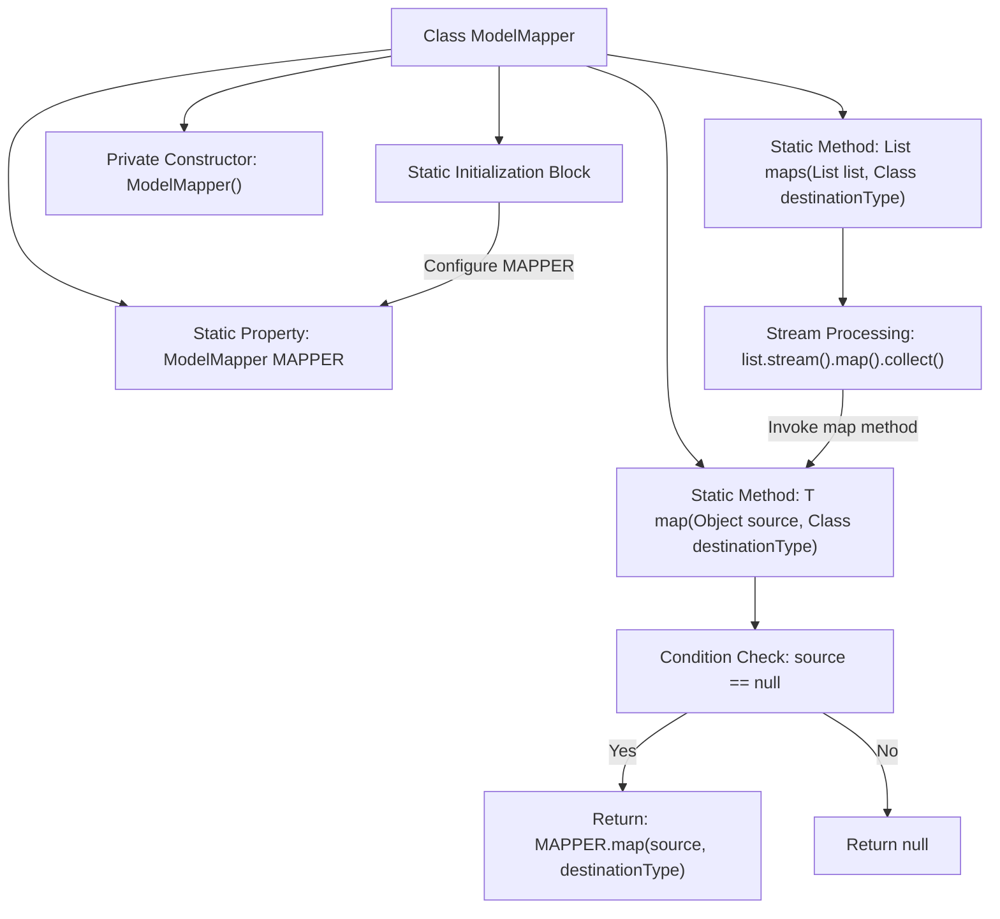

# Basic Information

|      |      |
|------|------|
| Name | ModelMapper |
| Language | .java |
| Code Path | WeFe/union/union-service/src/main/java/com/welab/wefe/union/service/util/ModelMapper.java |
| Package Name | com.welab.wefe.union.service.util |
| Dependencies | ['org.modelmapper.config.Configuration', 'org.modelmapper.convention.MatchingStrategies', 'java.util.List', 'java.util.stream.Collectors'] |
| Brief Description | ModelMapper utility class, thread-safe, configured for strict matching and public method access, providing mapping functionality for objects and lists. |

# Description

The code defines a utility class named ModelMapper for object mapping and conversion. The class contains a static ModelMapper instance configured with a strict matching strategy and allowing only public method access. It provides two static methods: the `map` method for single object conversion, handling null cases; and the `maps` method for batch conversion of lists, which internally calls the `map` method and implements processing via streams. The entire class is designed to be thread-safe and non-instantiable.

# Class Summary

| Name   | Type  | Description |
|-------|------|-------------|
| ModelMapper | class | ModelMapper utility class, thread-safe, with static initialization configuration for strict matching and public method access, providing mapping methods for objects and lists, returns null for empty sources. |


## Class ModelMapper

|      |      |
|------|------|
| Access Modifier | public |
| Type | class |
| Name | ModelMapper |
| Description | ModelMapper utility class, thread-safe, with static initialization configuration for strict matching and public method access, providing mapping methods for objects and lists, returns null for empty sources. |


### UML Class Diagram

```mermaid
classDiagram
    class ModelMapper {
        -org.modelmapper.ModelMapper MAPPER
        +map(Object source, Class~T~ destinationType) T
        +maps(List~?~ list, Class~T~ destinationType) List~T~
        -ModelMapper()
    }
    class org..modelmapper..ModelMapper {
        <<Interface>>
        +getConfiguration() Configuration
    }
    class Configuration {
        <<Interface>>
        +setMatchingStrategy(MatchingStrategies strategy)
        +setMethodAccessLevel(AccessLevel level)
    }
    class MatchingStrategies {
        <<Enumeration>>
        STRICT
        STANDARD
        LOOSE
    }
    class AccessLevel {
        <<Enumeration>>
        PUBLIC
        PROTECTED
        PRIVATE
    }

    ModelMapper --> org..modelmapper..ModelMapper : Dependency
    org..modelmapper..ModelMapper --> Configuration : Dependency
    Configuration --> MatchingStrategies : Dependency
    Configuration --> AccessLevel : Dependency
```

Class Diagram Description:
The ModelMapper class is a utility class for object mapping and conversion. It contains a static ModelMapper instance MAPPER, configured with strict matching strategy and public method access level through a static initialization block. It provides two generic methods: map for single object mapping and maps for list object mapping. This class depends on the org.modelmapper.ModelMapper interface and its Configuration class, while Configuration in turn relies on the enum classes MatchingStrategies and AccessLevel to set mapping strategies and access levels.


### Internal Method Call Graph



This flowchart illustrates the core structure and invocation relationships of the ModelMapper class. The class contains a static MAPPER instance and two core mapping methods: map for single object conversion and maps for collection conversion. The static initialization block configures MAPPER's strict matching strategy and public method access level. The map method includes null-check logic, while the maps method utilizes stream processing to invoke the map method for batch conversion. The entire design reflects thread safety and a concise API style.

### Field List

| Name  | Type  | Description |
|-------|-------|------|
| MAPPER = new org.modelmapper.ModelMapper() | org.modelmapper.ModelMapper | Private static final constant MAPPER, instantiated using the ModelMapper class. |

### Method List

| Name  | Type  | Description |
|-------|-------|------|
| map | T | Static methods map the source object to the target type object, returning null if the source object is null, otherwise invoking the mapper for conversion. |
| maps | List<T> | Map list elements to the target type and return a new list. Use stream processing to transform elements one by one, ultimately collecting them into a List. |


