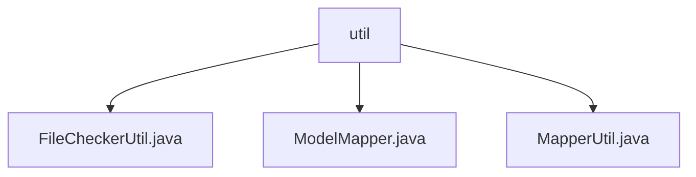

# Basic Information

|      |      |
|------|------|
| Name | util |
| Language | .java |
| Code Path | WeFe/union/union-service/src/main/java/com/welab/wefe/union/service/util |
| Package Name | docs.union.union-service.src.main.java.com.welab.wefe.union.service.util |
| Brief Description | FileCheckerUtil checks file types and security, deleting files upon failure. ModelMapper provides thread-safe object mapping, supporting both single-object and batch conversion. MapperUtil handles data transformation, including API output, time formatting, and object mapping. |

# Description

## Overview  
This module provides three core functionalities: file validation, object mapping, and data transformation. FileCheckerUtil handles secure file type validation, supporting formats such as PDF/JPEG; ModelMapper enables thread-safe single/batch object conversion; MapperUtil manages complex data structure mapping, acting as a data format transformation hub. Key data structures include a file type whitelist and transfer objects like DataResourceQueryOutput. The only dependency is the ModelMapper library. For example, FileCheckerUtil deletes invalid files, while MapperUtil can transform BloomFilter query results.  

## Primary Business Scenarios  
The module is suitable for three main scenarios: file upload validation (e.g., verifying image formats), inter-service object conversion (similar to DTO mapping), and cross-system data adaptation (e.g., standardizing API outputs). Interaction is exclusively via static method calls, such as ModelMapper.map() for VO conversion or MapperUtil for time format standardization. Typical applications include secure file processing workflows (upload → validate → delete invalid files) and heterogeneous data integration (raw data → standardized API output). API types encompass validation, conversion, and adapter classes.

### Package Internal Structure View

This flowchart illustrates the file structure of the util utility classes under the union-service module in the WeFe project. The root node is the util directory, which contains three utility class files: FileCheckerUtil.java for file checking, ModelMapper.java for handling model mapping, and MapperUtil.java for providing general mapping functionality. All files are at the same level with no nested relationships.

# File List

| Name   | Type  | Description |
|-------|------|-------------|
| [FileCheckerUtil.java](FileCheckerUtil.md) | file | The FileCheckerUtil class is used to check file types, supporting pdf, jpg, png, and jpeg. If invalid, it deletes the file and throws an exception. |
| [ModelMapper.java](ModelMapper.md) | file | ModelMapper utility class, thread-safe, configured for strict matching and public method access, providing mapping functionality for objects and lists. |
| [MapperUtil.java](MapperUtil.md) | file | The MapperUtil class provides multiple static methods for conversion between different data models, including time format processing and attribute mapping. Its main functionalities include input-output conversion for data resources, datasets, and members, as well as date formatting. |

