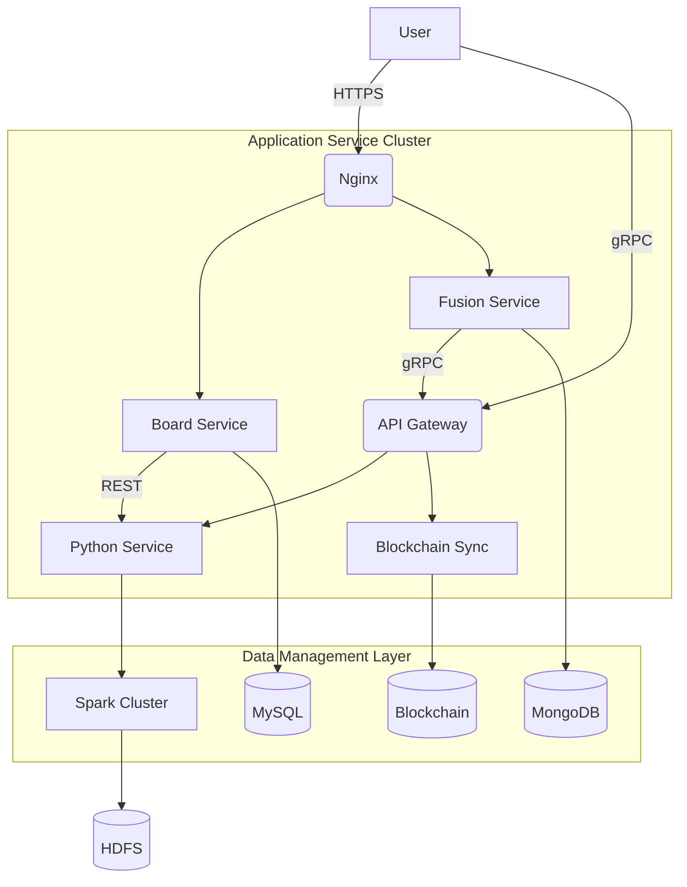

## System Architecture

## System Overview

This project is the backend system of a federated learning platform, with core functionalities centered around orchestrating, executing, and processing data for federated learning tasks. The business domain covers scenarios such as secure multi-party computation, privacy-preserving machine learning, and distributed model training and inference.

* **Core Features and Business Domains:**
    * Supports various federated learning algorithms (e.g., vertical/horizontal federated learning, secure tree models, neural networks)
    * Provides end-to-end management for data preprocessing, feature engineering, model training, and evaluation
    * Implements secure multi-party data alignment and joint modeling
    * Incorporates blockchain technology for data permission management and audit trails

* **Architecture Pattern:** **Microservices Architecture**
    * Key Rationale:
        * Multiple independently deployable services (e.g., `board-service`, `fusion-service`, `gateway-service`)
        * Services communicate via REST API and gRPC
        * Decoupling through configuration centers (e.g., `config.properties`)
        * Containerized deployment (Docker Compose) clearly defines service boundaries

## Core Components and Functional Map

The system adopts a layered architecture design, comprising the traffic entry layer, application service layer, and data management layer.

* **Traffic Entry Layer:**
    * **Components and Responsibilities:**
        * Nginx: Serves as a static resource server and reverse proxy, handling frontend request forwarding (e.g., `board-website` service)
        * API Gateway (`gateway-service`): Manages microservice API routing, load balancing, and authentication/authorization
    * **Implementation Considerations:**
        * Exposes ports 80/443 via Docker for external access
        * Supports HTTPS secure communication

* **Application Service Layer:**
    * **Service Inventory and Core Functions:**
        * **Board Service**: Federated learning task management portal, providing project and member management
            * Tech Stack: Java/Spring Boot
            * Key Dependencies: MySQL, MongoDB
        * **Fusion Service**: Data fusion service for multi-party data alignment and joint modeling
            * Tech Stack: Java/Spring Boot
            * Special Configuration: Supports large file uploads (1GB limit)
        * **Python Service**: Algorithm execution engine for running core federated learning algorithms
            * Tech Stack: Python 3.7
            * Key Frameworks: PyBind11, PaddlePaddle
            * GPU Support: Acceleration via CUDA 11.4
        * **Gateway Service**: Cross-institution communication hub for gRPC message routing
            * Tech Stack: Java/gRPC
            * Performance Optimization: Configured for chunked message transfer (100MB/chunk)
        * **Blockchain Data Sync**: Blockchain data synchronization service
            * Tech Stack: Java/Spring Boot
            * Blockchain Integration: Supports smart contract interaction
    * **Asynchronous Tasks and Background Processing:**
        * Spark cluster for distributed computing (visible in Python service's Docker configuration)
        * Background workers handle long-running tasks like model training

* **Data Management Layer:**
    * **Data Storage Components:**
        * **MySQL**: Stores business metadata and system configurations
        * **MongoDB**: Stores unstructured data and task logs
        * **ClickHouse**: Used for analytical queries (visible in middleware configuration)
        * **Redis**: Serves as a caching layer (optional configuration)
    * **Data Flow Strategies:**
        * Sensitive data encrypted via SM4 algorithm
        * Blockchain records data usage permission change history

## Container Configuration Overview

| Service Name | Container Image | Exposed Ports | Mounted Volumes | Key Environment Variables | Startup Command |
|-------------|----------------|--------------|----------------|--------------------------|----------------|
| wefe_python_service | wefe_python_service:v2.1 | 8888:5000 | /data/logs, config files | PYTHONPATH, SPARK config | Service startup script |
| wefe_gateway_service | wefe_gateway_service:v2.1 | 50051:50051 | Log directory, certificate files | gRPC parameters | Java -jar |
| wefe_board_service | wefe_board_service:v2.1 | 8800:8080 | Upload directory, logs | Spring config | Java -jar |
| wefe_middleware_mysql | mysql:5.7.24 | 4406:3306 | Data volume | Database password | Standard MySQL startup |
| wefe_middleware_clickhouse | yandex/clickhouse-server | 8122:8123, 9900:9000 | Data volume | None | Standard ClickHouse startup |

## Service Collaboration and Data Flow

* **Core Communication Paths:**
    1. User request → Nginx → Board Service (frontend)
    2. Task creation → Gateway Service → Python Service (algorithm execution)
    3. Data synchronization → Blockchain Data Sync → Consortium blockchain nodes

* **Interaction Modes:**
    * Frontend services use RESTful APIs (HTTP/JSON)
    * Microservices communicate via gRPC (high-performance binary protocol)
    * Python service performs distributed computing via Spark cluster

* **Data Isolation:**
    * Each service has an independent database instance
    * Data partitioning by member ID
    * Blockchain smart contracts control cross-institution data access

## Overall Architecture Diagram

## Architect's Key Insights and Future Outlook

* **Elasticity and Scalability:**
    * Horizontal scaling of compute layer via Spark
    * Stateless service design supports rapid scaling
    * Recommendation: Introduce Kubernetes for enhanced orchestration

* **Security Framework:**
    * Existing SM4 encryption and HTTPS transmission
    * Recommendations: Add service mesh mTLS, fine-grained RBAC

* **Performance Optimization:**
    * GPU acceleration implemented in Python service
    * Potential bottleneck: Single-point pressure on gateway; recommendation: Introduce Envoy

* **Tech Stack Evaluation:**
    * Java+Python hybrid stack increases operational complexity
    * Blockchain integration introduces ~20% performance overhead

* **Evolution Directions:**
    1. Adopt Service Mesh for optimized service communication
    2. Introduce Kafka for unified event bus
    3. Explore federated learning combined with differential privacy
    4. Develop Serverless function computing support

## Module Dependency Diagram  
This project is a multi-module Maven project containing several submodules and complex internal dependencies. Below is the dependency diagram between the main modules.  

```mermaid  
graph TD  
    wefe --> board  
    wefe --> common  
    wefe --> union  
    wefe --> gateway  
    wefe --> serving  
    wefe --> fusion  
    wefe --> mpc  
    wefe --> manager  
      
    board --> board-service  
    board-service --> common-web  
    board-service --> common-cert  
    board-service --> common-data-storage  
    board-service --> fusion-core  
      
    common --> java  
    java --> common-lang  
    java --> common-web  
    java --> common-data-mysql  
    java --> common-data-storage  
    java --> common-proto  
    java --> common-data-mongodb  
    java --> common-wefe  
    java --> common-verification-code  
    java --> common-cert  
    java --> common-jdbc  
      
    common-web --> common-lang  
    common-web --> common-data-mysql  
    common-web --> common-wefe  
      
    common-data-storage --> common-lang  
    common-data-storage --> common-proto  
    common-data-storage --> common-wefe  
      
    common-wefe --> common-lang  
    common-wefe --> common-verification-code  
      
    manager --> manager-service  
    manager-service --> common-web  
    manager-service --> common-lang  
    manager-service --> common-cert  
    manager-service --> common-data-mongodb  
      
    serving --> serving-service  
    serving --> serving-sdk-java  
    serving-service --> common-lang  
    serving-service --> common-web  
    serving-service --> serving-sdk-java  
      
    fusion --> fusion-service  
    fusion --> fusion-core  
    fusion-service --> common-lang  
    fusion-service --> common-web  
    fusion-service --> fusion-core  
      
    mpc --> mpc-pir  
    mpc --> mpc-common  
    mpc --> mpc-psi  
    mpc --> mpc-sa  
      
    mpc-pir --> mpc-pir-server  
    mpc-pir --> mpc-pir-sdk  
    mpc-pir --> mpc-common  
      
    mpc-psi --> mpc-psi-sdk  
    mpc-psi --> mpc-common  
      
    mpc-sa --> mpc-sa-server  
    mpc-sa --> mpc-sa-sdk  
    mpc-sa --> mpc-common  
      
    union --> union-service  
    union --> blockchain-data-sync  
    union-service --> common-web  
    union-service --> common-lang  
    union-service --> common-data-mongodb  
      
    blockchain-data-sync --> common-web  
    blockchain-data-sync --> common-lang  
    blockchain-data-sync --> common-data-mongodb  
```

