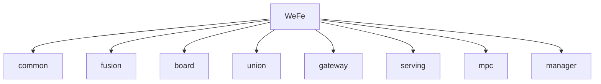

# 基础信息

|      |      |
|------|------|
| 名称 | WeFe |
| 编码语言 | .java |
| 代码路径 | WeFe |
| 概述说明 | 联邦学习平台全栈模块，涵盖数据治理、安全通信、开发支持，支持多数据库、国密算法、证书管理，集成Spring、MongoDB等。 |

### 包内部结构视图

该流程图展示了WeFe项目的模块结构，WeFe作为根目录包含8个子模块：common、fusion、board、union、gateway、serving、mpc和manager。每个子模块与主项目形成直接层级关系，呈现了典型的微服务架构项目布局。

# 模块列表

| 名称   | 类型  | 说明 |
|-------|------|-------------|
| [board](board/_module.md) | module | 该模块体系涵盖联邦学习平台全栈功能，包括文件系统管理、会话状态维护、Spring Bean配置、数据持久化、API服务、定时任务、异常处理及组件化机器学习流程。核心模块提供文件生命周期管理、RESTful接口、JPA数据操作及分布式通信协议，支持横向/纵向联邦学习场景。采用分层设计，集成Spring、gRPC、加密库等技术，实现从数据预处理到模型训练的全流程协同。 |
| [fusion](fusion/_module.md) | module | 联邦学习核心管理系统，集成数据持久化、隐私计算（PSI算法）和任务调度，支持全生命周期管理。采用分层架构，依赖Spring Data JPA和多种数据库驱动。典型流程包括初始化、数据准备、安全计算和结果回调。 |
| [manager](manager/_module.md) | module | 数字证书管理模块实现申请、签发、密钥绑定全流程，核心组件CertOperationService依赖CertDao持久化，数据结构含CertRequestVO等，使用FastJSON序列化，异常由CertMgrException处理。联盟链管理系统负责多维资源管理及智能合约交互，采用分层设计，支持成员注册、数据标签化等场景，依赖MongoDB、FISCO BCOS SDK等，功能覆盖状态管理、权限验证。 |
| [mpc](mpc/_module.md) | module | 该系列模块实现安全多方计算(MPC)核心功能：PIR隐私检索、PSI隐私求交、密钥交换与安全聚合。采用Naor-Pinkas/Hauck/ECDH等协议，支持联邦学习与联合风控场景。包含加密传输、数据混淆、线程安全缓存等机制，通过分层API与POJO规范提供完整生命周期管理。 |
| [serving](serving/_module.md) | module | 联邦学习预测框架统一管理预测流程与结果合并，支持横向/纵向联邦，依赖XGBoost和多线程工具。隐私计算系统整合安全数据交互与机器学习协同，采用分层设计，支持加密通信与联合计算，依赖加密库和Spring生态。 |
| [gateway](gateway/_module.md) | module | gRPC网关系统，含服务器管理、缓存加载、安全拦截、数据传输、存储访问、定时刷新、健康检查等功能模块，支持双通道通信、动态TLS、流式处理及分布式监控。 |
| [union](union/_module.md) | module | 联盟链管理模块提供成员、数据、合约及监控管理，采用分层接口设计，依赖FISCO BCOS和Spring。数据同步模块负责链上事件解析与持久化，支持多线程ETL流程，依赖MongoDB和节点SDK。 |
| [common](common/_module.md) | module | Java基础工具库，含配置管理、数据处理、验证、HTTP通信等功能，依赖Log4j等。Web应用全栈方案，支持API管理、权限控制、日志记录，依赖Spring等。JPA数据访问层，提供CRUD、动态查询，依赖JPA。跨云数据存储，支持分片、连接池管理，依赖Druid。Protobuf协议，支持数据序列化。MongoDB数据管理，支持CRUD、聚合查询。联邦学习框架，含健康检查、配置管理等。验证码服务，支持短信/邮件发送。密码学工具集，支持密钥管理、证书操作。JDBC框架，支持多数据库操作。 |

