# 基础信息

|      |      |
|------|------|
| 名称 | com |
| 编码语言 | .java |
| 代码路径 | WeFe/board/board-service/src/main/java/com |
| 包名 | docs.board.board-service.src.main.java.com |
| 概述说明 | 该模块体系涵盖联邦学习平台全栈功能，包括文件系统管理、会话状态维护、Spring Bean配置、数据持久化、API服务、定时任务、异常处理及组件化机器学习流程。核心模块提供文件生命周期管理、RESTful接口、JPA数据操作及分布式通信协议，支持横向/纵向联邦学习场景。采用分层设计，集成Spring、gRPC、加密库等技术，实现从数据预处理到模型训练的全流程协同。 |

# 说明

## 概述  
该模块是联邦学习平台的核心服务矩阵，整合文件系统管理、会话状态维护、Spring容器配置、数据持久化及分布式通信等能力，类似企业级AI协作中枢。统一接口规范涵盖RESTful API（分层继承AbstractApi）、JPA标准（BaseRepository扩展）及Protobuf/gRPC协议（TransferServiceGrpc）。关键数据结构形成多维度体系：业务实体类（JobMySqlModel）、校验模型（带@Check注解的Input）、枚举常量（ServiceStatus）及传输元数据（TransferMeta分片单元）。外部依赖集中于Spring生态（JPA/WebSocket）、加密组件（RSA/AES）、机器学习框架（PaddlePaddle/XGBoost）及存储系统（MySQL/LMDB）。例如DownloadDeepLearningModel处理模型文件，GenerateRsaKeyPairApi管理密钥生命周期。

## 主要业务场景  
模块支持联邦学习全链路场景：1)安全初始化（RSA密钥生成→CA证书缓存刷新→网关连接测试）；2)协作建模（数据分片去重→PSI样本对齐→横向逻辑回归训练）；3)系统运维（定时清理闲置账户→配置热更新→文件分片上传）。交互模式融合同步CRUD（如AccountService）、异步流程（ModelExportService）和事件驱动（ApplicationListener），类似工作流引擎与消息总线结合体。典型应用包括跨机构数据融合（布隆过滤器去重）、流程图节点管理（BaseFlowGraph防循环依赖）及实时通信（WebSocket双工会话）。功能完整性体现在多组件联动，例如项目删除触发级联清理，模型导出同步推送密钥至Serving系统。

### 包内部结构视图

由于PATH2的路径信息非常庞大且复杂，我将按照规则生成主要模块的流程图。这里展示核心服务模块的层级关系：

```mermaid
graph TD
    board --> service
    service --> base
    service --> api
    service --> data_resource
    service --> project
    service --> member
    service --> fusion
    service --> component
    
    base --> WeFeFileSystem.java
    base --> OnlineDemoApi.java
    base --> LoginAccountInfo.java
    
    api --> crypto
    api --> global_config
    api --> account
    api --> online_demo
    api --> data_resource
    api --> storage
    api --> chat
    api --> message
    api --> service
    api --> blacklist
    api --> partner_config
    api --> file
    api --> gateway
    api --> data_output_info
    api --> union
    api --> operation
    api --> project
    api --> datasource
    api --> member
    api --> model
    api --> component
    
    data_resource --> table_data_set
    data_resource --> upload_task
    data_resource --> bloom_filter
    data_resource --> image_data_set
    
    project --> modeling
    project --> job
    project --> dataset
    project --> project
    project --> flow
    project --> member
    project --> fusion
    project --> node
    
    component --> base
    component --> modeling
    component --> deep_learning
    component --> feature
    component --> temp
```

该流程图展示了WeFe/board-service的核心模块结构，包含service主模块及其下的base、api、data_resource、project、member、fusion和component等主要子模块。每个子模块又包含更具体的功能组件，如api模块下包含crypto、account等15个功能子模块，project模块包含modeling、job等7个功能子模块。这种模块化设计体现了清晰的职责划分和层级关系。

# 文件列表

| 名称   | 类型  | 说明 |
|-------|------|-------------|
| [welab](welab/_module.md) | package | 该模块体系涵盖联邦学习平台全栈功能，包括文件系统管理、会话状态维护、Spring Bean配置、数据持久化、API服务、定时任务、异常处理及组件化机器学习流程。核心模块提供文件生命周期管理、RESTful接口、JPA数据操作及分布式通信协议，支持横向/纵向联邦学习场景。采用分层设计，集成Spring、gRPC、加密库等技术，实现从数据预处理到模型训练的全流程协同。 |

