# 基础信息

|      |      |
|------|------|
| 名称 | BoardService |
| 编码语言 | .java |
| 代码路径 | WeFe/board/board-service/src/main/java/com/welab/wefe/board/service/BoardService.java |
| 包名 | com.welab.wefe.board.service |
| 依赖项 | ['com.alibaba.fastjson.JSONObject', 'com.welab.wefe.board.service.base.OnlineDemoApi', 'com.welab.wefe.board.service.constant.Config', 'com.welab.wefe.board.service.exception.FlowNodeException', 'com.welab.wefe.board.service.service.CacheObjects', 'com.welab.wefe.common.StatusCode', 'com.welab.wefe.common.exception.StatusCodeWithException', 'com.welab.wefe.common.util.JObject', 'com.welab.wefe.common.util.RSAUtil', 'com.welab.wefe.common.util.SignUtil', 'com.welab.wefe.common.web.Launcher', 'com.welab.wefe.common.web.config.ApiBeanNameGenerator', 'com.welab.wefe.common.web.dto.ApiResult', 'com.welab.wefe.common.web.dto.SignedApiInput', 'com.welab.wefe.common.web.service.flowlimit.FlowLimitByIpService', 'com.welab.wefe.common.web.service.flowlimit.FlowLimitByMobileService', 'com.welab.wefe.common.wefe.checkpoint.CheckpointManager', 'org.slf4j.Logger', 'org.slf4j.LoggerFactory', 'org.springframework.beans.BeansException', 'org.springframework.boot.autoconfigure.SpringBootApplication', 'org.springframework.context.ApplicationContext', 'org.springframework.context.ApplicationContextAware', 'org.springframework.context.annotation.ComponentScan', 'org.springframework.scheduling.annotation.EnableAsync', 'org.springframework.scheduling.annotation.EnableScheduling', 'java.nio.charset.StandardCharsets'] |
| 概述说明 | BoardService是SpringBoot应用入口，集成定时和异步任务，自定义组件扫描和权限控制，处理API异常和流量限制，支持RSA签名验证。 |

# 说明

BoardService是一个Spring Boot应用的主类，集成了定时任务和异步处理功能。通过@ComponentScan指定了基础扫描包和自定义的Bean命名生成器。该类实现了ApplicationContextAware接口，用于设置应用上下文。main方法中配置了Launcher实例，包括API包类、异常处理、权限策略、流量限制等功能。异常处理中特别处理了FlowNodeException，返回包含节点ID的错误信息。权限检查包括在线演示环境限制和RSA签名验证。RSA验签逻辑处理了来自前端和其他子系统的请求，确保数据完整性。

# 类列表 Class Summary

| 名称   | 类型  | 说明 |
|-------|------|-------------|
| BoardService | class | BoardService是SpringBoot应用，启用定时和异步任务，自定义组件扫描和命名。主方法配置API权限、异常处理和流量限制，支持RSA验签和在线演示环境检查。 |

## 类 BoardService

|      |      |
|------|------|
| 访问范围 | @SpringBootApplication;@EnableScheduling;@EnableAsync;@ComponentScan(;        lazyInit = true,;        nameGenerator = ApiBeanNameGenerator.class,;        basePackageClasses = {;                BoardService.class,;                Launcher.class,;                CheckpointManager.class;        };);public |
| 类型 | class |
| 名称 | BoardService |
| 说明 | BoardService是SpringBoot应用，启用定时和异步任务，自定义组件扫描和命名。主方法配置API权限、异常处理和流量限制，支持RSA验签和在线演示环境检查。 |

### UML类图

```mermaid
classDiagram
    class BoardService {
        -Logger LOG
        +main(String[] args) void
        +setApplicationContext(ApplicationContext applicationContext) void
        -rsaVerify(JSONObject params) void
    }
    class Launcher {
        +CONTEXT: ApplicationContext
        +instance() Launcher
        +apiPackageClass(Class~?~ clazz) Launcher
        +onApiExceptionFunction(Function~Api, Exception, ApiResult~?~~) Launcher
        +apiPermissionPolicy(TriConsumer~Api, Annotation, JSONObject~) Launcher
        +flowLimitByIpFunctionFunction(TriFunction~HttpServletRequest, Api, JSONObject, Boolean~) Launcher
        +flowLimitByMobileFunctionFunction(TriFunction~HttpServletRequest, Api, JSONObject, Boolean~) Launcher
        +launch(Class~?~ clazz, String[] args) void
        +getBean(Class~T~ clazz) T
    }
    class FlowNodeException {
        +getNode() Node
        +getStatusCode() StatusCode
    }
    class StatusCodeWithException {
        +StatusCode statusCode
        +String message
    }
    class SignedApiInput {
        +String data
        +String sign
        +getData() String
        +getSign() String
    }
    class ApiResult~T~ {
        +int code
        +String message
        +T data
    }
    class JObject {
        +create() JObject
        +put(String key, Object value) JObject
    }
    class Config {
        +isOnlineDemo() Boolean
    }
    class FlowLimitByIpService {
        +FlowLimitByIpService(HttpServletRequest, Api, JSONObject)
        +check() Boolean
    }
    class FlowLimitByMobileService {
        +FlowLimitByMobileService(HttpServletRequest, Api, JSONObject)
        +check() Boolean
    }
    class SignUtil {
        +verify(byte[] data, String publicKey, String sign, String secretKeyType) Boolean
    }
    class CacheObjects {
        +getRsaPublicKey() String
        +getSecretKeyType() String
    }

    BoardService --> Launcher : "配置启动参数"
    BoardService --> FlowNodeException : "处理节点异常"
    BoardService --> StatusCodeWithException : "抛出权限异常"
    BoardService --> SignedApiInput : "处理签名输入"
    BoardService --> ApiResult~JObject~ : "构建异常响应"
    BoardService --> JObject : "创建异常信息"
    BoardService --> Config : "检查在线演示配置"
    BoardService --> FlowLimitByIpService : "IP流量限制检查"
    BoardService --> FlowLimitByMobileService : "手机号流量限制检查"
    BoardService --> SignUtil : "验证签名"
    BoardService --> CacheObjects : "获取密钥信息"
    Launcher --> ApplicationContext : "设置应用上下文"
```

该代码是BoardService的Spring Boot应用启动类，主要功能包括：1) 配置API权限策略和异常处理；2) 实现RSA签名验证；3) 提供IP和手机号流量限制检查。通过Launcher类进行服务启动配置，处理FlowNodeException等特定异常，并使用SignUtil进行签名验证。类图展示了BoardService与Launcher、异常类、工具类等之间的交互关系，体现了权限控制、流量限制和异常处理的核心功能。

### 内部方法调用关系图

该流程图展示了SpringBoot应用的启动流程和核心功能模块。从主类注解配置开始，通过Launcher进行服务初始化，包含异常处理、权限验证、流量控制等关键功能。其中权限检查模块会触发RSA签名验证流程，整个过程体现了服务的安全控制和异常处理机制。上下文注入和组件扫描配置为整个应用提供了基础运行环境。

### 字段列表 Field List

| 名称  | 类型  | 说明 |
|-------|-------|------|
| LOG = LoggerFactory.getLogger(BoardService.class) | Logger | BoardService类中声明了一个静态不可变的日志记录器实例LOG。 |

### 方法列表

| 名称  | 类型  | 说明 |
|-------|-------|------|
| main | void | Java主方法配置Launcher实例，设置API包类、异常处理、权限策略及流量限制，最后启动服务。 |
| setApplicationContext | void | 该方法重写setApplicationContext，将传入的Spring应用上下文赋值给Launcher类的静态变量CONTEXT。 |
| rsaVerify | void | RSA验证方法，检查输入参数签名有效性，使用系统公钥验证数据，失败抛出异常，验证成功则解析数据到参数对象。 |

