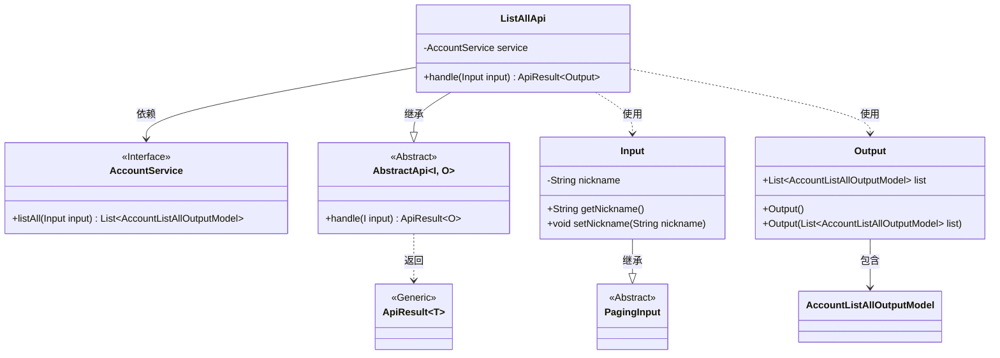
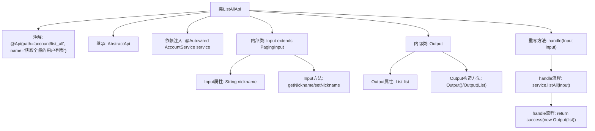

# 基础信息

|      |      |
|------|------|
| 名称 | ListAllApi |
| 编码语言 | .java |
| 代码路径 | WeFe/board/board-service/src/main/java/com/welab/wefe/board/service/api/account/ListAllApi.java |
| 包名 | com.welab.wefe.board.service.api.account |
| 依赖项 | ['com.welab.wefe.board.service.dto.base.PagingInput', 'com.welab.wefe.board.service.dto.entity.AccountListAllOutputModel', 'com.welab.wefe.board.service.service.account.AccountService', 'com.welab.wefe.common.web.api.base.AbstractApi', 'com.welab.wefe.common.web.api.base.Api', 'com.welab.wefe.common.web.dto.ApiResult', 'org.springframework.beans.factory.annotation.Autowired', 'java.util.List'] |
| 概述说明 | API类ListAllApi用于获取全量用户列表，接收分页参数和昵称筛选，返回用户列表数据。 |

# 说明

该代码定义了一个名为ListAllApi的API类，用于获取全量用户列表。类继承自AbstractApi，包含Input和Output两个嵌套类。Input类扩展了PagingInput，包含nickname属性及其getter/setter方法。Output类包含一个AccountListAllOutputModel类型的列表属性。API路径为account/list_all，通过自动注入的AccountService调用listAll方法处理请求，并返回包含用户列表的结果。整个类实现了分页查询和按昵称筛选的功能。

# 类列表 Class Summary

| 名称   | 类型  | 说明 |
|-------|------|-------------|
| ListAllApi | class | 定义获取用户列表的API类，包含分页输入和昵称筛选，返回用户列表数据。 |

## 类 ListAllApi

|      |      |
|------|------|
| 访问范围 | @Api(path = "account/list_all", name = "获取全量的用户列表");public |
| 类型 | class |
| 名称 | ListAllApi |
| 说明 | 定义获取用户列表的API类，包含分页输入和昵称筛选，返回用户列表数据。 |

### UML类图

这段类图展示了ListAllApi及其相关类的结构关系。ListAllApi继承自泛型抽象类AbstractApi<Input, Output>，包含一个AccountService接口依赖。Input类继承自PagingInput，包含nickname属性和getter/setter方法。Output类包含AccountListAllOutputModel列表。整个结构实现了通过AccountService获取用户列表的功能，遵循了分层设计原则，Input处理分页和查询参数，Output封装返回结果。

### 内部方法调用关系图

这段代码定义了一个名为ListAllApi的API类，用于获取全量用户列表。该类继承自AbstractApi并指定了输入输出泛型类型，包含通过AccountService获取数据的核心处理逻辑。代码结构包含两个静态内部类：Input用于接收分页查询参数和昵称过滤条件，Output用于包装返回的用户列表数据。主要流程是通过service.listAll()获取数据后构造Output对象返回，整体设计符合分层架构模式。

### 字段列表 Field List

| 名称  | 类型  | 说明 |
|-------|-------|------|
| service | AccountService | 使用@Autowired自动注入AccountService实例。 |

### 方法列表

| 名称  | 类型  | 说明 |
|-------|-------|------|
| handle | ApiResult<Output> | 方法重写处理输入并返回账户列表结果。调用服务获取列表后封装为成功响应。 |

