# 基础信息

|      |      |
|------|------|
| 名称 | QueryMemberAccountsApi |
| 编码语言 | .java |
| 代码路径 | WeFe/board/board-service/src/main/java/com/welab/wefe/board/service/api/account/QueryMemberAccountsApi.java |
| 包名 | com.welab.wefe.board.service.api.account |
| 依赖项 | ['com.welab.wefe.board.service.dto.base.PagingInput', 'com.welab.wefe.board.service.dto.base.PagingOutput', 'com.welab.wefe.board.service.dto.entity.AccountOutputModel', 'com.welab.wefe.board.service.service.account.AccountService', 'com.welab.wefe.common.exception.StatusCodeWithException', 'com.welab.wefe.common.fieldvalidate.annotation.Check', 'com.welab.wefe.common.web.api.base.AbstractApi', 'com.welab.wefe.common.web.api.base.Api', 'com.welab.wefe.common.web.dto.ApiResult', 'com.welab.wefe.common.wefe.enums.AuditStatus', 'org.springframework.beans.factory.annotation.Autowired'] |
| 概述说明 | 通过成员ID查询账户信息的API，包含分页输入参数如memberId、phoneNumber等，返回分页账户数据。 |

# 说明

该代码定义了一个名为QueryMemberAccountsApi的API类，用于通过会员ID查询账户信息。API路径为account/query_by_member_id，继承自AbstractApi，输入类型为内部类Input，输出为分页的AccountOutputModel。Input类包含分页参数和多个查询条件：必填的memberId、phoneNumber、nickname、auditStatus和adminRole。处理逻辑调用accountService的queryMemberAccounts方法，返回分页查询结果。所有字段都有对应的getter和setter方法。

# 类列表 Class Summary

| 名称   | 类型  | 说明 |
|-------|------|-------------|
| QueryMemberAccountsApi | class | 通过成员ID查询账户信息的API，包含分页输入参数如memberId、phoneNumber等，返回分页账户数据。 |


## 类 QueryMemberAccountsApi

|      |      |
|------|------|
| 访问范围 | @Api(path = "account/query_by_member_id", name = "Query account information by member ID");public |
| 类型 | class |
| 名称 | QueryMemberAccountsApi |
| 说明 | 通过成员ID查询账户信息的API，包含分页输入参数如memberId、phoneNumber等，返回分页账户数据。 |


### UML类图

```mermaid
classDiagram
    class QueryMemberAccountsApi {
        -AccountService accountService
        +handle(Input input) ApiResult~PagingOutput~AccountOutputModel~~
    }
    class Input {
        -String memberId
        -String phoneNumber
        -String nickname
        -AuditStatus auditStatus
        -Boolean adminRole
        +getMemberId() String
        +setMemberId(String memberId) void
        +getPhoneNumber() String
        +setPhoneNumber(String phoneNumber) void
        +getNickname() String
        +setNickname(String nickname) void
        +getAuditStatus() AuditStatus
        +setAuditStatus(AuditStatus auditStatus) void
        +getAdminRole() Boolean
        +setAdminRole(Boolean adminRole) void
    }
    class PagingInput {
        <<Abstract>>
    }
    class AccountService {
        <<Interface>>
        +queryMemberAccounts(Input input) PagingOutput~AccountOutputModel~
    }
    class PagingOutput~T~ {
        <<Generic>>
    }
    class AccountOutputModel {
    }
    class AuditStatus {
        <<Enum>>
    }
    class ApiResult~T~ {
        <<Generic>>
    }

    QueryMemberAccountsApi --> AccountService : 依赖
    Input --|> PagingInput : 继承
    QueryMemberAccountsApi ..> Input : 使用
    AccountService ..> PagingOutput~AccountOutputModel~ : 返回
    QueryMemberAccountsApi ..> ApiResult~PagingOutput~AccountOutputModel~~ : 返回
    Input ..> AuditStatus : 包含
    PagingOutput~T~ ..> AccountOutputModel : 包含
```

这段代码展示了一个基于成员ID查询账户信息的API实现。QueryMemberAccountsApi继承自AbstractApi，使用AccountService处理业务逻辑，接受Input参数并返回分页的AccountOutputModel结果。Input类继承PagingInput，包含成员ID、电话号码等查询条件，并使用了枚举类型AuditStatus。整个设计体现了清晰的层级关系和依赖，通过泛型实现了类型安全的输入输出处理。


### 内部方法调用关系图

```mermaid
graph TD
    A["类QueryMemberAccountsApi"]
    B["注解: @Api(path='account/query_by_member_id', name='Query account information by member ID')"]
    C["继承: AbstractApi<Input, PagingOutput<AccountOutputModel>>"]
    D["依赖注入: @Autowired AccountService accountService"]
    E["重写方法: handle(Input input)"]
    F["内部类: Input extends PagingInput"]
    G["属性: @Check(require=true) String memberId"]
    H["属性: String phoneNumber"]
    I["属性: String nickname"]
    J["属性: AuditStatus auditStatus"]
    K["属性: Boolean adminRole"]
    L["Getter/Setter方法"]

    A --> B
    A --> C
    A --> D
    A --> E
    A --> F
    F --> G
    F --> H
    F --> I
    F --> J
    F --> K
    F --> L
    E --> M["调用: accountService.queryMemberAccounts(input)"]
    E --> N["返回: success(result)"]
```



这段代码描述了一个基于成员ID查询账户信息的API类，继承自抽象API模板类。核心流程是通过handle方法调用AccountService查询成员账户，并返回分页结果。内部类Input定义了查询参数，包含必填的memberId和其他可选字段，所有字段都有对应的getter/setter方法。流程图展示了类结构、依赖关系和主要方法调用链路。

### 字段列表 Field List

| 名称  | 类型  | 说明 |
|-------|-------|------|
| accountService | AccountService | 使用@Autowired自动注入AccountService实例。 |

### 方法列表

| 名称  | 类型  | 说明 |
|-------|-------|------|
| handle | ApiResult<PagingOutput<AccountOutputModel>> | 代码重写父类方法，调用accountService查询成员账户，返回分页结果。异常时抛出状态码异常。 |


