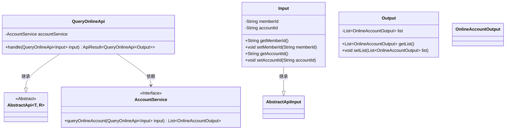
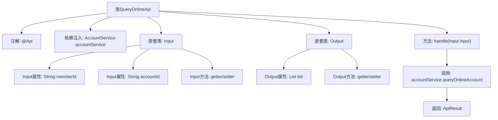

# 基础信息

|      |      |
|------|------|
| 名称 | QueryOnlineApi |
| 编码语言 | .java |
| 代码路径 | WeFe/board/board-service/src/main/java/com/welab/wefe/board/service/api/account/QueryOnlineApi.java |
| 包名 | com.welab.wefe.board.service.api.account |
| 依赖项 | ['com.welab.wefe.board.service.dto.vo.OnlineAccountOutput', 'com.welab.wefe.board.service.service.account.AccountService', 'com.welab.wefe.common.exception.StatusCodeWithException', 'com.welab.wefe.common.fieldvalidate.annotation.Check', 'com.welab.wefe.common.web.api.base.AbstractApi', 'com.welab.wefe.common.web.api.base.Api', 'com.welab.wefe.common.web.dto.AbstractApiInput', 'com.welab.wefe.common.web.dto.ApiResult', 'org.springframework.beans.factory.annotation.Autowired', 'java.util.List'] |
| 概述说明 | 查询交易所在线账户的API，需提供会员ID和可选账户ID，返回在线账户列表。 |

# 说明

该代码定义了一个名为QueryOnlineApi的API类，用于查询交易所中心的在线账户。API路径为account/query_online，继承自AbstractApi类，处理输入Input和输出Output。Input包含必填的memberId和可选的accountId字段，Output包含在线账户列表。通过AccountService的queryOnlineAccount方法处理请求，返回结果列表。所有字段均通过getter和setter方法访问和修改。

# 类列表 Class Summary

| 名称   | 类型  | 说明 |
|-------|------|-------------|
| QueryOnlineApi | class | 查询交易所在线账户的API，需成员ID和可选账户ID，返回在线账户列表。 |

## 类 QueryOnlineApi

|      |      |
|------|------|
| 访问范围 | @Api(path = "account/query_online", name = "Query the online account of the exchange center");public |
| 类型 | class |
| 名称 | QueryOnlineApi |
| 说明 | 查询交易所在线账户的API，需成员ID和可选账户ID，返回在线账户列表。 |

### UML类图

这段代码展示了一个查询在线账户的API实现，核心类QueryOnlineApi继承自泛型抽象类AbstractApi，并依赖AccountService接口进行业务处理。输入参数Input和输出结果Output分别作为内部类封装数据，其中Input包含会员ID和账户ID字段，Output包含在线账户列表。类图清晰地反映了继承关系和依赖关系，体现了分层设计思想。

### 内部方法调用关系图

这段代码展示了一个基于Spring框架的API类QueryOnlineApi，用于查询交易所中心的在线账户状态。该API继承自AbstractApi，包含输入参数Input和输出结果Output两个嵌套类。主要流程是通过handle方法调用AccountService的queryOnlineAccount服务，返回包含在线账户列表的ApiResult。Input类包含必填的memberId和可选的accountId字段，Output类封装了OnlineAccountOutput列表。整个结构体现了典型的Spring Boot API分层设计模式。

### 字段列表 Field List

| 名称  | 类型  | 说明 |
|-------|-------|------|
| accountService | AccountService | 使用@Autowired自动注入AccountService实例。 |

### 方法列表

| 名称  | 类型  | 说明 |
|-------|-------|------|
| handle | ApiResult<QueryOnlineApi.Output> | 处理查询在线账户请求，调用服务获取结果并返回成功响应。 |

