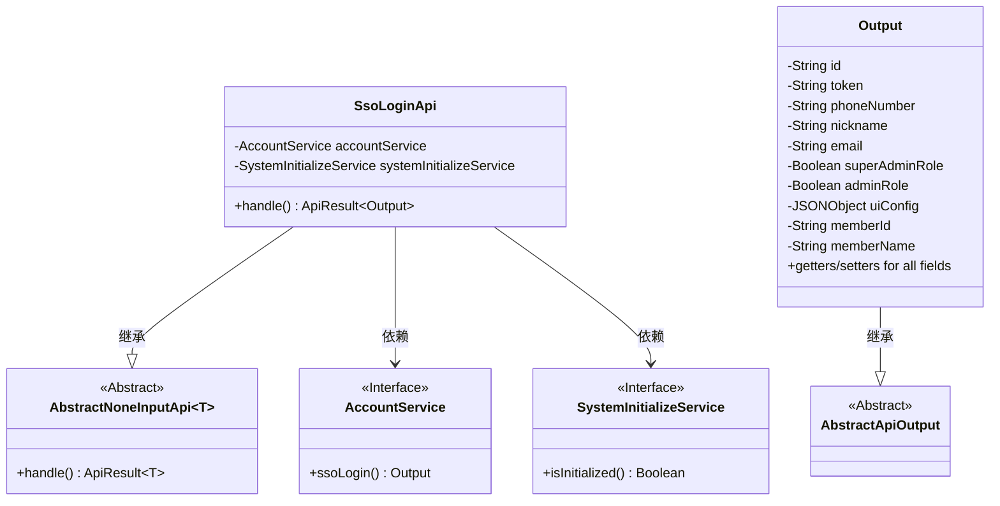
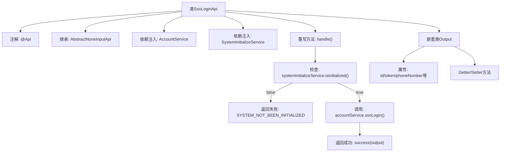

# 基础信息

|      |      |
|------|------|
| 名称 | SsoLoginApi |
| 编码语言 | .java |
| 代码路径 | WeFe/board/board-service/src/main/java/com/welab/wefe/board/service/api/account/SsoLoginApi.java |
| 包名 | com.welab.wefe.board.service.api.account |
| 依赖项 | ['com.alibaba.fastjson.JSONObject', 'com.welab.wefe.board.service.service.SystemInitializeService', 'com.welab.wefe.board.service.service.account.AccountService', 'com.welab.wefe.common.StatusCode', 'com.welab.wefe.common.exception.StatusCodeWithException', 'com.welab.wefe.common.web.api.base.AbstractNoneInputApi', 'com.welab.wefe.common.web.api.base.Api', 'com.welab.wefe.common.web.dto.AbstractApiOutput', 'com.welab.wefe.common.web.dto.ApiResult', 'org.springframework.beans.factory.annotation.Autowired'] |
| 概述说明 | SSO登录API，检查系统初始化后调用账户服务登录，返回用户ID、令牌、角色及配置等信息。 |

# 说明

该代码定义了一个名为SsoLoginApi的API类，用于处理单点登录请求。路径为account/sso_login，无需登录即可访问。类继承自AbstractNoneInputApi，输出类型为内部类Output。主要逻辑是检查系统是否初始化，未初始化则返回错误，否则调用accountService的ssoLogin方法返回用户信息。Output类包含用户ID、令牌、电话号码、昵称、邮箱、管理员角色标识、UI配置及会员信息等字段，并提供了相应的getter和setter方法。

# 类列表 Class Summary

| 名称   | 类型  | 说明 |
|-------|------|-------------|
| SsoLoginApi | class | SSO登录API，检查系统初始化后调用账户服务登录，返回用户ID、令牌、角色及配置等信息。 |

## 类 SsoLoginApi

|      |      |
|------|------|
| 访问范围 | @Api(path = "account/sso_login", name = "sso_login", login = false);public |
| 类型 | class |
| 名称 | SsoLoginApi |
| 说明 | SSO登录API，检查系统初始化后调用账户服务登录，返回用户ID、令牌、角色及配置等信息。 |

### UML类图

这段代码展示了一个SSO登录API的实现结构。SsoLoginApi继承自泛型抽象类AbstractNoneInputApi，处理无输入参数的API请求，依赖AccountService进行登录操作和SystemInitializeService检查系统初始化状态。Output作为内部类继承AbstractApiOutput，包含用户登录后的各类信息（如ID、token、角色权限等）。整体设计符合分层架构，通过接口隔离实现细节，Output类提供了完整的用户信息封装。

### 内部方法调用关系图

该流程图展示了SSO登录API的核心结构，包含类注解、依赖注入、主要处理逻辑和输出类定义。处理流程首先检查系统是否初始化，未初始化则返回错误，否则执行SSO登录并返回结果。嵌套类Output定义了包含用户身份信息、权限和配置的复杂数据结构，通过Getter/Setter方法提供访问接口。

### 字段列表 Field List

| 名称  | 类型  | 说明 |
|-------|-------|------|
| systemInitializeService | SystemInitializeService | 自动注入系统初始化服务实例。 |
| accountService | AccountService | 自动注入AccountService实例。 |

### 方法列表

| 名称  | 类型  | 说明 |
|-------|-------|------|
| handle | ApiResult<Output> | 代码检查系统是否初始化，未初始化返回错误状态码，已初始化则调用账户服务进行单点登录并返回结果。 |

