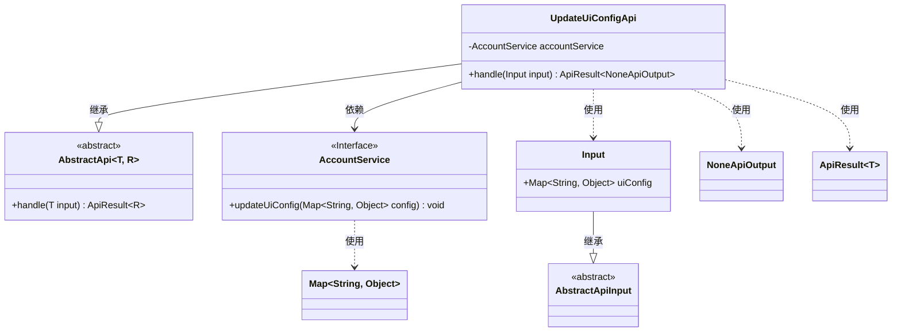

# 基础信息

|      |      |
|------|------|
| 名称 | UpdateUiConfigApi |
| 编码语言 | .java |
| 代码路径 | WeFe/board/board-service/src/main/java/com/welab/wefe/board/service/api/account/UpdateUiConfigApi.java |
| 包名 | com.welab.wefe.board.service.api.account |
| 依赖项 | ['com.welab.wefe.board.service.service.account.AccountService', 'com.welab.wefe.common.exception.StatusCodeWithException', 'com.welab.wefe.common.fieldvalidate.annotation.Check', 'com.welab.wefe.common.web.api.base.AbstractApi', 'com.welab.wefe.common.web.api.base.Api', 'com.welab.wefe.common.web.dto.AbstractApiInput', 'com.welab.wefe.common.web.dto.ApiResult', 'com.welab.wefe.common.web.dto.NoneApiOutput', 'org.springframework.beans.factory.annotation.Autowired', 'java.util.Map'] |
| 概述说明 | 修改用户UI配置的API，接收配置信息并调用服务更新，返回成功结果。 |

# 说明

这是一个用于修改用户UI配置信息的API类，路径为"account/update_ui_config"。该类继承自AbstractApi，接收UpdateUiConfigApi.Input作为输入参数，返回NoneApiOutput。通过自动注入的AccountService调用updateUiConfig方法处理输入参数中的uiConfig配置信息。输入类Input继承自AbstractApiInput，包含一个必填的Map类型字段uiConfig，用于传递用户界面配置信息。处理成功后返回空结果。

# 类列表 Class Summary

| 名称   | 类型  | 说明 |
|-------|------|-------------|
| UpdateUiConfigApi | class | 这是一个修改用户UI配置的API接口，接收配置信息并调用服务更新，返回空结果。输入参数为必填的UI配置映射。 |

## 类 UpdateUiConfigApi

|      |      |
|------|------|
| 访问范围 | @Api(path = "account/update_ui_config", name = "修改用户UI配置信息");public |
| 类型 | class |
| 名称 | UpdateUiConfigApi |
| 说明 | 这是一个修改用户UI配置的API接口，接收配置信息并调用服务更新，返回空结果。输入参数为必填的UI配置映射。 |

### UML类图

这段代码描述了一个用于更新用户UI配置的API类`UpdateUiConfigApi`，它继承自泛型抽象类`AbstractApi`，使用`AccountService`接口来实际执行配置更新操作。输入参数`Input`继承自`AbstractApiInput`，包含一个必须的UI配置映射。该API返回`NoneApiOutput`表示无具体输出数据，通过`ApiResult`包装返回结果。类图清晰地展示了继承关系、依赖关系和使用关系。

### 内部方法调用关系图

```mermaid
graph TD
    A["类UpdateUiConfigApi"]
    B["注解: @Api(path='account/update_ui_config', name='修改用户UI配置信息')"]
    C["继承: AbstractApi<Input, NoneApiOutput>"]
    D["依赖注入: @Autowired AccountService accountService"]
    E["重写方法: handle(Input input)"]
    F["内部类: Input extends AbstractApiInput"]
    G["注解校验: @Check(name='用户界面配置信息', require=true)"]
    H["字段: Map<String, Object> uiConfig"]
    I["调用: accountService.updateUiConfig(input.uiConfig)"]
    J["返回: ApiResult<NoneApiOutput> success()"]

    A --> B
    A --> C
    A --> D
    A --> E
    E --> I
    E --> J
    A --> F
    F --> G
    F --> H
```

该流程图展示了UpdateUiConfigApi类的结构和主要逻辑流程。该类是一个API接口，用于修改用户UI配置信息，通过继承AbstractApi并实现handle方法来处理请求。流程包括依赖注入AccountService、校验输入参数、调用服务层更新配置，最后返回成功结果。内部类Input定义了必需的uiConfig字段，并通过注解进行校验。整体设计符合API分层架构，职责清晰。

### 字段列表 Field List

| 名称  | 类型  | 说明 |
|-------|-------|------|
| accountService | AccountService | 使用@Autowired自动注入AccountService实例。 |

### 方法列表

| 名称  | 类型  | 说明 |
|-------|-------|------|
| handle | ApiResult<NoneApiOutput> | 处理更新UI配置请求，调用服务更新配置后返回成功结果。 |

