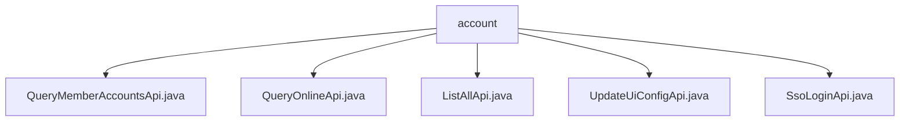

# 基础信息

|      |      |
|------|------|
| 名称 | account |
| 编码语言 | .java |
| 代码路径 | WeFe/board/board-service/src/main/java/com/welab/wefe/board/service/api/account |
| 包名 | docs.board.board-service.src.main.java.com.welab.wefe.board.service.api.account |
| 概述说明 | QueryMemberAccountsApi通过会员ID查询账户信息。QueryOnlineApi查询在线账户。ListAllApi获取全量用户列表。UpdateUiConfigApi修改用户UI配置。SsoLoginApi处理单点登录请求。 |

# 说明

## 概述  
该模块提供账户管理相关API，核心职责包括查询会员账户信息、在线状态、全量用户列表，以及更新UI配置和处理单点登录。接口规范统一继承AbstractApi或其子类，输入输出均采用嵌套类结构，例如QueryMemberAccountsApi.Input包含分页参数和查询条件。关键数据结构包括AccountOutputModel（分页结果）、AccountListAllOutputModel（全量列表）和Map类型的uiConfig（UI配置）。外部依赖仅涉及AccountService，用于业务逻辑处理。例如，QueryOnlineApi通过其queryOnlineAccount方法获取在线账户。

## 主要业务场景  
模块支持多种账户管理场景：按会员ID分页查询账户（类似CRUD筛选）、获取交易所在线账户、全量用户列表分页查询（支持昵称过滤）和UI配置更新。交互模式均为HTTP API调用，例如SsoLoginApi处理单点登录时验证系统状态并返回用户令牌。典型应用包括后台管理系统集成（如分页展示用户）和SSO登录流程。API类型涵盖查询类（如ListAllApi）和更新类（如UpdateUiConfigApi），例如后者通过Map接收动态UI配置。

### 包内部结构视图

该流程图展示了WeFe项目中account目录下的API文件结构。根节点为account文件夹，包含5个Java接口文件：QueryMemberAccountsApi、QueryOnlineApi、ListAllApi、UpdateUiConfigApi和SsoLoginApi，这些文件均直接隶属于account目录，没有更深层级的嵌套关系。

# 文件列表

| 名称   | 类型  | 说明 |
|-------|------|-------------|
| [QueryMemberAccountsApi.java](QueryMemberAccountsApi.md) | file | 通过成员ID查询账户信息的API，包含分页输入参数如memberId、phoneNumber等，返回分页账户数据。 |
| [QueryOnlineApi.java](QueryOnlineApi.md) | file | 查询交易所在线账户的API，需提供会员ID和可选账户ID，返回在线账户列表。 |
| [ListAllApi.java](ListAllApi.md) | file | API类ListAllApi用于获取全量用户列表，接收分页参数和昵称筛选，返回用户列表数据。 |
| [UpdateUiConfigApi.java](UpdateUiConfigApi.md) | file | 修改用户UI配置的API，接收配置信息并调用服务更新，返回成功结果。 |
| [SsoLoginApi.java](SsoLoginApi.md) | file | SSO登录API，检查系统初始化后调用账户服务登录，返回用户ID、令牌、角色及配置等信息。 |

