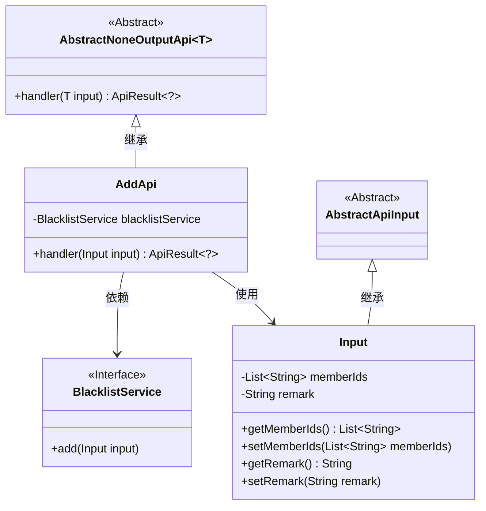

# 基础信息

|      |      |
|------|------|
| 名称 | AddApi |
| 编码语言 | .java |
| 代码路径 | WeFe/board/board-service/src/main/java/com/welab/wefe/board/service/api/blacklist/AddApi.java |
| 包名 | com.welab.wefe.board.service.api.blacklist |
| 依赖项 | ['com.welab.wefe.board.service.service.BlacklistService', 'com.welab.wefe.common.exception.StatusCodeWithException', 'com.welab.wefe.common.fieldvalidate.annotation.Check', 'com.welab.wefe.common.web.api.base.AbstractNoneOutputApi', 'com.welab.wefe.common.web.api.base.Api', 'com.welab.wefe.common.web.dto.AbstractApiInput', 'com.welab.wefe.common.web.dto.ApiResult', 'org.springframework.beans.factory.annotation.Autowired', 'java.util.List'] |
| 概述说明 | 该代码定义了一个添加成员到黑名单的API接口，包含成员ID列表和备注信息，调用BlacklistService进行添加操作。 |

# 说明

该代码定义了一个名为AddApi的API类，用于将成员加入黑名单。API路径为blacklist/add，继承自AbstractNoneOutputApi，输入类型为内部类Input。Input包含必填的成员ID列表memberIds和可选的备注remark。通过BlacklistService的add方法处理输入，成功时返回空结果。整个API通过注解定义了路径、名称和参数校验规则。

# 类列表 Class Summary

| 名称   | 类型  | 说明 |
|-------|------|-------------|
| AddApi | class | 这是一个添加成员到黑名单的API类，接收成员ID列表和备注，调用黑名单服务完成添加操作。 |

## 类 AddApi

|      |      |
|------|------|
| 访问范围 | @Api(path = "blacklist/add", name = "add members to blacklist");public |
| 类型 | class |
| 名称 | AddApi |
| 说明 | 这是一个添加成员到黑名单的API类，接收成员ID列表和备注，调用黑名单服务完成添加操作。 |

### UML类图

这段代码描述了一个黑名单添加API的实现结构。AddApi继承自AbstractNoneOutputApi泛型类，处理Input类型的输入参数，通过依赖注入的BlacklistService接口实现黑名单添加功能。Input类继承自AbstractApiInput，包含成员ID列表和备注信息。整体设计体现了清晰的层级关系，其中AbstractNoneOutputApi提供基础API框架，AddApi实现具体业务逻辑，Input封装请求参数，BlacklistService定义核心业务操作接口。

### 内部方法调用关系图

```mermaid
graph TD
    A["类AddApi"]
    B["注解: @Api(path='blacklist/add', name='add members to blacklist')"]
    C["继承: AbstractNoneOutputApi<Input>"]
    D["依赖注入: @Autowired BlacklistService"]
    E["重写方法: handler(Input input)"]
    F["内部类: Input"]
    G["属性: List<String> memberIds"]
    H["属性: String remark"]
    I["方法: getMemberIds()/setMemberIds()"]
    J["方法: getRemark()/setRemark()"]
    K["校验注解: @Check(name='成员id', require=true)"]
    L["调用: blacklistService.add(input)"]
    M["返回: success()"]

    A --> B
    A --> C
    A --> D
    A --> E
    E --> L
    E --> M
    C -.-> F
    F --> G
    F --> H
    F --> I
    F --> J
    G --> K
```

这段代码是一个黑名单添加功能的API实现类，继承自抽象模板类AbstractNoneOutputApi。主要流程是通过handler方法处理输入参数，调用BlacklistService执行添加操作。Input内部类包含成员ID列表和备注字段，其中memberIds字段通过@Check注解强制校验非空。整体设计采用分层架构，将业务逻辑委托给Service层处理，符合单一职责原则。

### 字段列表 Field List

| 名称  | 类型  | 说明 |
|-------|-------|------|
| blacklistService | BlacklistService | 使用@Autowired自动注入BlacklistService实例。 |

### 方法列表

| 名称  | 类型  | 说明 |
|-------|-------|------|
| handler | ApiResult<?> | 代码片段是一个Java方法，重写handler处理输入，调用blacklistService.add添加输入，成功返回ApiResult。 |

