# 基础信息

|      |      |
|------|------|
| 名称 | BlacklistApi |
| 编码语言 | .java |
| 代码路径 | WeFe/board/board-service/src/main/java/com/welab/wefe/board/service/api/blacklist/BlacklistApi.java |
| 包名 | com.welab.wefe.board.service.api.blacklist |
| 依赖项 | ['com.welab.wefe.board.service.dto.base.PagingInput', 'com.welab.wefe.board.service.dto.base.PagingOutput', 'com.welab.wefe.board.service.dto.entity.BlacklistOutputModel', 'com.welab.wefe.board.service.service.BlacklistService', 'com.welab.wefe.common.exception.StatusCodeWithException', 'com.welab.wefe.common.web.api.base.AbstractApi', 'com.welab.wefe.common.web.api.base.Api', 'com.welab.wefe.common.web.dto.ApiResult', 'org.springframework.beans.factory.annotation.Autowired'] |
| 概述说明 | 黑名单分页查询API，继承AbstractApi，调用BlacklistService处理分页请求，返回分页结果。 |

# 说明

这是一个名为BlacklistApi的API类，用于分页查询黑名单数据。它继承自AbstractApi基类，接收Input参数并返回分页格式的BlacklistOutputModel结果。类上标注了Api注解，指定路径为blacklist/list，功能描述为分页查询黑名单。内部通过注入的BlacklistService调用list方法处理业务逻辑。Input类继承PagingInput，表示这是一个分页查询请求。handle方法负责调用服务层并返回封装后的分页结果。整个API设计遵循标准的参数输入输出规范。

# 类列表 Class Summary

| 名称   | 类型  | 说明 |
|-------|------|-------------|
| BlacklistApi | class | 黑名单分页查询API，继承AbstractApi，使用BlacklistService处理输入PagingInput，返回分页结果PagingOutput<BlacklistOutputModel>。 |


## 类 BlacklistApi

|      |      |
|------|------|
| 访问范围 | @Api(path = "blacklist/list", name = "query blacklist by pagination");public |
| 类型 | class |
| 名称 | BlacklistApi |
| 说明 | 黑名单分页查询API，继承AbstractApi，使用BlacklistService处理输入PagingInput，返回分页结果PagingOutput<BlacklistOutputModel>。 |


### UML类图

```mermaid
classDiagram
    class AbstractApi~T, R~ {
        <<Abstract>>
        +handle(T input) ApiResult~R~
    }
    class BlacklistApi {
        -BlacklistService blacklistService
        +handle(Input input) ApiResult~PagingOutput~BlacklistOutputModel~~
    }
    class BlacklistService {
        <<Interface>>
        +list(Input input) PagingOutput~BlacklistOutputModel~
    }
    class PagingInput {
        <<Abstract>>
    }
    class Input {
    }
    class PagingOutput~T~ {
    }
    class ApiResult~T~ {
    }
    class BlacklistOutputModel {
    }

    BlacklistApi --|> AbstractApi~Input, PagingOutput~BlacklistOutputModel~~ : 继承
    Input --|> PagingInput : 继承
    BlacklistApi --> BlacklistService : 依赖
    BlacklistService ..> PagingOutput~BlacklistOutputModel~ : 创建
    BlacklistService ..> BlacklistOutputModel : 使用
    AbstractApi ..> ApiResult~R~ : 使用
```

这段代码展示了一个分页查询黑名单的API实现。BlacklistApi继承自泛型抽象类AbstractApi，指定了输入类型Input和输出类型PagingOutput<BlacklistOutputModel>。Input继承自PagingInput用于分页参数，通过依赖注入的BlacklistService接口实现业务逻辑。整体设计采用了分层架构，通过泛型实现了类型安全的API处理，其中BlacklistService负责实际的数据查询和分页处理，返回包含黑名单数据的包装对象。


### 内部方法调用关系图

```mermaid
graph TD
    A["类BlacklistApi"]
    B["注解: @Api(path='blacklist/list', name='query blacklist by pagination')"]
    C["继承: AbstractApi<Input, PagingOutput<BlacklistOutputModel>>"]
    D["依赖注入: @Autowired BlacklistService"]
    E["重写方法: handle(Input input)"]
    F["内部类: Input extends PagingInput"]
    G["调用: blacklistService.list(input)"]
    H["返回: success(PagingOutput结果)"]

    A --> B
    A --> C
    A --> D
    A --> E
    A --> F
    E --> G
    G --> H
```



该流程图描述了BlacklistApi类的结构和执行流程。该类通过@Api注解定义API路径，继承AbstractApi基类并指定输入/输出泛型类型。核心逻辑在handle方法中，通过自动注入的BlacklistService执行分页查询，最终返回封装的成功结果。内部类Input扩展了分页参数基类，整个流程展示了从请求处理到服务调用的完整链路。

### 字段列表 Field List

| 名称  | 类型  | 说明 |
|-------|-------|------|
| blacklistService | BlacklistService | 自动注入黑名单服务实例。 |

### 方法列表

| 名称  | 类型  | 说明 |
|-------|-------|------|
| handle | ApiResult<PagingOutput<BlacklistOutputModel>> | 处理输入并返回黑名单分页列表，成功时调用服务层方法。 |


