# 基础信息

|      |      |
|------|------|
| 名称 | BlacklistMemberApi |
| 编码语言 | .java |
| 代码路径 | WeFe/board/board-service/src/main/java/com/welab/wefe/board/service/api/blacklist/BlacklistMemberApi.java |
| 包名 | com.welab.wefe.board.service.api.blacklist |
| 依赖项 | ['com.welab.wefe.board.service.dto.base.PagingInput', 'com.welab.wefe.board.service.dto.base.PagingOutput', 'com.welab.wefe.board.service.dto.entity.MemberOutputModel', 'com.welab.wefe.board.service.service.BlacklistService', 'com.welab.wefe.common.exception.StatusCodeWithException', 'com.welab.wefe.common.web.api.base.AbstractApi', 'com.welab.wefe.common.web.api.base.Api', 'com.welab.wefe.common.web.dto.ApiResult', 'org.springframework.beans.factory.annotation.Autowired'] |
| 概述说明 | 黑名单成员查询API，通过ID或姓名分页查询黑名单成员，返回分页结果。 |

# 说明

该代码定义了一个名为BlacklistMemberApi的API类，用于查询黑名单成员。API路径为blacklist/member，接受包含id和name的分页输入参数Input，返回分页的MemberOutputModel结果。通过BlacklistService处理查询逻辑，并返回ApiResult封装的分页数据。输入类Input继承自PagingInput，包含id和name两个可读写属性。

# 类列表 Class Summary

| 名称   | 类型  | 说明 |
|-------|------|-------------|
| BlacklistMemberApi | class | 黑名单成员查询API，继承AbstractApi，使用BlacklistService处理分页查询，输入包含ID和姓名，输出成员分页结果。 |


## 类 BlacklistMemberApi

|      |      |
|------|------|
| 访问范围 | @Api(path = "blacklist/member", name = "query blacklist members");public |
| 类型 | class |
| 名称 | BlacklistMemberApi |
| 说明 | 黑名单成员查询API，继承AbstractApi，使用BlacklistService处理分页查询，输入包含ID和姓名，输出成员分页结果。 |


### UML类图

```mermaid
classDiagram
    class AbstractApi~T, R~ {
        <<Abstract>>
        +handle(T input) ApiResult~R~
    }

    class BlacklistMemberApi {
        -BlacklistService blacklistService
        +handle(Input input) ApiResult~PagingOutput~MemberOutputModel~~
    }

    class PagingInput {
        <<Abstract>>
    }

    class Input {
        -String id
        -String name
        +String getId()
        +void setId(String id)
        +String getName()
        +void setName(String name)
    }

    class BlacklistService {
        <<Interface>>
        +queryBlacklistMember(Input input) PagingOutput~MemberOutputModel~
    }

    class PagingOutput~T~ {
        // 分页输出泛型类
    }

    class MemberOutputModel {
        // 成员输出模型
    }

    class ApiResult~T~ {
        // API结果封装
    }

    AbstractApi~Input, PagingOutput~MemberOutputModel~~ <|-- BlacklistMemberApi
    PagingInput <|-- Input
    BlacklistMemberApi --> BlacklistService : 依赖
    BlacklistMemberApi ..> Input : 包含
    BlacklistService ..> PagingOutput~MemberOutputModel~ : 返回
    BlacklistService ..> Input : 参数
    BlacklistMemberApi ..> ApiResult~PagingOutput~MemberOutputModel~~ : 返回
```

这段代码描述了一个黑名单成员查询API的实现结构。BlacklistMemberApi继承自泛型抽象类AbstractApi，处理Input参数并返回分页成员结果。Input类继承PagingInput，包含id和name查询字段。BlacklistService接口提供查询功能，返回PagingOutput<MemberOutputModel>分页结果。整体架构采用分层设计，通过ApiResult封装响应，实现了查询逻辑与API层的解耦。


### 内部方法调用关系图

```mermaid
graph TD
    A["类BlacklistMemberApi"]
    B["注解: @Api(path='blacklist/member', name='query blacklist members')"]
    C["继承: AbstractApi<Input, PagingOutput<MemberOutputModel>>"]
    D["依赖注入: @Autowired BlacklistService blacklistService"]
    E["重写方法: handle(Input input)"]
    F["内部类: Input"]
    G["属性: String id"]
    H["属性: String name"]
    I["方法: getId()/setId()"]
    J["方法: getName()/setName()"]
    K["调用: blacklistService.queryBlacklistMember(input)"]
    L["返回: ApiResult.success()"]

    A --> B
    A --> C
    A --> D
    A --> E
    A --> F
    F --> G
    F --> H
    F --> I
    F --> J
    E --> K
    K --> L
```



该流程图展示了BlacklistMemberApi类的结构，包括类注解、继承关系、依赖注入的BlacklistService，以及重写的handle方法处理逻辑。内部类Input包含分页查询参数id和name及其getter/setter方法。核心流程是通过blacklistService查询黑名单成员并返回封装结果，体现了Spring Boot中API层的典型设计模式。

### 字段列表 Field List

| 名称  | 类型  | 说明 |
|-------|-------|------|
| blacklistService | BlacklistService | 代码片段使用@Autowired注解自动注入BlacklistService实例。 |

### 方法列表

| 名称  | 类型  | 说明 |
|-------|-------|------|
| handle | ApiResult<PagingOutput<MemberOutputModel>> | 重写方法处理黑名单成员查询，调用服务并返回分页结果。 |


