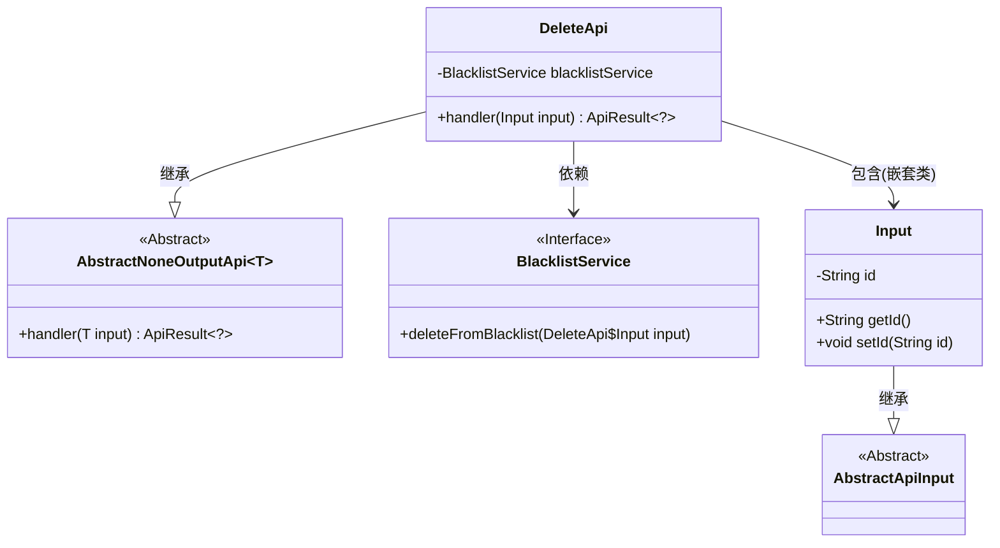
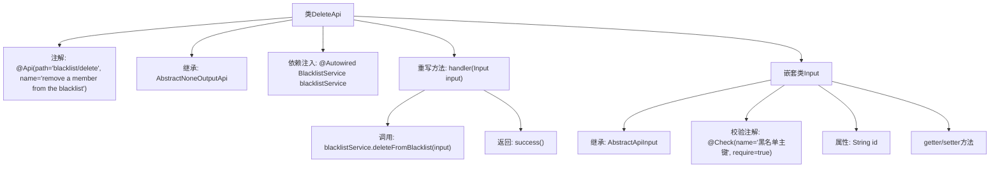

# 基础信息

|      |      |
|------|------|
| 名称 | DeleteApi |
| 编码语言 | .java |
| 代码路径 | WeFe/board/board-service/src/main/java/com/welab/wefe/board/service/api/blacklist/DeleteApi.java |
| 包名 | com.welab.wefe.board.service.api.blacklist |
| 依赖项 | ['com.welab.wefe.board.service.service.BlacklistService', 'com.welab.wefe.common.exception.StatusCodeWithException', 'com.welab.wefe.common.fieldvalidate.annotation.Check', 'com.welab.wefe.common.web.api.base.AbstractNoneOutputApi', 'com.welab.wefe.common.web.api.base.Api', 'com.welab.wefe.common.web.dto.AbstractApiInput', 'com.welab.wefe.common.web.dto.ApiResult', 'org.springframework.beans.factory.annotation.Autowired'] |
| 概述说明 | 删除黑名单成员的API，需传入主键ID，调用BlacklistService执行删除操作，无返回数据。 |

# 说明

该代码定义了一个名为DeleteApi的API类，用于从黑名单中移除成员。API路径为"blacklist/delete"，输入参数为包含必填字段"id"的Input类。通过调用BlacklistService的deleteFromBlacklist方法处理请求，成功后返回空结果。输入类Input继承自AbstractApiInput，包含id属性的getter和setter方法。整个API继承自AbstractNoneOutputApi，表示无输出数据。

# 类列表 Class Summary

| 名称   | 类型  | 说明 |
|-------|------|-------------|
| DeleteApi | class | 删除黑名单成员的API，需提供黑名单主键ID，调用BlacklistService执行删除操作。 |

## 类 DeleteApi

|      |      |
|------|------|
| 访问范围 | @Api(path = "blacklist/delete", name = "remove a member from the blacklist");public |
| 类型 | class |
| 名称 | DeleteApi |
| 说明 | 删除黑名单成员的API，需提供黑名单主键ID，调用BlacklistService执行删除操作。 |

### UML类图

这段代码展示了一个删除黑名单成员的API实现。DeleteApi继承自泛型类AbstractNoneOutputApi，使用嵌套类Input作为参数类型，并通过依赖注入的BlacklistService接口执行删除操作。Input类继承自AbstractApiInput，包含一个必填的id字段。整体设计符合分层架构，通过继承和组合实现功能解耦。

### 内部方法调用关系图

该流程图展示了DeleteApi类的完整结构，包括类注解、继承关系、服务注入和核心业务逻辑处理流程。主类通过handler方法调用blacklistService执行删除操作，嵌套类Input定义了必需的id字段及其校验规则。整体呈现了从API入口到业务处理的完整调用链路，层级清晰体现了Spring Boot应用的典型分层架构特征。

### 字段列表 Field List

| 名称  | 类型  | 说明 |
|-------|-------|------|
| blacklistService | BlacklistService | 代码片段使用@Autowired自动注入BlacklistService实例。 |

### 方法列表

| 名称  | 类型  | 说明 |
|-------|-------|------|
| handler | ApiResult<?> | 删除黑名单条目，处理输入后返回成功结果。 |

