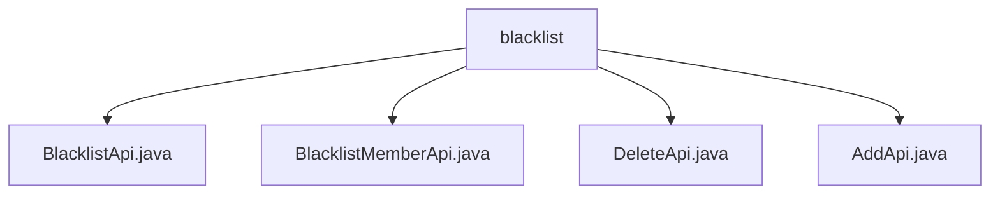

# 基础信息

|      |      |
|------|------|
| 名称 | blacklist |
| 编码语言 | .java |
| 代码路径 | WeFe/board/board-service/src/main/java/com/welab/wefe/board/service/api/blacklist |
| 包名 | docs.board.board-service.src.main.java.com.welab.wefe.board.service.api.blacklist |
| 概述说明 | BlacklistApi分页查询黑名单，路径blacklist/list。BlacklistMemberApi查询黑名单成员，路径blacklist/member。DeleteApi移除黑名单成员，路径blacklist/delete。AddApi添加成员到黑名单，路径blacklist/add。均继承基类，通过BlacklistService处理逻辑。 |

# 说明

## 概述  
该模块为黑名单管理系统，核心职责是提供黑名单成员的增删查功能，类似CRUD操作集。接口规范包含分页查询（/blacklist/list、/blacklist/member）、添加（/blacklist/add）和删除（/blacklist/delete）三类API，均继承AbstractApi基类。关键数据结构包括分页输入PagingInput、黑名单模型BlacklistOutputModel和成员模型MemberOutputModel。外部依赖仅为BlacklistService，用于处理业务逻辑。例如AddApi通过memberIds和remark参数添加成员，DeleteApi通过id移除成员。

## 主要业务场景  
业务流程围绕黑名单生命周期管理：分页查询支持ID/姓名筛选（例如BlacklistMemberApi），添加支持批量操作（例如AddApi），删除支持单条操作（例如DeleteApi）。交互模式统一为RESTful风格，输入输出遵循标准规范。典型应用包括风险控制场景，如批量拉黑异常用户。API类型涵盖查询类（返回分页数据）和操作类（无返回数据），集成案例包括与其他风控模块联动。

### 包内部结构视图

该流程图展示了blacklist目录下的四个API文件结构。根节点为blacklist文件夹，其下直接包含四个Java接口文件：BlacklistApi、BlacklistMemberApi、DeleteApi和AddApi，清晰地呈现了黑名单功能模块的API文件组织方式。

# 文件列表

| 名称   | 类型  | 说明 |
|-------|------|-------------|
| [BlacklistApi.java](BlacklistApi.md) | file | 黑名单分页查询API，继承AbstractApi，调用BlacklistService处理分页请求，返回分页结果。 |
| [BlacklistMemberApi.java](BlacklistMemberApi.md) | file | 黑名单成员查询API，通过ID或姓名分页查询黑名单成员，返回分页结果。 |
| [DeleteApi.java](DeleteApi.md) | file | 删除黑名单成员的API，需传入主键ID，调用BlacklistService执行删除操作，无返回数据。 |
| [AddApi.java](AddApi.md) | file | 该代码定义了一个添加成员到黑名单的API接口，包含成员ID列表和备注信息，调用BlacklistService进行添加操作。 |

