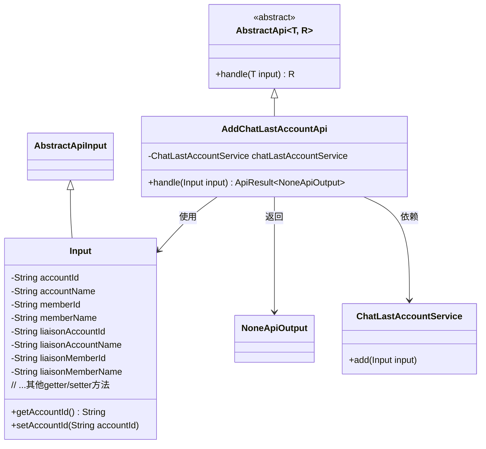

# 基础信息

|      |      |
|------|------|
| 名称 | AddChatLastAccountApi |
| 编码语言 | .java |
| 代码路径 | WeFe/board/board-service/src/main/java/com/welab/wefe/board/service/api/chat/AddChatLastAccountApi.java |
| 包名 | com.welab.wefe.board.service.api.chat |
| 依赖项 | ['com.welab.wefe.board.service.service.ChatLastAccountService', 'com.welab.wefe.common.exception.StatusCodeWithException', 'com.welab.wefe.common.fieldvalidate.annotation.Check', 'com.welab.wefe.common.web.api.base.AbstractApi', 'com.welab.wefe.common.web.api.base.Api', 'com.welab.wefe.common.web.dto.AbstractApiInput', 'com.welab.wefe.common.web.dto.ApiResult', 'com.welab.wefe.common.web.dto.NoneApiOutput', 'org.springframework.beans.factory.annotation.Autowired'] |
| 概述说明 | API类AddChatLastAccountApi用于添加最近聊天账号，输入包括账号、成员及联络人信息，必填字段校验后调用服务处理。 |

# 说明

该代码定义了一个名为AddChatLastAccountApi的API类，用于添加最近聊天账户。API路径为chat/add_chat_last_account，输入参数包括账户ID、账户名称、成员ID、成员名称、联络账户ID、联络账户名称、联络成员ID和联络成员名称，所有字段均为必填。处理逻辑通过ChatLastAccountService的add方法实现，成功后返回空输出。输入参数通过内部类Input定义，并提供了各字段的getter和setter方法。

# 类列表 Class Summary

| 名称   | 类型  | 说明 |
|-------|------|-------------|
| AddChatLastAccountApi | class | 添加最近聊天账号的API，包含账号、成员及联络人信息，必填字段校验后调用服务处理。 |

## 类 AddChatLastAccountApi

|      |      |
|------|------|
| 访问范围 | @Api(path = "chat/add_chat_last_account", name = "Add a recent chat account");public |
| 类型 | class |
| 名称 | AddChatLastAccountApi |
| 说明 | 添加最近聊天账号的API，包含账号、成员及联络人信息，必填字段校验后调用服务处理。 |

### UML类图

这段代码描述了一个添加最近聊天账号的API实现。AddChatLastAccountApi继承自AbstractApi，处理Input类型的输入参数并返回NoneApiOutput。Input类包含账号、成员及联络人相关的多个字段，并通过ChatLastAccountService完成核心业务逻辑。类图展示了继承关系、依赖关系和输入输出类型，清晰地呈现了该API的结构设计。

### 内部方法调用关系图

```mermaid
graph TD
    A["类AddChatLastAccountApi"]
    B["注解: @Api(path='chat/add_chat_last_account', name='Add a recent chat account')"]
    C["继承: AbstractApi<Input, NoneApiOutput>"]
    D["依赖注入: @Autowired ChatLastAccountService"]
    E["重写方法: handle(Input input)"]
    F["内部类: Input"]
    G["属性: String accountId (带@Check校验)"]
    H["属性: String accountName (带@Check校验)"]
    I["属性: String memberId (带@Check校验)"]
    J["属性: String memberName (带@Check校验)"]
    K["属性: String liaisonAccountId (带@Check校验)"]
    L["属性: String liaisonAccountName (带@Check校验)"]
    M["属性: String liaisonMemberId (带@Check校验)"]
    N["属性: String liaisonMemberName (带@Check校验)"]
    O["getter/setter方法群"]

    A --> B
    A --> C
    A --> D
    A --> E
    A --> F
    F --> G
    F --> H
    F --> I
    F --> J
    F --> K
    F --> L
    F --> M
    F --> N
    F --> O
```

该流程图展示了AddChatLastAccountApi类的完整结构，包含API注解、父类继承关系、服务注入和输入参数处理逻辑。核心是handle方法通过注入的chatLastAccountService处理输入参数，输入类Input包含8个必填字段及其校验规则，每个字段都有对应的getter/setter方法。该设计实现了添加最近聊天账号的API功能，通过严格的参数校验确保数据完整性。

### 字段列表 Field List

| 名称  | 类型  | 说明 |
|-------|-------|------|
| chatLastAccountService | ChatLastAccountService | 使用@Autowired自动注入ChatLastAccountService实例。 |

### 方法列表

| 名称  | 类型  | 说明 |
|-------|-------|------|
| handle | ApiResult<NoneApiOutput> | 代码重写handle方法，调用chatLastAccountService.add处理输入并返回成功结果。 |

