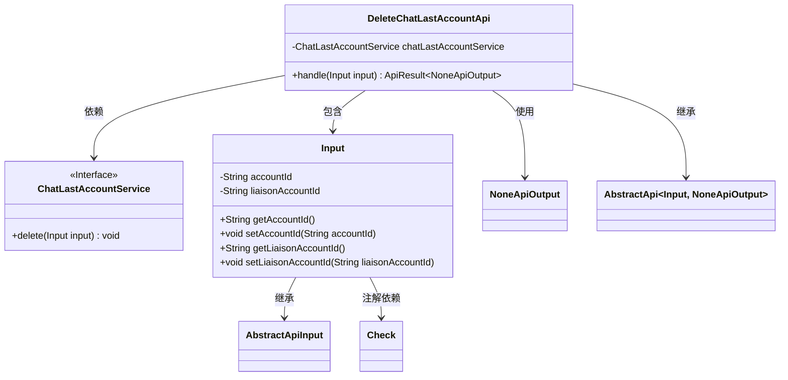

# 基础信息

|      |      |
|------|------|
| 名称 | DeleteChatLastAccountApi |
| 编码语言 | .java |
| 代码路径 | WeFe/board/board-service/src/main/java/com/welab/wefe/board/service/api/chat/DeleteChatLastAccountApi.java |
| 包名 | com.welab.wefe.board.service.api.chat |
| 依赖项 | ['com.welab.wefe.board.service.service.ChatLastAccountService', 'com.welab.wefe.common.exception.StatusCodeWithException', 'com.welab.wefe.common.fieldvalidate.annotation.Check', 'com.welab.wefe.common.web.api.base.AbstractApi', 'com.welab.wefe.common.web.api.base.Api', 'com.welab.wefe.common.web.dto.AbstractApiInput', 'com.welab.wefe.common.web.dto.ApiResult', 'com.welab.wefe.common.web.dto.NoneApiOutput', 'org.springframework.beans.factory.annotation.Autowired'] |
| 概述说明 | 删除最近聊天账号的API接口，需提供账号ID和联络账号ID，调用服务删除记录后返回成功结果。 |

# 说明

这是一个名为DeleteChatLastAccountApi的API类，用于删除最近聊天账户记录。它继承自AbstractApi，接受Input参数并返回NoneApiOutput。Input类包含两个必填字段：accountId（账户ID）和liaisonAccountId（联络账户ID）。该API通过注入的ChatLastAccountService服务处理删除操作，成功时返回空结果。整个类结构清晰，包含必要的输入验证和字段访问方法。

# 类列表 Class Summary

| 名称   | 类型  | 说明 |
|-------|------|-------------|
| DeleteChatLastAccountApi | class | 删除最近聊天账号的API接口，需提供账号ID和联络账号ID，调用服务删除记录后返回成功结果。 |

## 类 DeleteChatLastAccountApi

|      |      |
|------|------|
| 访问范围 | @Api(path = "chat/delete_chat_last_account", name = "Delete recent chat account");public |
| 类型 | class |
| 名称 | DeleteChatLastAccountApi |
| 说明 | 删除最近聊天账号的API接口，需提供账号ID和联络账号ID，调用服务删除记录后返回成功结果。 |

### UML类图

这段代码展示了一个删除最近聊天账号的API实现。DeleteChatLastAccountApi继承自AbstractApi，处理包含账号ID和联系人ID的输入参数，通过调用ChatLastAccountService接口完成删除操作。类图清晰地呈现了继承关系、依赖关系和包含关系，其中Input作为内部类封装了必要的验证字段，服务层通过接口实现解耦。整体设计符合分层架构原则，职责划分明确。

### 内部方法调用关系图

```mermaid
graph TD
    A["类DeleteChatLastAccountApi"]
    B["注解: @Api(path='chat/delete_chat_last_account', name='Delete recent chat account')"]
    C["继承: AbstractApi<Input, NoneApiOutput>"]
    D["依赖注入: @Autowired ChatLastAccountService"]
    E["重写方法: handle(Input input)"]
    F["内部类: Input extends AbstractApiInput"]
    G["属性: @Check String accountId"]
    H["属性: @Check String liaisonAccountId"]
    I["方法: getAccountId()/setAccountId()"]
    J["方法: getLiaisonAccountId()/setLiaisonAccountId()"]
    K["调用: chatLastAccountService.delete(input)"]
    L["返回: success()"]

    A --> B
    A --> C
    A --> D
    A --> E
    A --> F
    F --> G
    F --> H
    F --> I
    F --> J
    E --> K
    E --> L
```

这段代码定义了一个删除最近聊天账号的API类，继承自抽象API基类。主要流程是通过注入的ChatLastAccountService执行删除操作，输入参数包含账号ID和联络账号ID两个必填字段。流程图展示了类结构、注解、继承关系、内部类定义以及核心方法handle()的处理逻辑，其中handle()会调用服务层删除方法并返回成功结果。输入参数类通过@Check注解确保字段必填，并提供了标准的getter/setter方法。

### 字段列表 Field List

| 名称  | 类型  | 说明 |
|-------|-------|------|
| chatLastAccountService | ChatLastAccountService | 自动注入ChatLastAccountService服务实例。 |

### 方法列表

| 名称  | 类型  | 说明 |
|-------|-------|------|
| handle | ApiResult<NoneApiOutput> | Java方法：删除聊天账户记录，输入参数为Input对象，返回成功结果或无输出。异常时抛出StatusCodeWithException。 |

