# 基础信息

|      |      |
|------|------|
| 名称 | QueryChatDetailApi |
| 编码语言 | .java |
| 代码路径 | WeFe/board/board-service/src/main/java/com/welab/wefe/board/service/api/chat/QueryChatDetailApi.java |
| 包名 | com.welab.wefe.board.service.api.chat |
| 依赖项 | ['com.welab.wefe.board.service.dto.base.PagingInput', 'com.welab.wefe.board.service.dto.base.PagingOutput', 'com.welab.wefe.board.service.dto.entity.MemberChatOutputModel', 'com.welab.wefe.board.service.service.MemberChatService', 'com.welab.wefe.common.exception.StatusCodeWithException', 'com.welab.wefe.common.fieldvalidate.annotation.Check', 'com.welab.wefe.common.web.api.base.AbstractApi', 'com.welab.wefe.common.web.api.base.Api', 'com.welab.wefe.common.web.dto.AbstractApiOutput', 'com.welab.wefe.common.web.dto.ApiResult', 'org.springframework.beans.factory.annotation.Autowired', 'java.util.List'] |
| 概述说明 | 查询聊天详情的API，需提供发送和接收方账号ID，可选时间限制，返回分页聊天记录列表。 |

# 说明

该代码定义了一个名为QueryChatDetailApi的API类，用于查询聊天详情。API路径为chat/detail，接受Input类作为输入参数，返回分页的MemberChatOutputModel列表。Input类包含必填的发送方账号ID、接收方账号ID和可选的查询时间限制。Output类包含聊天记录列表。API通过MemberChatService处理查询请求，返回分页结果。所有字段均通过校验注解确保数据完整性。

# 类列表 Class Summary

| 名称   | 类型  | 说明 |
|-------|------|-------------|
| QueryChatDetailApi | class | 查询聊天详情的API类，输入包含发送和接收账户ID及时间限制，输出分页的聊天记录列表。 |


## 类 QueryChatDetailApi

|      |      |
|------|------|
| 访问范围 | @Api(path = "chat/detail", name = "Query chat details");public |
| 类型 | class |
| 名称 | QueryChatDetailApi |
| 说明 | 查询聊天详情的API类，输入包含发送和接收账户ID及时间限制，输出分页的聊天记录列表。 |


### UML类图

```mermaid
classDiagram
    class QueryChatDetailApi {
        +MemberChatService memberChatService
        +handle(Input input) ApiResult~PagingOutput~MemberChatOutputModel~~
    }
    class AbstractApi~T, R~ {
        <<Interface>>
    }
    class PagingInput {
        <<Interface>>
    }
    class PagingOutput~T~ {
        <<Interface>>
    }
    class MemberChatOutputModel {
    }
    class MemberChatService {
        +queryChatDetail(Input input) PagingOutput~MemberChatOutputModel~
    }
    class Input {
        -String fromAccountId
        -String toAccountId
        -Long limitCreateTime
        +getFromAccountId() String
        +setFromAccountId(String fromAccountId) void
        +getToAccountId() String
        +setToAccountId(String toAccountId) void
        +getLimitCreateTime() Long
        +setLimitCreateTime(Long limitCreateTime) void
    }
    class Output {
        -List~MemberChatOutputModel~ list
        +getList() List~MemberChatOutputModel~
        +setList(List~MemberChatOutputModel~ list) Output
    }
    class AbstractApiOutput {
        <<Interface>>
    }

    QueryChatDetailApi --> AbstractApi : 继承
    QueryChatDetailApi --> MemberChatService : 依赖
    Input --> PagingInput : 继承
    Output --> AbstractApiOutput : 继承
    PagingOutput~MemberChatOutputModel~ <|.. MemberChatService : 实现
    AbstractApi~Input, PagingOutput~MemberChatOutputModel~~ <|.. QueryChatDetailApi : 实现
```

这段代码展示了一个查询聊天详情的API类结构。QueryChatDetailApi继承自AbstractApi泛型类，处理Input输入参数并返回分页的MemberChatOutputModel结果。Input类继承PagingInput包含发送/接收方账户ID和时间限制参数，Output类继承AbstractApiOutput包含聊天记录列表。MemberChatService提供实际的查询服务。整体结构体现了清晰的层次关系和依赖，Input/Output模型与业务逻辑分离，符合良好的API设计规范。


### 内部方法调用关系图

```mermaid
graph TD
    A["类QueryChatDetailApi"]
    B["注解: @Api(path='chat/detail', name='Query chat details')"]
    C["继承: AbstractApi<Input, PagingOutput<MemberChatOutputModel>>"]
    D["依赖注入: @Autowired MemberChatService"]
    E["重写方法: handle(Input input)"]
    F["内部类: Input extends PagingInput"]
    G["属性: @Check String fromAccountId"]
    H["属性: @Check String toAccountId"]
    I["属性: @Check Long limitCreateTime"]
    J["方法: getter/setter"]
    K["内部类: Output extends AbstractApiOutput"]
    L["属性: List<MemberChatOutputModel> list"]
    M["方法: getList/setList"]

    A --> B
    A --> C
    A --> D
    A --> E
    A --> F
    F --> G
    F --> H
    F --> I
    F --> J
    A --> K
    K --> L
    K --> M
    E --> D
    E --> F
```



这段代码定义了一个查询聊天详情的API类，继承自抽象API基类，包含输入输出数据结构和业务处理方法。流程图展示了类的主要结构：顶部是带有API注解的主类，通过依赖注入获取服务实例，重写handle方法处理请求；包含两个内部类，Input类定义了带校验的查询参数和对应的getter/setter，Output类封装了分页查询结果列表。整体采用分层设计，符合标准的API开发模式。

### 字段列表 Field List

| 名称  | 类型  | 说明 |
|-------|-------|------|
| memberChatService | MemberChatService | 使用@Autowired自动注入MemberChatService成员聊天服务。 |

### 方法列表

| 名称  | 类型  | 说明 |
|-------|-------|------|
| handle | ApiResult<PagingOutput<MemberChatOutputModel>> | 处理输入并返回成员聊天详情查询结果。 |


