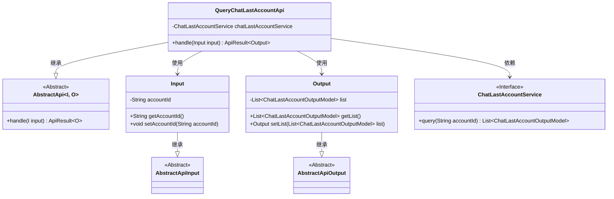
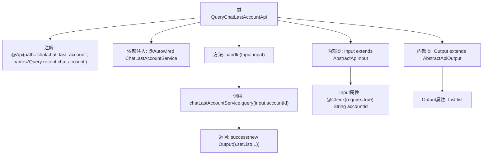

# 基础信息

|      |      |
|------|------|
| 名称 | QueryChatLastAccountApi |
| 编码语言 | .java |
| 代码路径 | WeFe/board/board-service/src/main/java/com/welab/wefe/board/service/api/chat/QueryChatLastAccountApi.java |
| 包名 | com.welab.wefe.board.service.api.chat |
| 依赖项 | ['com.welab.wefe.board.service.dto.entity.ChatLastAccountOutputModel', 'com.welab.wefe.board.service.service.ChatLastAccountService', 'com.welab.wefe.common.exception.StatusCodeWithException', 'com.welab.wefe.common.fieldvalidate.annotation.Check', 'com.welab.wefe.common.web.api.base.AbstractApi', 'com.welab.wefe.common.web.api.base.Api', 'com.welab.wefe.common.web.dto.AbstractApiInput', 'com.welab.wefe.common.web.dto.AbstractApiOutput', 'com.welab.wefe.common.web.dto.ApiResult', 'org.springframework.beans.factory.annotation.Autowired', 'java.util.List'] |
| 概述说明 | 查询最近聊天账号的API类，通过accountId获取聊天账号列表，包含输入输出定义及服务调用。 |

# 说明

该代码定义了一个名为QueryChatLastAccountApi的API类，用于查询最近聊天账户。API路径为chat/chat_last_account，通过ChatLastAccountService服务处理请求。输入类Input包含必须的accountId字段，输出类Output包含一个ChatLastAccountOutputModel列表。处理逻辑是通过accountId查询并返回结果列表。

# 类列表 Class Summary

| 名称   | 类型  | 说明 |
|-------|------|-------------|
| QueryChatLastAccountApi | class | 查询最近聊天账号的API，接收账号ID参数，返回聊天账号列表。 |

## 类 QueryChatLastAccountApi

|      |      |
|------|------|
| 访问范围 | @Api(path = "chat/chat_last_account", name = "Query recent chat account");public |
| 类型 | class |
| 名称 | QueryChatLastAccountApi |
| 说明 | 查询最近聊天账号的API，接收账号ID参数，返回聊天账号列表。 |

### UML类图

该代码实现了一个查询最近聊天账号的API接口，核心类QueryChatLastAccountApi继承自泛型抽象类AbstractApi，处理Input输入参数并返回Output输出结果。Input类包含必填的accountId字段，Output类封装了查询结果列表。通过依赖注入的ChatLastAccountService接口实现具体查询逻辑，整体采用分层设计模式，输入输出均继承自抽象基类，具有良好的扩展性和类型安全性。

### 内部方法调用关系图

这段代码展示了一个基于Spring框架的API类结构，主要用于查询最近聊天账户。流程图清晰地呈现了类层次关系，包括主类QueryChatLastAccountApi与其内部类Input/Output的继承关系，以及核心方法handle的处理流程。通过@Autowired注入服务层组件，handle方法调用服务层查询逻辑并包装返回结果，同时Input类通过@Check注解实现了参数校验。整个设计体现了清晰的职责划分和标准的API响应处理模式。

### 字段列表 Field List

| 名称  | 类型  | 说明 |
|-------|-------|------|
| chatLastAccountService | ChatLastAccountService | 自动注入ChatLastAccountService服务实例。 |

### 方法列表

| 名称  | 类型  | 说明 |
|-------|-------|------|
| handle | ApiResult<QueryChatLastAccountApi.Output> | 处理查询聊天最后账户请求，返回账户ID对应的结果列表。 |

