# 基础信息

|      |      |
|------|------|
| 名称 | ResendMessageApi |
| 编码语言 | .java |
| 代码路径 | WeFe/board/board-service/src/main/java/com/welab/wefe/board/service/api/chat/ResendMessageApi.java |
| 包名 | com.welab.wefe.board.service.api.chat |
| 依赖项 | ['com.welab.wefe.board.service.service.MemberChatService', 'com.welab.wefe.common.exception.StatusCodeWithException', 'com.welab.wefe.common.fieldvalidate.annotation.Check', 'com.welab.wefe.common.web.api.base.AbstractApi', 'com.welab.wefe.common.web.api.base.Api', 'com.welab.wefe.common.web.dto.AbstractApiInput', 'com.welab.wefe.common.web.dto.ApiResult', 'com.welab.wefe.common.web.dto.NoneApiOutput', 'org.springframework.beans.factory.annotation.Autowired'] |
| 概述说明 | 这是一个用于重新发送失败消息的API，路径为"chat/resend_message"。它接收包含消息ID的输入，调用MemberChatService的resendMessage方法处理，成功后返回空输出。输入参数memberChatId为必填项，表示后端数据库中的消息ID。 |

# 说明

该代码定义了一个名为ResendMessageApi的API类，用于重新发送发送失败的消息。API路径为"chat/resend_message"，接受一个包含memberChatId的输入参数，该参数是后端数据库中的消息ID且为必填项。处理逻辑通过MemberChatService的resendMessage方法实现，成功时返回空输出。输入类Input继承自AbstractApiInput，包含memberChatId的getter和setter方法。

# 类列表 Class Summary

| 名称   | 类型  | 说明 |
|-------|------|-------------|
| ResendMessageApi | class | 定义了一个重发失败消息的API接口，路径为chat/resend_message，接收成员聊天ID作为输入，调用MemberChatService进行消息重发，成功后返回空输出。 |


## 类 ResendMessageApi

|      |      |
|------|------|
| 访问范围 | @Api(path = "chat/resend_message", name = "Resend send failure message");public |
| 类型 | class |
| 名称 | ResendMessageApi |
| 说明 | 定义了一个重发失败消息的API接口，路径为chat/resend_message，接收成员聊天ID作为输入，调用MemberChatService进行消息重发，成功后返回空输出。 |


### UML类图

```mermaid
classDiagram
    class ResendMessageApi {
        -MemberChatService memberChatService
        +handle(Input input) ApiResult~NoneApiOutput~
    }
    ResendMessageApi --> MemberChatService : 依赖
    ResendMessageApi --> AbstractApi~Input, NoneApiOutput~ : 继承
    ResendMessageApi ..|> <<Interface>> Api : 实现

    class Input {
        -String memberChatId
        +String getMemberChatId()
        +void setMemberChatId(String memberChatId)
    }
    Input --> AbstractApiInput : 继承
    Input --> Check : 注解

    class MemberChatService {
        +resendMessage(String memberChatId)
    }

    class NoneApiOutput {
    }

    class AbstractApi~T, R~ {
        <<abstract>>
        +handle(T input) ApiResult~R~
    }

    class AbstractApiInput {
    }

    <<Interface>> Api {
        <<Interface>>
    }
```

类图描述：该图展示了消息重发API的核心结构。ResendMessageApi继承自泛型抽象类AbstractApi，并实现了Api接口，依赖MemberChatService处理业务逻辑。输入参数Input继承自AbstractApiInput，包含带校验注解的memberChatId字段。NoneApiOutput作为空输出类型，与AbstractApi共同构成模板方法模式的基础框架。


### 内部方法调用关系图

```mermaid
graph TD
    A["类ResendMessageApi"]
    B["注解: @Api(path='chat/resend_message', name='Resend send failure message')"]
    C["继承: AbstractApi<Input, NoneApiOutput>"]
    D["依赖注入: @Autowired MemberChatService"]
    E["重写方法: handle(Input input)"]
    F["调用: memberChatService.resendMessage(input.memberChatId)"]
    G["返回: success()"]
    H["静态内部类Input"]
    I["属性: @Check String memberChatId"]
    J["方法: getMemberChatId()"]
    K["方法: setMemberChatId()"]

    A --> B
    A --> C
    A --> D
    A --> E
    E --> F
    F --> G
    A --> H
    H --> I
    H --> J
    H --> K
```



该流程图展示了ResendMessageApi类的结构及其内部关系。类通过@Api注解定义API路径，继承AbstractApi模板类并实现handle方法处理请求。核心流程是调用memberChatService的resendMessage方法重发消息，最后返回成功状态。Input作为静态内部类封装了必填参数memberChatId及其getter/setter方法，通过@Check注解进行参数校验。整体设计符合Spring Boot的API开发规范，实现了清晰的业务逻辑分层。

### 字段列表 Field List

| 名称  | 类型  | 说明 |
|-------|-------|------|
| memberChatService | MemberChatService | 使用@Autowired自动注入MemberChatService实例。 |

### 方法列表

| 名称  | 类型  | 说明 |
|-------|-------|------|
| handle | ApiResult<NoneApiOutput> | 重发聊天消息，调用memberChatService.resendMessage方法，成功返回空结果。 |


