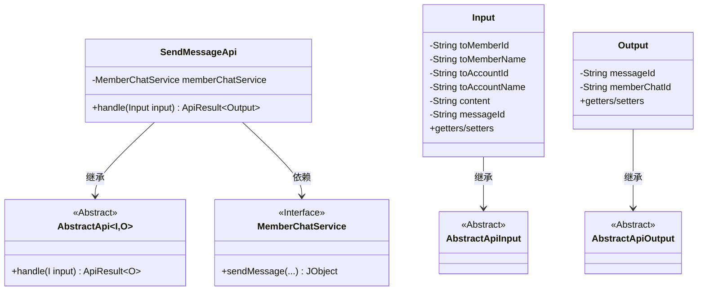
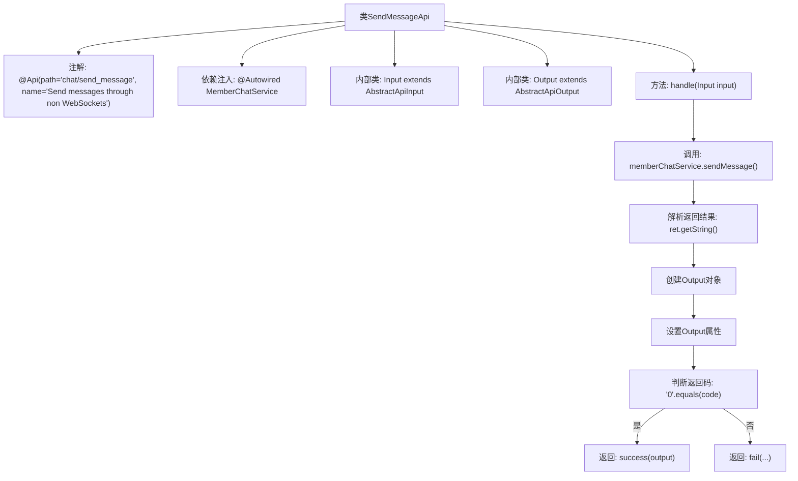

# 基础信息

|      |      |
|------|------|
| 名称 | SendMessageApi |
| 编码语言 | .java |
| 代码路径 | WeFe/board/board-service/src/main/java/com/welab/wefe/board/service/api/chat/SendMessageApi.java |
| 包名 | com.welab.wefe.board.service.api.chat |
| 依赖项 | ['com.welab.wefe.board.service.constant.ChatConstant', 'com.welab.wefe.board.service.service.MemberChatService', 'com.welab.wefe.common.StatusCode', 'com.welab.wefe.common.exception.StatusCodeWithException', 'com.welab.wefe.common.fieldvalidate.annotation.Check', 'com.welab.wefe.common.util.JObject', 'com.welab.wefe.common.web.api.base.AbstractApi', 'com.welab.wefe.common.web.api.base.Api', 'com.welab.wefe.common.web.dto.AbstractApiInput', 'com.welab.wefe.common.web.dto.AbstractApiOutput', 'com.welab.wefe.common.web.dto.ApiResult', 'org.springframework.beans.factory.annotation.Autowired'] |
| 概述说明 | 非WebSocket消息发送API，接收接收者信息和内容，返回前后端消息ID。成功返回0，失败返回错误码和消息。 |

# 说明

SendMessageApi是一个非WebSocket消息发送接口，路径为chat/send_message。它继承自AbstractApi，输入类Input包含接收者成员ID、名称、账户ID、名称及消息内容等必填字段，输出类Output包含前端消息ID和后端数据库消息ID。处理逻辑通过MemberChatService发送消息，返回结果包含状态码、消息内容和消息ID，成功时返回输出数据，失败时返回系统错误。所有输入字段均需校验。

# 类列表 Class Summary

| 名称   | 类型  | 说明 |
|-------|------|-------------|
| SendMessageApi | class | 发送消息的非WebSocket接口，包含接收者信息、消息内容及前后端ID映射，返回处理结果。 |

## 类 SendMessageApi

|      |      |
|------|------|
| 访问范围 | @Api(path = "chat/send_message", name = "Send messages through non WebSockets");public |
| 类型 | class |
| 名称 | SendMessageApi |
| 说明 | 发送消息的非WebSocket接口，包含接收者信息、消息内容及前后端ID映射，返回处理结果。 |

### UML类图

这段代码展示了一个消息发送API的实现结构。SendMessageApi继承自泛型抽象类AbstractApi，处理Input和Output两种数据类型。Input类包含接收者信息和消息内容，Output类包含前后端消息ID。通过MemberChatService接口实现消息发送功能，并根据返回结果构造响应。整体采用分层设计，输入输出通过继承抽象基类实现标准化。

### 内部方法调用关系图

这段代码是一个API处理类，用于通过非WebSocket方式发送消息。流程图展示了从类定义到核心处理方法的完整流程：首先通过注解定义API路径和名称，然后注入服务依赖，处理请求时调用成员聊天服务发送消息，解析返回结果后根据状态码决定返回成功或失败响应。内部类Input和Output分别用于封装请求参数和响应数据。

### 字段列表 Field List

| 名称  | 类型  | 说明 |
|-------|-------|------|
| memberChatService | MemberChatService | 使用@Autowired自动注入MemberChatService实例。 |

### 方法列表

| 名称  | 类型  | 说明 |
|-------|-------|------|
| handle | ApiResult<Output> | 该方法处理发送消息请求，调用memberChatService发送消息并返回结果。若返回码为0则返回成功结果，否则返回系统错误及错误信息。 |

