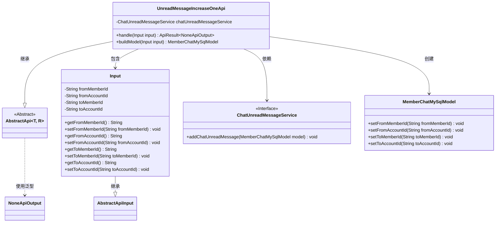

# 基础信息

|      |      |
|------|------|
| 名称 | UnreadMessageIncreaseOneApi |
| 编码语言 | .java |
| 代码路径 | WeFe/board/board-service/src/main/java/com/welab/wefe/board/service/api/chat/UnreadMessageIncreaseOneApi.java |
| 包名 | com.welab.wefe.board.service.api.chat |
| 依赖项 | ['com.welab.wefe.board.service.database.entity.chat.MemberChatMySqlModel', 'com.welab.wefe.board.service.service.ChatUnreadMessageService', 'com.welab.wefe.common.exception.StatusCodeWithException', 'com.welab.wefe.common.fieldvalidate.annotation.Check', 'com.welab.wefe.common.web.api.base.AbstractApi', 'com.welab.wefe.common.web.api.base.Api', 'com.welab.wefe.common.web.dto.AbstractApiInput', 'com.welab.wefe.common.web.dto.ApiResult', 'com.welab.wefe.common.web.dto.NoneApiOutput', 'org.springframework.beans.factory.annotation.Autowired'] |
| 概述说明 | API类UnreadMessageIncreaseOneApi，路径chat/unread_message_increase_one，功能为接收发送方和接收方的成员及账户ID，通过chatUnreadMessageService增加未读消息数。 |

# 说明

该代码定义了一个名为UnreadMessageIncreaseOneApi的API类，用于处理未读消息数量加1的请求。API路径为"chat/unread_message_increase_one"。该类继承自AbstractApi，输入类型为内部定义的Input类，输出类型为NoneApiOutput。Input类包含四个必填字段：发送方成员ID、发送方账户ID、接收方成员ID和接收方账户ID。处理逻辑通过调用chatUnreadMessageService的addChatUnreadMessage方法实现，该方法接收由输入参数构建的MemberChatMySqlModel对象。整个API的功能是将指定聊天双方的未读消息计数增加1。

# 类列表 Class Summary

| 名称   | 类型  | 说明 |
|-------|------|-------------|
| UnreadMessageIncreaseOneApi | class | 该API用于将指定发送方和接收方的未读消息数加1，包含双方成员和账户ID校验。 |

## 类 UnreadMessageIncreaseOneApi

|      |      |
|------|------|
| 访问范围 | @Api(path = "chat/unread_message_increase_one", name = "Unread message plus 1");public |
| 类型 | class |
| 名称 | UnreadMessageIncreaseOneApi |
| 说明 | 该API用于将指定发送方和接收方的未读消息数加1，包含双方成员和账户ID校验。 |

### UML类图

这段代码定义了一个`UnreadMessageIncreaseOneApi`类，用于处理未读消息数量加1的API请求。该类继承自泛型抽象类`AbstractApi`，接受`Input`作为输入参数并返回`NoneApiOutput`。核心功能是通过`ChatUnreadMessageService`服务将输入参数转换为`MemberChatMySqlModel`并存储。输入类`Input`包含发送方和接收方的成员ID和账户ID，所有字段都通过`@Check`注解确保必填。整体设计采用了分层架构，通过依赖注入和服务接口实现松耦合。

### 内部方法调用关系图

```mermaid
graph TD
    A["类UnreadMessageIncreaseOneApi"]
    B["注解: @Api"]
    C["继承: AbstractApi<Input, NoneApiOutput>"]
    D["依赖注入: @Autowired ChatUnreadMessageService"]
    E["重写方法: handle(Input input)"]
    F["内部类: Input extends AbstractApiInput"]
    G["Input属性: String fromMemberId"]
    H["Input属性: String fromAccountId"]
    I["Input属性: String toMemberId"]
    J["Input属性: String toAccountId"]
    K["Input方法: getter/setter"]
    L["私有方法: buildModel(Input input)"]
    M["创建: MemberChatMySqlModel"]
    N["设置模型属性"]
    O["返回: ApiResult<NoneApiOutput>"]

    A --> B
    A --> C
    A --> D
    A --> E
    A --> F
    F --> G
    F --> H
    F --> I
    F --> J
    F --> K
    A --> L
    L --> M
    L --> N
    E --> L
    E --> O
    E --> D
```

这段代码流程图展示了一个处理未读消息加1的API类结构。核心流程从handle方法开始，通过buildModel方法构建数据模型，然后调用chatUnreadMessageService服务完成业务操作。Input内部类封装了必要的消息发送方和接收方信息，并通过注解进行参数校验。整个设计体现了清晰的层级关系和职责划分，从API入口到具体业务实现形成完整调用链。

### 字段列表 Field List

| 名称  | 类型  | 说明 |
|-------|-------|------|
| chatUnreadMessageService | ChatUnreadMessageService | 使用@Autowired自动注入ChatUnreadMessageService实例。 |

### 方法列表

| 名称  | 类型  | 说明 |
|-------|-------|------|
| buildModel | MemberChatMySqlModel | 构建MemberChatMySqlModel对象，设置发送方和接收方的成员ID及账户ID，返回模型实例。 |
| handle | ApiResult<NoneApiOutput> | 方法重写，处理输入并调用服务添加未读消息，成功后返回空结果。 |

