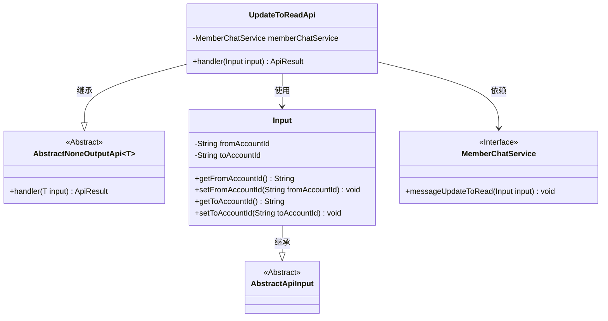

# 基础信息

|      |      |
|------|------|
| 名称 | UpdateToReadApi |
| 编码语言 | .java |
| 代码路径 | WeFe/board/board-service/src/main/java/com/welab/wefe/board/service/api/chat/UpdateToReadApi.java |
| 包名 | com.welab.wefe.board.service.api.chat |
| 依赖项 | ['com.welab.wefe.board.service.service.MemberChatService', 'com.welab.wefe.common.exception.StatusCodeWithException', 'com.welab.wefe.common.fieldvalidate.annotation.Check', 'com.welab.wefe.common.web.api.base.AbstractNoneOutputApi', 'com.welab.wefe.common.web.api.base.Api', 'com.welab.wefe.common.web.dto.AbstractApiInput', 'com.welab.wefe.common.web.dto.ApiResult', 'org.springframework.beans.factory.annotation.Autowired'] |
| 概述说明 | 更新聊天消息为已读状态的API，接收发送方和接收方账号ID，调用服务层处理。 |

# 说明

该API用于将指定账户的聊天消息更新为已读状态。路径为"chat/update_to_read"，接受两个必需参数：发送方账户ID和接收方账户ID。通过MemberChatService处理请求，无返回数据。输入类包含两个字符串类型字段，均需校验非空。

# 类列表 Class Summary

| 名称   | 类型  | 说明 |
|-------|------|-------------|
| UpdateToReadApi | class | 更新聊天消息为已读状态的API，需要发送方和接收方账号ID，调用MemberChatService处理。 |

## 类 UpdateToReadApi

|      |      |
|------|------|
| 访问范围 | @Api(path = "chat/update_to_read", name = "Update the chat message of the account as read");public |
| 类型 | class |
| 名称 | UpdateToReadApi |
| 说明 | 更新聊天消息为已读状态的API，需要发送方和接收方账号ID，调用MemberChatService处理。 |

### UML类图

该代码实现了一个将聊天消息标记为已读的API接口。UpdateToReadApi继承自AbstractNoneOutputApi，使用MemberChatService处理业务逻辑，Input类继承AbstractApiInput并包含发送方和接收方账号ID。类图展示了继承关系、依赖关系和使用关系，清晰地呈现了各组件间的协作方式。

### 内部方法调用关系图

```mermaid
graph TD
    A["类UpdateToReadApi"]
    B["注解: @Api(path='chat/update_to_read', name='Update the chat message of the account as read')"]
    C["继承: AbstractNoneOutputApi<Input>"]
    D["依赖注入: @Autowired MemberChatService"]
    E["重写方法: handler(Input input)"]
    F["调用: memberChatService.messageUpdateToRead(input)"]
    G["返回: success()"]
    H["嵌套类Input"]
    I["属性: @Check String fromAccountId"]
    J["属性: @Check String toAccountId"]
    K["Getter/Setter方法"]

    A --> B
    A --> C
    A --> D
    A --> E
    E --> F
    E --> G
    A --> H
    H --> I
    H --> J
    H --> K
```

流程图描述：该流程图展示了UpdateToReadApi类的完整结构，包括类注解、继承关系、依赖注入的MemberChatService服务，以及重写的handler方法处理逻辑。handler方法会调用memberChatService的messageUpdateToRead方法并返回成功结果。嵌套类Input包含两个必填字段fromAccountId和toAccountId及其Getter/Setter方法，通过@Check注解进行参数校验。

### 字段列表 Field List

| 名称  | 类型  | 说明 |
|-------|-------|------|
| memberChatService | MemberChatService | 使用@Autowired自动注入MemberChatService实例。 |

### 方法列表

| 名称  | 类型  | 说明 |
|-------|-------|------|
| handler | ApiResult<?> | 方法重写，调用memberChatService更新消息为已读，成功返回结果。 |

