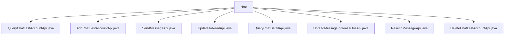

# 基础信息

|      |      |
|------|------|
| 名称 | chat |
| 编码语言 | .java |
| 代码路径 | WeFe/board/board-service/src/main/java/com/welab/wefe/board/service/api/chat |
| 包名 | docs.board.board-service.src.main.java.com.welab.wefe.board.service.api.chat |
| 概述说明 | 定义了多个聊天相关API：查询最近账户、添加最近账户、发送消息、更新已读状态、查询聊天详情、未读消息加1、重发消息、删除最近账户。各API包含必要输入参数，通过对应服务处理请求，返回结果或空输出。 |

# 说明

## 概述  
该模块核心职责是提供聊天系统的账户管理、消息收发及状态更新功能，类似即时通讯系统的后端服务。接口规范统一采用RESTful风格，路径以`chat/`为前缀，输入输出通过内部类定义，所有字段均需校验。关键数据结构包括`ChatLastAccountOutputModel`（最近聊天账户）、`MemberChatOutputModel`（聊天详情）和`MemberChatMySqlModel`（消息存储模型）。外部依赖项为`ChatLastAccountService`（账户管理）和`MemberChatService`（消息处理）。例如`QueryChatLastAccountApi`返回账户列表，`SendMessageApi`处理消息发送。

## 主要业务场景  
模块支持完整的聊天业务流程：账户管理（增删查）、消息收发（发送/重发）、状态更新（已读标记/未读计数）和详情查询。交互模式为同步API调用，例如`AddChatLastAccountApi`添加账户后，可通过`SendMessageApi`发送消息，再通过`UpdateToReadApi`标记已读。典型应用包括最近联系人列表维护（如`QueryChatLastAccountApi`）、实时消息处理（如`ResendMessageApi`重试机制）和未读消息统计（如`UnreadMessageIncreaseOneApi`计数更新）。API类型涵盖CRUD操作和状态变更，集成案例包括消息发送后联动更新未读计数。

### 包内部结构视图

该流程图展示了WeFe项目中聊天服务的API文件结构。根节点"chat"下包含8个具体的API实现类，涵盖了聊天记录查询、添加、发送消息、标记已读、查询详情、未读消息计数、重发消息和删除账号等功能。这些API共同构成了完整的聊天服务功能模块。

# 文件列表

| 名称   | 类型  | 说明 |
|-------|------|-------------|
| [QueryChatLastAccountApi.java](QueryChatLastAccountApi.md) | file | 查询最近聊天账号的API类，通过accountId获取聊天账号列表，包含输入输出定义及服务调用。 |
| [AddChatLastAccountApi.java](AddChatLastAccountApi.md) | file | API类AddChatLastAccountApi用于添加最近聊天账号，输入包括账号、成员及联络人信息，必填字段校验后调用服务处理。 |
| [SendMessageApi.java](SendMessageApi.md) | file | 非WebSocket消息发送API，接收接收者信息和内容，返回前后端消息ID。成功返回0，失败返回错误码和消息。 |
| [UpdateToReadApi.java](UpdateToReadApi.md) | file | 更新聊天消息为已读状态的API，接收发送方和接收方账号ID，调用服务层处理。 |
| [QueryChatDetailApi.java](QueryChatDetailApi.md) | file | 查询聊天详情的API，需提供发送和接收方账号ID，可选时间限制，返回分页聊天记录列表。 |
| [UnreadMessageIncreaseOneApi.java](UnreadMessageIncreaseOneApi.md) | file | API类UnreadMessageIncreaseOneApi，路径chat/unread_message_increase_one，功能为接收发送方和接收方的成员及账户ID，通过chatUnreadMessageService增加未读消息数。 |
| [ResendMessageApi.java](ResendMessageApi.md) | file | 这是一个用于重新发送失败消息的API，路径为"chat/resend_message"。它接收包含消息ID的输入，调用MemberChatService的resendMessage方法处理，成功后返回空输出。输入参数memberChatId为必填项，表示后端数据库中的消息ID。 |
| [DeleteChatLastAccountApi.java](DeleteChatLastAccountApi.md) | file | 删除最近聊天账号的API接口，需提供账号ID和联络账号ID，调用服务删除记录后返回成功结果。 |

