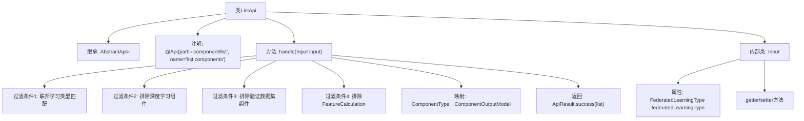

# 基础信息

|      |      |
|------|------|
| 名称 | ListApi |
| 编码语言 | .java |
| 代码路径 | WeFe/board/board-service/src/main/java/com/welab/wefe/board/service/api/component/ListApi.java |
| 包名 | com.welab.wefe.board.service.api.component |
| 依赖项 | ['com.welab.wefe.board.service.dto.entity.component.ComponentOutputModel', 'com.welab.wefe.common.exception.StatusCodeWithException', 'com.welab.wefe.common.fieldvalidate.annotation.Check', 'com.welab.wefe.common.web.api.base.AbstractApi', 'com.welab.wefe.common.web.api.base.Api', 'com.welab.wefe.common.web.dto.AbstractApiInput', 'com.welab.wefe.common.web.dto.ApiResult', 'com.welab.wefe.common.wefe.enums.ComponentType', 'com.welab.wefe.common.wefe.enums.FederatedLearningType', 'java.util.Arrays', 'java.util.List', 'java.util.stream.Collectors'] |
| 概述说明 | ListApi接口根据输入条件过滤组件列表，排除深度学习、未开发及已移除组件，返回符合条件的组件信息。输入参数为联邦学习类型。 |

# 说明

该代码定义了一个名为ListApi的API类，用于获取组件列表。API路径为"component/list"，接收Input参数并返回ComponentOutputModel列表。处理逻辑包括：根据输入的联邦学习类型过滤组件，排除深度学习组件、未开发的验证数据集相关组件以及已移除的"计算特征价值"组件（建议使用"特征统计"组件替代）。Input类包含一个联邦学习类型参数及其getter/setter方法。最终返回的组件列表包含名称、标签和描述信息。

# 类列表 Class Summary

| 名称   | 类型  | 说明 |
|-------|------|-------------|
| ListApi | class | ListApi接口返回组件列表，根据输入类型过滤非深度学习组件、未开发组件及特定移除组件，输出组件名称、标签和描述。 |


## 类 ListApi

|      |      |
|------|------|
| 访问范围 | @Api(path = "component/list", name = "list components");public |
| 类型 | class |
| 名称 | ListApi |
| 说明 | ListApi接口返回组件列表，根据输入类型过滤非深度学习组件、未开发组件及特定移除组件，输出组件名称、标签和描述。 |


### UML类图

```mermaid
classDiagram
    class AbstractApi~T, R~ {
        <<Abstract>>
        +handle(T input) ApiResult~R~
    }
    class ListApi {
        +handle(Input input) ApiResult~List~ComponentOutputModel~~
    }
    class AbstractApiInput {
        <<Abstract>>
    }
    class Input {
        -FederatedLearningType federatedLearningType
        +getFederatedLearningType() FederatedLearningType
        +setFederatedLearningType(FederatedLearningType federatedLearningType)
    }
    class ComponentOutputModel {
        +String name
        +String label
        +String desc
    }
    class ComponentType {
        <<Enumeration>>
        +getFederatedLearningTypes() List~FederatedLearningType~
        +getLabel() String
        +getDesc() String
        +isDeepLearningComponents() boolean
    }
    class FederatedLearningType {
        <<Enumeration>>
    }
    class ApiResult~T~ {
        +success(T data) ApiResult~T~
    }

    ListApi --|> AbstractApi~Input, List~ComponentOutputModel~~
    Input --|> AbstractApiInput
    ListApi --> Input : 使用
    ListApi --> ComponentOutputModel : 生成
    ListApi --> ComponentType : 过滤
    ComponentType --> FederatedLearningType : 关联
    ListApi --> ApiResult~List~ComponentOutputModel~~ : 返回
```

这段代码展示了一个API类`ListApi`，它继承自泛型抽象类`AbstractApi`，用于处理组件列表请求。通过输入参数`Input`中的联邦学习类型，过滤`ComponentType`枚举值，生成`ComponentOutputModel`列表。过滤条件包括排除深度学习组件、未开发的验证数据集组件和已移除的特征计算组件。类图清晰地展示了各组件间的继承、依赖和关联关系，体现了请求处理流程中的数据转换和过滤逻辑。


### 内部方法调用关系图



该流程图展示了ListApi类的结构和主要处理逻辑。该类继承自AbstractApi，通过handle方法处理输入参数，经过多步过滤和映射后返回组件列表。内部类Input包含联邦学习类型属性及其访问方法。handle方法通过4个过滤条件和1个映射操作，最终返回成功结果。

### 字段列表 Field List

| 名称  | 类型  | 说明 |
|-------|-------|------|

### 方法列表

| 名称  | 类型  | 说明 |
|-------|-------|------|
| handle | ApiResult<List<ComponentOutputModel>> | 该方法根据输入条件过滤组件类型，排除深度学习、未开发的数据集验证组件及已移除的特定组件，生成符合条件的组件列表并返回。 |


