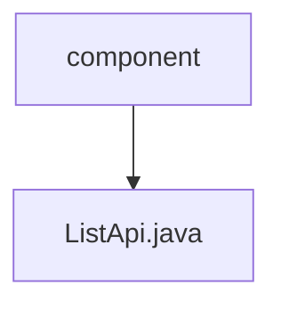

# 基础信息

|      |      |
|------|------|
| 名称 | component |
| 编码语言 | .java |
| 代码路径 | WeFe/board/board-service/src/main/java/com/welab/wefe/board/service/api/component |
| 包名 | docs.board.board-service.src.main.java.com.welab.wefe.board.service.api.component |
| 概述说明 | ListApi接口根据输入条件过滤组件列表，排除深度学习、未开发及已移除组件，返回符合条件的组件信息。输入参数为联邦学习类型。 |

# 说明

该代码定义了一个名为ListApi的API类，用于获取组件列表。API路径为"component/list"，接收Input参数并返回ComponentOutputModel列表。处理逻辑包括：根据输入的联邦学习类型过滤组件，排除深度学习组件、未开发的验证数据集相关组件以及已移除的"计算特征价值"组件（建议使用"特征统计"组件替代）。Input类包含一个联邦学习类型参数及其getter/setter方法。最终返回的组件列表包含名称、标签和描述信息。

### 包内部结构视图

该流程图展示了WeFe项目中board-service模块的组件API结构。根节点"component"表示组件目录，其下级节点"ListApi.java"是该目录下的具体API实现文件。整个结构简洁明了，体现了Java项目中典型的包-类层级关系。

# 文件列表

| 名称   | 类型  | 说明 |
|-------|------|-------------|
| [ListApi.java](ListApi.md) | file | ListApi接口根据输入条件过滤组件列表，排除深度学习、未开发及已移除组件，返回符合条件的组件信息。输入参数为联邦学习类型。 |

