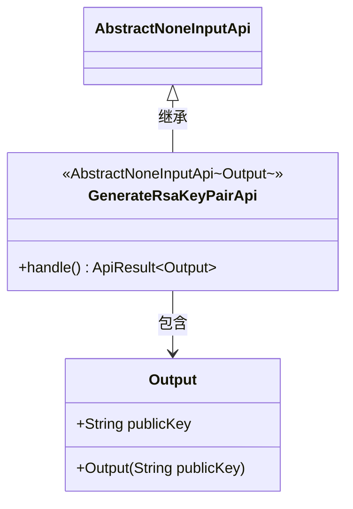
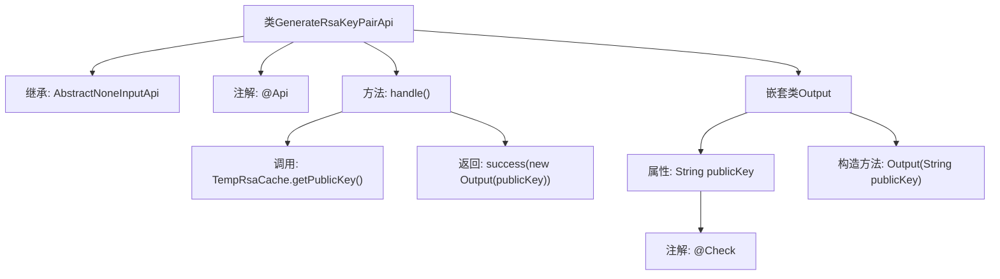

# 基础信息

|      |      |
|------|------|
| 名称 | GenerateRsaKeyPairApi |
| 编码语言 | .java |
| 代码路径 | WeFe/board/board-service/src/main/java/com/welab/wefe/board/service/api/crypto/GenerateRsaKeyPairApi.java |
| 包名 | com.welab.wefe.board.service.api.crypto |
| 依赖项 | ['com.welab.wefe.common.exception.StatusCodeWithException', 'com.welab.wefe.common.fieldvalidate.annotation.Check', 'com.welab.wefe.common.web.TempRsaCache', 'com.welab.wefe.common.web.api.base.AbstractNoneInputApi', 'com.welab.wefe.common.web.api.base.Api', 'com.welab.wefe.common.web.dto.ApiResult'] |
| 概述说明 | 生成RSA密钥对的API，返回公钥用于数据加密传输。 |

# 说明

这是一个名为GenerateRsaKeyPairApi的API类，路径为crypto/generate_rsa_key_pair，功能是生成新的RSA密钥对并返回公钥。它继承自AbstractNoneInputApi，不接收输入参数，输出包含一个publicKey字段的Output类。publicKey字段标注为Rsa公钥，用于加密数据。处理逻辑通过TempRsaCache获取公钥并返回成功结果。

# 类列表 Class Summary

| 名称   | 类型  | 说明 |
|-------|------|-------------|
| GenerateRsaKeyPairApi | class | 生成RSA密钥对的API，返回公钥用于数据加密传输。 |

## 类 GenerateRsaKeyPairApi

|      |      |
|------|------|
| 访问范围 | @Api(path = "crypto/generate_rsa_key_pair", name = "创建一对新的 Rsa 密钥，并得到其中的公钥。");public |
| 类型 | class |
| 名称 | GenerateRsaKeyPairApi |
| 说明 | 生成RSA密钥对的API，返回公钥用于数据加密传输。 |

### UML类图

该类图展示了一个RSA密钥对生成API的结构。GenerateRsaKeyPairApi继承自泛型抽象类AbstractNoneInputApi，指定Output作为泛型参数。它重写了handle()方法，返回包含公钥的ApiResult。Output是静态嵌套类，包含公钥字段和构造方法。类之间的关系清晰展示了继承和组合结构，体现了API处理请求后返回公钥信息的业务逻辑。

### 内部方法调用关系图

该流程图描述了GenerateRsaKeyPairApi类的结构和工作流程。该类继承自AbstractNoneInputApi，通过@Api注解定义API路径和名称。核心方法handle()调用TempRsaCache获取公钥，并返回包含公钥的Output对象。嵌套类Output包含一个带有@Check注解的publicKey属性，用于存储和验证RSA公钥。整个流程展示了从密钥生成到结果返回的完整调用链。

### 字段列表 Field List

| 名称  | 类型  | 说明 |
|-------|-------|------|

### 方法列表

| 名称  | 类型  | 说明 |
|-------|-------|------|
| handle | ApiResult<Output> | 该方法重写父类逻辑，获取临时RSA公钥并封装为成功结果返回。 |

