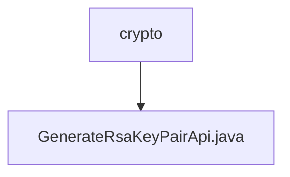

# 基础信息

|      |      |
|------|------|
| 名称 | crypto |
| 编码语言 | .java |
| 代码路径 | WeFe/board/board-service/src/main/java/com/welab/wefe/board/service/api/crypto |
| 包名 | docs.board.board-service.src.main.java.com.welab.wefe.board.service.api.crypto |
| 概述说明 | 生成RSA密钥对的API，返回公钥用于数据加密传输。 |

# 说明

这是一个名为GenerateRsaKeyPairApi的API类，路径为crypto/generate_rsa_key_pair，功能是生成新的RSA密钥对并返回公钥。它继承自AbstractNoneInputApi，不接收输入参数，输出包含一个publicKey字段的Output类。publicKey字段标注为Rsa公钥，用于加密数据。处理逻辑通过TempRsaCache获取公钥并返回成功结果。

### 包内部结构视图

该流程图展示了WeFe项目中加密模块的层级结构，crypto文件夹作为父节点，包含一个子节点GenerateRsaKeyPairApi.java文件。这种简洁的层级关系清晰地反映了加密API模块的文件组织结构，便于开发者快速理解项目布局。

# 文件列表

| 名称   | 类型  | 说明 |
|-------|------|-------------|
| [GenerateRsaKeyPairApi.java](GenerateRsaKeyPairApi.md) | file | 生成RSA密钥对的API，返回公钥用于数据加密传输。 |

