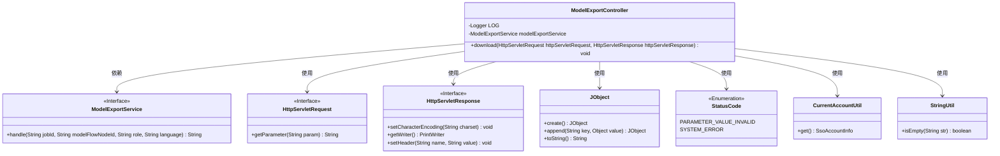
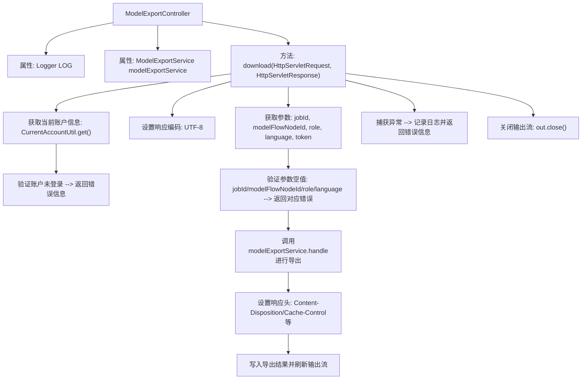

# 基础信息

|      |      |
|------|------|
| 名称 | ModelExportController |
| 编码语言 | .java |
| 代码路径 | WeFe/board/board-service/src/main/java/com/welab/wefe/board/service/api/data_output_info/ModelExportController.java |
| 包名 | com.welab.wefe.board.service.api.data_output_info |
| 依赖项 | ['com.welab.wefe.board.service.service.modelexport.ModelExportService', 'com.welab.wefe.common.StatusCode', 'com.welab.wefe.common.util.JObject', 'com.welab.wefe.common.util.StringUtil', 'com.welab.wefe.common.web.service.account.SsoAccountInfo', 'com.welab.wefe.common.web.util.CurrentAccountUtil', 'com.welab.wefe.common.wefe.enums.ModelExportLanguage', 'org.slf4j.Logger', 'org.slf4j.LoggerFactory', 'org.springframework.beans.factory.annotation.Autowired', 'org.springframework.stereotype.Controller', 'org.springframework.web.bind.annotation.RequestMapping', 'javax.servlet.http.HttpServletRequest', 'javax.servlet.http.HttpServletResponse', 'java.io.PrintWriter'] |
| 概述说明 | ModelExportController处理模型导出请求，验证参数后调用ModelExportService导出数据，返回JSON结果或错误信息。 |

# 说明

这是一个名为ModelExportController的Spring控制器类，主要用于处理模型导出请求。它包含一个下载方法，通过/data_output_info/model_export路径接收HTTP请求。方法首先从请求参数中获取jobId、modelFlowNodeId、role、language和token，并进行非空校验。若用户未登录或参数缺失，会返回相应的错误信息。校验通过后，调用modelExportService处理导出请求，设置响应头信息，包括内容类型、附件下载和缓存控制，最后将导出结果写入响应。过程中发生异常会记录日志并返回系统错误信息。方法确保在结束时关闭输出流。

# 类列表 Class Summary

| 名称   | 类型  | 说明 |
|-------|------|-------------|
| ModelExportController | class | 这是一个Spring控制器类ModelExportController，处理模型导出请求。它接收jobId、modelFlowNodeId、role、language等参数，验证参数和登录状态后调用ModelExportService导出模型，返回文件下载。异常时记录日志并返回错误信息。 |

## 类 ModelExportController

|      |      |
|------|------|
| 访问范围 | @Controller;public |
| 类型 | class |
| 名称 | ModelExportController |
| 说明 | 这是一个Spring控制器类ModelExportController，处理模型导出请求。它接收jobId、modelFlowNodeId、role、language等参数，验证参数和登录状态后调用ModelExportService导出模型，返回文件下载。异常时记录日志并返回错误信息。 |

### UML类图

这段代码展示了一个Spring MVC控制器`ModelExportController`，它处理模型导出请求。控制器依赖`ModelExportService`进行实际导出操作，并通过`HttpServletRequest`获取参数，使用`HttpServletResponse`返回响应。代码中包含了参数校验、错误处理和响应设置等逻辑，通过多个工具类如`JObject`、`StatusCode`等辅助完成功能。整体设计体现了分层架构思想，控制器负责协调，服务类处理业务逻辑。

### 内部方法调用关系图

该流程图描述了ModelExportController处理模型导出的完整流程。从接收HTTP请求开始，依次展示参数获取、权限验证、空值检查等预处理步骤，然后调用服务层进行实际导出操作，最后设置响应头并返回结果。异常处理贯穿整个过程，确保任何错误都能被捕获并返回友好提示。流程严格遵循HTTP响应规范，包含字符编码设置、跨域头处理等细节，最终无论成功或失败都会正确关闭输出流。

### 字段列表 Field List

| 名称  | 类型  | 说明 |
|-------|-------|------|
| modelExportService | ModelExportService | 代码片段使用@Autowired注解自动注入ModelExportService实例。 |
| LOG = LoggerFactory.getLogger(this.getClass()) | Logger | 类中定义受保护常量LOG，用于记录当前类日志。 |

### 方法列表

| 名称  | 类型  | 说明 |
|-------|-------|------|
| download | void | 该代码实现了一个模型导出接口，接收jobId等参数，验证登录和参数后调用服务导出模型文件，设置响应头返回文件下载，异常时返回错误信息。 |

