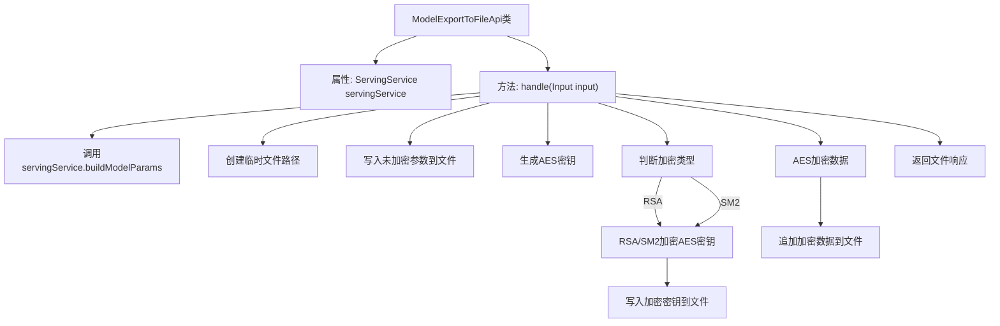

# 基础信息

|      |      |
|------|------|
| 名称 | ModelExportToFileApi |
| 编码语言 | .java |
| 代码路径 | WeFe/board/board-service/src/main/java/com/welab/wefe/board/service/api/data_output_info/ModelExportToFileApi.java |
| 包名 | com.welab.wefe.board.service.api.data_output_info |
| 依赖项 | ['com.alibaba.fastjson.JSON', 'com.welab.wefe.board.service.base.file_system.WeFeFileSystem', 'com.welab.wefe.board.service.service.CacheObjects', 'com.welab.wefe.board.service.service.ServingService', 'com.welab.wefe.common.SecurityUtil', 'com.welab.wefe.common.constant.SecretKeyType', 'com.welab.wefe.common.fieldvalidate.annotation.Check', 'com.welab.wefe.common.util', 'com.welab.wefe.common.web.api.base.AbstractApi', 'com.welab.wefe.common.web.api.base.Api', 'com.welab.wefe.common.web.dto.AbstractApiInput', 'com.welab.wefe.common.web.dto.ApiResult', 'com.welab.wefe.common.wefe.enums.JobMemberRole', 'org.springframework.beans.factory.annotation.Autowired', 'org.springframework.http.ResponseEntity', 'java.io.File', 'java.util.TreeMap'] |
| 概述说明 | 该API将模型参数导出到文件，使用AES加密数据并用RSA/SM2加密密钥，最终返回加密文件。输入需任务ID和角色。 |

# 说明

该代码定义了一个名为ModelExportToFileApi的API类，用于将模型导出到文件。API路径为data_output_info/model_export_to_file。主要功能包括：通过ServingService构建模型参数，将参数写入临时文件；随机生成AES密钥并使用RSA或SM2加密后写入文件；最后用AES加密模型数据并追加到文件。输入参数Input包含必填字段taskId和role。整个过程涉及文件操作和多种加密方式，最终返回生成的文件。

# 类列表 Class Summary

| 名称   | 类型  | 说明 |
|-------|------|-------------|
| ModelExportToFileApi | class | 该API类用于导出模型到文件，接收任务ID和角色参数，生成加密文件并返回。文件内容包含模型参数和加密密钥，使用AES和RSA/SM2加密确保数据安全。 |


## 类 ModelExportToFileApi

|      |      |
|------|------|
| 访问范围 | @Api(path = "data_output_info/model_export_to_file", name = "导出模型到文件中");public |
| 类型 | class |
| 名称 | ModelExportToFileApi |
| 说明 | 该API类用于导出模型到文件，接收任务ID和角色参数，生成加密文件并返回。文件内容包含模型参数和加密密钥，使用AES和RSA/SM2加密确保数据安全。 |


### UML类图

```mermaid
classDiagram
    class ModelExportToFileApi {
        <<Api>> 
        +ServingService servingService
        +handle(Input input) ApiResult~ResponseEntity~?~
    }

    class AbstractApi~T, R~ {
        <<Abstract>> 
        #handle(T input) ApiResult~R~
    }

    class ServingService {
        +buildModelParams(String taskId, JobMemberRole role) TreeMap~String, Object~
    }

    class Input {
        -String taskId
        -JobMemberRole role
        +getTaskId() String
        +setTaskId(String taskId) void
        +getRole() JobMemberRole
        +setRole(JobMemberRole role) void
    }

    class AbstractApiInput {
        <<Abstract>> 
    }

    class JobMemberRole {
        <<Enumeration>> 
    }

    ModelExportToFileApi --|> AbstractApi~Input, ResponseEntity~?~ : 继承
    Input --|> AbstractApiInput : 继承
    ModelExportToFileApi --> ServingService : 依赖
    ModelExportToFileApi --> Input : 使用
    Input --> JobMemberRole : 关联
```

该代码实现了一个将模型导出到文件的API，主要功能包括：构建模型参数、生成临时文件、使用RSA/SM2加密AES密钥、用AES加密数据并写入文件。类图展示了核心类结构：ModelExportToFileApi继承自泛型抽象类AbstractApi，依赖ServingService服务，使用嵌套类Input作为参数对象，Input又继承自AbstractApiInput并关联JobMemberRole枚举。加密功能通过工具类实现（未在图中展示）。


### 内部方法调用关系图



这段代码流程图展示了模型导出到文件的完整处理流程。首先通过servingService构建模型参数，然后创建临时文件并分步骤写入数据：先写入未加密的JSON参数，接着生成AES密钥并根据配置选择RSA或SM2加密方式处理密钥，将加密后的密钥写入文件，最后用AES加密原始数据并追加到文件中。整个过程体现了参数处理、多重加密和文件操作的完整链条，最终返回包含加密数据的文件响应。

### 字段列表 Field List

| 名称  | 类型  | 说明 |
|-------|-------|------|
| servingService | ServingService | 自动注入ServingService服务实例。 |

### 方法列表

| 名称  | 类型  | 说明 |
|-------|-------|------|
| handle | ApiResult<ResponseEntity<?>> | 处理输入数据，构建参数并写入文件，生成AES密钥并用RSA或SM2加密后存储，再用AES加密数据返回文件。 |


